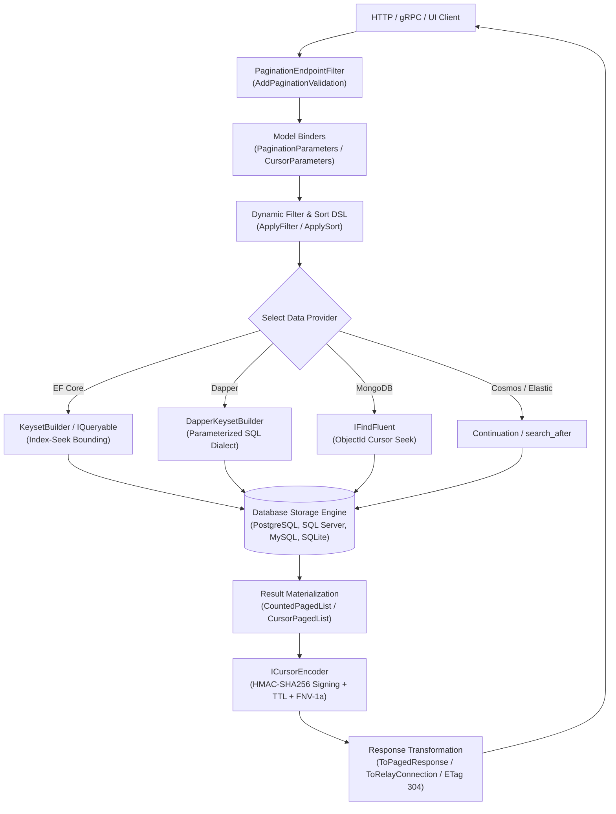
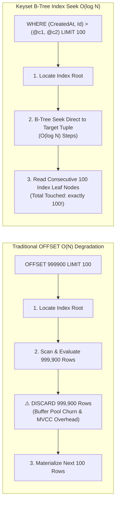

# EricksonLopez.Pagination

High-performance, zero-allocation, AOT-first offset and keyset pagination ecosystem with cryptographic tamper-proof cursors and dynamic filter/sort DSL for modern .NET.

[](https://github.com/ericksonlopezf/dotnet-pagination/actions)
[](https://codecov.io/gh/ericksonlopezf/dotnet-pagination)
[](https://sonarcloud.io/summary/new_code?id=ericksonlopezf_dotnet-pagination)
[](https://github.com/ericksonlopezf/dotnet-pagination/blob/main/docs/quality-gates.md)
[](https://www.nuget.org/packages/EricksonLopez.Pagination)
[](https://www.nuget.org/packages/EricksonLopez.Pagination)
[](https://github.com/ericksonlopezf/dotnet-pagination/blob/main/LICENSE)
[](https://dotnet.microsoft.com)
[](https://learn.microsoft.com/en-us/dotnet/core/deploying/native-aot)

---

`EricksonLopez.Pagination` is an enterprise-grade pagination and data traversal ecosystem engineered for high-throughput .NET 8, .NET 9, and .NET 10 systems. It eliminates the severe $O(N)$ latency degradation and table-scan bottlenecks of traditional SQL `OFFSET/FETCH` queries by providing true $O(\log N)$ keyset (cursor) pagination, count-less lookahead probing, and memory-efficient streaming across Entity Framework Core, Dapper, LinqToDB, MongoDB, Azure Cosmos DB, Elasticsearch, gRPC, Blazor, and GraphQL Relay. With cryptographic HMAC-SHA256 tamper-proof cursors, distributed nonce replay protection, compile-time Roslyn diagnostics (PAG002–PAG008), and source-generated Native AOT decoders, it provides deterministic performance, zero-allocation hot paths, and multi-tenant security out of the box.

---

## Table of Contents

- [What Problem It Solves](#-what-problem-it-solves)
  - [The Physics of SQL OFFSET Degradation at Scale](#the-physics-of-sql-offset-degradation-at-scale)
  - [The Full-Table Scan Overhead of COUNT(*)](#the-full-table-scan-overhead-of-count)
  - [Opaque Cursor Tampering & Replay Vulnerabilities](#opaque-cursor-tampering--replay-vulnerabilities)
  - [How EricksonLopez.Pagination Solves This](#how-ericksonlopezpagination-solves-this)
- [Key Features](#-key-features)
- [Ecosystem](#-ecosystem)
- [Documentation](#-documentation)
  - [Technical Reference & Architecture Guides](#-technical-reference--architecture-guides)
  - [Interactive Showcase & Recipes](#-interactive-showcase--recipes)
- [Installation](#-installation)
  - [1. Core & Abstractions](#1-core--abstractions)
  - [2. Data Access Providers](#2-data-access-providers)
  - [3. Web, API & Transport Integrations](#3-web-api--transport-integrations)
  - [4. Compile-Time Tooling & Diagnostics](#4-compile-time-tooling--diagnostics)
- [Quick Start](#-quick-start)
  - [1. Service Registration & Cryptographic Configuration](#1-service-registration--cryptographic-configuration)
  - [2. High-Performance Keyset (Cursor) Pagination](#2-high-performance-keyset-cursor-pagination)
  - [3. Count-Less Fast Offset Pagination](#3-count-less-fast-offset-pagination)
  - [4. Dynamic Filter & Sort DSL](#4-dynamic-filter--sort-dsl)
  - [5. Zero-Allocation Batch Streaming (IAsyncEnumerable)](#5-zero-allocation-batch-streaming-iasyncenumerable)
- [Core Use Cases](#-core-use-cases)
  - [Use Case 1: Clean Architecture / CQRS Handlers](#use-case-1-clean-architecture--cqrs-handlers)
  - [Use Case 2: Multi-Column Keyset Pagination with Dapper](#use-case-2-multi-column-keyset-pagination-with-dapper)
  - [Use Case 3: Distributed Multi-Node Cursor Replay Protection with Redis](#use-case-3-distributed-multi-node-cursor-replay-protection-with-redis)
  - [Use Case 4: Zero-Downtime Rolling Deployments via Schema Fingerprints](#use-case-4-zero-downtime-rolling-deployments-via-schema-fingerprints)
  - [Use Case 5: Parallel Keyset Dataset Partitioning for ETL Workers](#use-case-5-parallel-keyset-dataset-partitioning-for-etl-workers)
  - [Use Case 6: RFC 7232 HTTP Conditional Requests & Deterministic ETag Caching](#use-case-6-rfc-7232-http-conditional-requests--deterministic-etag-caching)
- [Configuration & Integrations](#-configuration--integrations)
  - [ASP.NET Core Minimal APIs & RouteGroup Validation](#aspnet-core-minimal-apis--routegroup-validation)
  - [OpenAPI & Swagger Integration](#openapi--swagger-integration)
  - [OpenTelemetry Metrics & Observability](#opentelemetry-metrics--observability)
  - [JSON Serialization & Native AOT Support](#json-serialization--native-aot-support)
  - [GraphQL Relay Connection Compliance](#graphql-relay-connection-compliance)
  - [Roslyn Diagnostic Analyzers](#roslyn-diagnostic-analyzers)
- [Testing & Quality](#-testing--quality)
  - [Multi-Paradigm Testing Architecture](#multi-paradigm-testing-architecture)
  - [Code Coverage & Exclusions](#code-coverage--exclusions)
  - [Mutation Testing with Stryker.NET](#mutation-testing-with-strykernet)
- [Performance Benchmarks](#-performance-benchmarks)
  - [1. Deep Pagination Scaling (1,000,000 Rows in PostgreSQL 16)](#1-deep-pagination-scaling-1000000-rows-in-postgresql-16)
  - [2. Keyset Scalability up to 10 Million Rows](#2-keyset-scalability-up-to-10-million-rows)
  - [3. Cryptographic Cursor Codec Benchmark (< 0.4 μs)](#3-cryptographic-cursor-codec-benchmark--04-μs)
  - [4. Dynamic Filter AST Compilation & Cache Benchmark](#4-dynamic-filter-ast-compilation--cache-benchmark)
  - [5. Provider Comparison vs Alternatives](#5-provider-comparison-vs-alternatives)
- [Compatibility & Technical Matrix](#-compatibility--technical-matrix)
  - [Target Frameworks & Native AOT Compatibility](#target-frameworks--native-aot-compatibility)
  - [Database Dialects & Storage Provider Support](#database-dialects--storage-provider-support)
- [Architecture & Design Principles](#-architecture--design-principles)
  - [Execution Pipeline Architecture](#execution-pipeline-architecture)
  - [Keyset Index Seek vs. Offset Scan Mechanism](#keyset-index-seek-vs-offset-scan-mechanism)
  - [Cryptographic Cursor Lifecycle & State Machine](#cryptographic-cursor-lifecycle--state-machine)
- [Best Practices & Anti-Patterns](#-best-practices--anti-patterns)
- [Troubleshooting & Common Pitfalls](#-troubleshooting--common-pitfalls)
- [Part of the EricksonLopez Ecosystem](#-part-of-the-ericksonlopez-ecosystem)
- [Contributing](#-contributing)
- [License](#-license)

---

## 🎯 What Problem It Solves

### The Physics of SQL OFFSET Degradation at Scale
Traditional relational pagination relies on `OFFSET N LIMIT M` (or `FETCH NEXT`). In SQL engines (PostgreSQL, SQL Server, MySQL, SQLite, Oracle), `OFFSET` operates in linear $O(N)$ time complexity relative to page depth:
1. **Row Discard Penalty**: To execute `OFFSET 999900 LIMIT 100`, the database engine must traverse the index root, read and evaluate MVCC visibility for **999,900 preceding rows**, and discard them all before returning the 100 target rows.
2. **Buffer Pool Thrashing**: Reading millions of rows into database buffer pools evicts hot cache pages, spiking disk I/O and CPU utilization across all tenants.
3. **Sort Buffer Spilling**: Unindexed queries sort $N + M$ records in memory, causing disk spillage (`tempdb` / temporary files) and catastrophic tail latency.

### The Full-Table Scan Overhead of COUNT(*)
Standard pagination libraries execute two database queries per page: `COUNT(*)` followed by `SELECT ... OFFSET ... LIMIT ...`. On tables with millions of rows, `COUNT(*)` performs a full sequential scan or full index scan, holding shared locks and multiplying database CPU load on every single page navigation.

### Opaque Cursor Tampering & Replay Vulnerabilities
Naïve cursor implementations serialize internal database identifiers into plain Base64 strings (e.g. `eyJJZCI6MTA0Mn0=`). This introduces major enterprise security flaws:
- **Identifier Enumeration & Scraping**: Attackers decode the cursor, alter primary keys, and iterate through restricted records.
- **Replay Attacks**: Stale cursors can be cached or replayed indefinitely to bypass pagination boundaries or consume server resources.
- **Cross-Pod Schema Drift**: Modifying keyset sort criteria during rolling deployments causes desynchronized cursor errors when older pods process new cursors or vice versa.

### How EricksonLopez.Pagination Solves This
- **$O(\log N)$ Keyset (Cursor) Seeks**: Converts pagination into `WHERE (col1, col2) > (@c1, @c2)` predicates that execute direct B-Tree index seeks. Latency remains flat (~1.69–2.23 ms) whether querying row 10, row 100,000, or row 10,000,000.
- **Index-Seek Bounding Conditions (ADR-0019)**: Injects single-column prefix bounds to force database query optimizers to choose index seeks instead of multi-column index scans.
- **Count-Less $N+1$ Probing**: Evaluates `HasNextPage` by fetching `PageSize + 1` records, completely eliminating `COUNT(*)` queries when exact totals are unnecessary.
- **Cryptographic Tamper-Proof Cursors (ADR-0017 & ADR-0020)**: Encodes cursors with HMAC-SHA256 signatures, constant-time verification (`CryptographicOperations.FixedTimeEquals`), configurable TTL expiration, FNV-1a schema fingerprints (ADR-0007), and distributed nonce replay stores (ADR-0035).
- **AST-Compiled Dynamic Filtering & Sorting**: Compiles URL filter expressions (`?filter=status=active,price>=100`) into typed LINQ expression trees with a 25.5x speedup via AST caching.
- **Native AOT & Trimming Support**: Provides source generators (`EricksonLopez.Pagination.SourceGenerators`) that register typed cursor decoders at compile time via `[ModuleInitializer]`, ensuring reflection-free execution.

---

## ⚡ Key Features

- ⚡ **Constant-Time Keyset Navigation**: True $O(\log N)$ B-Tree index seek pagination maintaining sub-2.5 ms latency across 10M+ rows.
- 🔒 **Cryptographic HMAC-SHA256 Cursors**: Tamper-proof, constant-time verified cursors with microsecond codec overhead (< 0.4 μs).
- ⏱️ **TTL & Replay Attack Defense**: Built-in cursor expiration, clock-skew tolerance, and distributed nonce stores (`ICursorReplayStore`) for Redis.
- 🚀 **Zero-Allocation Batch Streaming**: Continuous ETL streaming of millions of records via `IAsyncEnumerable<T>` with $O(1)$ memory consumption.
- 🛡️ **Count-Less Offset Optimization**: $N+1$ lookahead probing eliminating `COUNT(*)` execution on high-throughput endpoints.
- 🔍 **Dynamic Filter & Sort DSL**: URL filter expressions compiled to expression trees with field aliasing (`[Filterable(Name)]`) and custom operators (`IFilterOperatorProvider<T>`).
- 🏛️ **FNV-1a Schema Fingerprints**: Cross-pod schema validation ensuring seamless zero-downtime rolling deployments (ADR-0007).
- 📦 **Native AOT & Trimming Ready**: Compile-time decoder generators and AOT-safe filter interfaces (`IFilterProvider<T>`).
- 📊 **Built-In OpenTelemetry Observability**: Native `System.Diagnostics.Metrics` counters and histograms for query volumes, page sizes, and cursor error rates.
- 🛡️ **Compile-Time Roslyn Diagnostics**: Custom analyzers (`PAG002`–`PAG008`) preventing unsorted queries, sort conflicts, and insecure cursor encoders.
- 🌐 **Multi-Storage Uniformity**: Consistent fluent API across EF Core, Dapper, LinqToDB, MongoDB, Azure Cosmos DB, Elasticsearch, gRPC, Blazor, and GraphQL Relay.

---

## 📦 Ecosystem

| Package | Version | Description |
|---|---|---|
| [`EricksonLopez.Pagination`](https://www.nuget.org/packages/EricksonLopez.Pagination) | [](https://www.nuget.org/packages/EricksonLopez.Pagination) | Core implementations, `PagedList<T>`, `CursorPagedList<T>`, encoders, and DI configuration |
| [`EricksonLopez.Pagination.Abstractions`](https://www.nuget.org/packages/EricksonLopez.Pagination.Abstractions) | [](https://www.nuget.org/packages/EricksonLopez.Pagination.Abstractions) | Zero-dependency contracts, `IPagedList<T>`, `ICursorPagedList<T>`, parameters, and attributes |
| [`EricksonLopez.Pagination.EntityFrameworkCore`](https://www.nuget.org/packages/EricksonLopez.Pagination.EntityFrameworkCore) | [](https://www.nuget.org/packages/EricksonLopez.Pagination.EntityFrameworkCore) | EF Core `IQueryable<T>` extensions, `KeysetBuilder<T>`, and dynamic filter/sort DSL |
| [`EricksonLopez.Pagination.Dapper`](https://www.nuget.org/packages/EricksonLopez.Pagination.Dapper) | [](https://www.nuget.org/packages/EricksonLopez.Pagination.Dapper) | High-performance raw SQL offset & keyset pagination for `IDbConnection` |
| [`EricksonLopez.Pagination.LinqToDB`](https://www.nuget.org/packages/EricksonLopez.Pagination.LinqToDB) | [](https://www.nuget.org/packages/EricksonLopez.Pagination.LinqToDB) | LinqToDB LINQ provider offset and keyset cursor pagination extensions |
| [`EricksonLopez.Pagination.MongoDB`](https://www.nuget.org/packages/EricksonLopez.Pagination.MongoDB) | [](https://www.nuget.org/packages/EricksonLopez.Pagination.MongoDB) | MongoDB official driver `IFindFluent<T>` offset and `ObjectId` cursor extensions |
| [`EricksonLopez.Pagination.Cosmos`](https://www.nuget.org/packages/EricksonLopez.Pagination.Cosmos) | [](https://www.nuget.org/packages/EricksonLopez.Pagination.Cosmos) | Azure Cosmos DB continuation token forward cursor pagination extensions |
| [`EricksonLopez.Pagination.Elasticsearch`](https://www.nuget.org/packages/EricksonLopez.Pagination.Elasticsearch) | [](https://www.nuget.org/packages/EricksonLopez.Pagination.Elasticsearch) | Elasticsearch 8.x client `search_after` cursor pagination and mapping |
| [`EricksonLopez.Pagination.Redis`](https://www.nuget.org/packages/EricksonLopez.Pagination.Redis) | [](https://www.nuget.org/packages/EricksonLopez.Pagination.Redis) | Distributed cursor nonce replay store backed by StackExchange.Redis |
| [`EricksonLopez.Pagination.Relay`](https://www.nuget.org/packages/EricksonLopez.Pagination.Relay) | [](https://www.nuget.org/packages/EricksonLopez.Pagination.Relay) | GraphQL Relay Cursor Connections specification (`Connection<T>`, `Edge<T>`, `PageInfo`) |
| [`EricksonLopez.Pagination.Result`](https://www.nuget.org/packages/EricksonLopez.Pagination.Result) | [](https://www.nuget.org/packages/EricksonLopez.Pagination.Result) | Railway-Oriented Programming integration with `EricksonLopez.Result` |
| [`EricksonLopez.Pagination.AspNetCore`](https://www.nuget.org/packages/EricksonLopez.Pagination.AspNetCore) | [](https://www.nuget.org/packages/EricksonLopez.Pagination.AspNetCore) | Minimal API / MVC model binders, validation filters, RFC 7232 ETags, and response envelopes |
| [`EricksonLopez.Pagination.Blazor`](https://www.nuget.org/packages/EricksonLopez.Pagination.Blazor) | [](https://www.nuget.org/packages/EricksonLopez.Pagination.Blazor) | Headless `<PagedListPager>` Razor component with Bootstrap preset and templating |
| [`EricksonLopez.Pagination.Grpc`](https://www.nuget.org/packages/EricksonLopez.Pagination.Grpc) | [](https://www.nuget.org/packages/EricksonLopez.Pagination.Grpc) | Google Protobuf message converters and gRPC pagination contracts |
| [`EricksonLopez.Pagination.OpenApi`](https://www.nuget.org/packages/EricksonLopez.Pagination.OpenApi) | [](https://www.nuget.org/packages/EricksonLopez.Pagination.OpenApi) | Swagger / OpenAPI schema transformers and parameter operation filters |
| [`EricksonLopez.Pagination.SourceGenerators`](https://www.nuget.org/packages/EricksonLopez.Pagination.SourceGenerators) | [](https://www.nuget.org/packages/EricksonLopez.Pagination.SourceGenerators) | Roslyn source generator emitting compile-time Native AOT cursor decoders |
| [`EricksonLopez.Pagination.Analyzers`](https://www.nuget.org/packages/EricksonLopez.Pagination.Analyzers) | [](https://www.nuget.org/packages/EricksonLopez.Pagination.Analyzers) | Roslyn diagnostic analyzers (`PAG002`–`PAG008`) catching pagination errors at build time |

---

## 📚 Documentation

> 🌐 **Official Documentation Hub:** [https://github.com/ericksonlopezf/dotnet-pagination/tree/main/docs](https://github.com/ericksonlopezf/dotnet-pagination/tree/main/docs)

### 📖 Technical Reference & Architecture Guides

- [**System Overview**](https://github.com/ericksonlopezf/dotnet-pagination/blob/main/docs/system-overview.md) — Comprehensive technical overview, architectural layering, and design tenets.
- [**Architecture & Invariants**](https://github.com/ericksonlopezf/dotnet-pagination/blob/main/docs/architecture.md) — Deep architectural blueprint, component interactions, and dependency graphs.
- [**Deep Offset Degradation & Keyset Guide**](https://github.com/ericksonlopezf/dotnet-pagination/blob/main/docs/deep-offset-degradation.md) — Physical storage engine execution mechanics of `OFFSET` vs B-Tree keyset seeks.
- [**Architectural Decision Records (ADRs)**](https://github.com/ericksonlopezf/dotnet-pagination/tree/main/docs/adr) — Official ADR catalog documenting technical rationale and rejected architectures.
- [**Benchmark Suite & Results**](https://github.com/ericksonlopezf/dotnet-pagination/blob/main/docs/benchmark.md) — Multi-database performance benchmarks across 1M and 10M row datasets.
- [**Feature Matrix & Competitive Intelligence**](https://github.com/ericksonlopezf/dotnet-pagination/blob/main/docs/feature-matrix.md) — In-depth feature comparison vs X.PagedList, Gridify, and Sieve.
- [**Quality Gates & Static Analysis**](https://github.com/ericksonlopezf/dotnet-pagination/blob/main/docs/quality-gates.md) — Roslyn, SonarQube, Coverlet code coverage, and Stryker.NET mutation testing policies.
- [**API Reference**](https://github.com/ericksonlopezf/dotnet-pagination/blob/main/docs/api-reference.md) — Complete public API surface reference and member documentation.
- [**API Inventory**](https://github.com/ericksonlopezf/dotnet-pagination/blob/main/docs/api-inventory.md) — Granular index of all exported public types and extension methods.
- [**CI/CD Pipelines**](https://github.com/ericksonlopezf/dotnet-pagination/blob/main/docs/ci-cd-pipelines.md) — GitHub Actions enterprise build, test, and automated release pipeline specifications.
- [**Migration Guide**](https://github.com/ericksonlopezf/dotnet-pagination/blob/main/docs/migration-guide.md) — Upgrade steps and contract migration paths between major versions.

### 🎓 Interactive Showcase & Recipes

- [**Production Cookbook & Recipes**](https://github.com/ericksonlopezf/dotnet-pagination/blob/main/docs/cookbook.md) — 25+ ready-to-use production recipes covering Minimal APIs, CQRS, Redis, Dapper, and Native AOT.
- [**Architecture Diagrams**](https://github.com/ericksonlopezf/dotnet-pagination/blob/main/docs/diagrams.md) — Complete collection of Mermaid sequence diagrams, state machines, and execution pipelines.
- [**Frequently Asked Questions (FAQ)**](https://github.com/ericksonlopezf/dotnet-pagination/blob/main/docs/faq.md) — Answers to architectural questions regarding keyset constraints, tiebreakers, and AOT.

---

## 📥 Installation

Install the required packages based on your project layer and database provider:

### 1. Core & Abstractions
```bash
# Domain and Application layers (contracts only)
dotnet add package EricksonLopez.Pagination.Abstractions

# Core implementation and cryptographic encoders
dotnet add package EricksonLopez.Pagination
```

### 2. Data Access Providers
```bash
# Entity Framework Core
dotnet add package EricksonLopez.Pagination.EntityFrameworkCore

# Dapper Micro-ORM
dotnet add package EricksonLopez.Pagination.Dapper

# MongoDB
dotnet add package EricksonLopez.Pagination.MongoDB

# Azure Cosmos DB
dotnet add package EricksonLopez.Pagination.Cosmos

# Elasticsearch 8.x
dotnet add package EricksonLopez.Pagination.Elasticsearch

# LinqToDB
dotnet add package EricksonLopez.Pagination.LinqToDB
```

### 3. Web, API & Transport Integrations
```bash
# ASP.NET Core Minimal APIs & MVC
dotnet add package EricksonLopez.Pagination.AspNetCore

# Blazor UI Component
dotnet add package EricksonLopez.Pagination.Blazor

# Distributed Redis Replay Store
dotnet add package EricksonLopez.Pagination.Redis

# GraphQL Relay Connections
dotnet add package EricksonLopez.Pagination.Relay

# gRPC Protobuf Converters
dotnet add package EricksonLopez.Pagination.Grpc

# OpenAPI / Swagger Schema Transformer
dotnet add package EricksonLopez.Pagination.OpenApi

# Railway-Oriented Result Integration
dotnet add package EricksonLopez.Pagination.Result
```

### 4. Compile-Time Tooling & Diagnostics
```bash
# Native AOT Cursor Decoder Generator (Development dependency)
dotnet add package EricksonLopez.Pagination.SourceGenerators

# Roslyn Diagnostic Analyzers PAG002-PAG008 (Development dependency)
dotnet add package EricksonLopez.Pagination.Analyzers
```

---

## 🚀 Quick Start

### 1. Service Registration & Cryptographic Configuration
Configure pagination services in `Program.cs`. `AddPagination()` uses `HmacCursorEncoder` **by default** — if no key is configured, a deterministic development key is used automatically with a startup warning. For production, supply your own key and TTL:

```csharp
using EricksonLopez.Pagination;
using EricksonLopez.Pagination.AspNetCore;

var builder = WebApplication.CreateBuilder(args);

// Register Core Pagination Services
// NOTE: HmacCursorEncoder is the default. The configuration below shows production-grade
// settings with an explicit secret key and TTL. Omitting it is safe for development
// (a startup warning is logged reminding you to set a key before deploying to production).
builder.Services.AddPagination(options =>
{
    // Production: cryptographically sign cursors with HMAC-SHA256 and a 30-minute TTL
    options.Cursor.Encoder = new HmacCursorEncoder(
        secretKey: builder.Configuration["Pagination:SecretKey"]!, // min 32 bytes UTF-8
        timeToLive: TimeSpan.FromMinutes(30),
        clockSkewTolerance: TimeSpan.FromSeconds(30));

    options.MaxPageSize = 100;
    options.DefaultPageSize = 20;
});

var app = builder.Build();
```

> **Advanced:** `AddPagination()` accepts an optional second parameter `Action<PaginationAspNetCoreOptions>` for ASP.NET Core-specific settings. The primary setting is `ModelBinderProviderInsertIndex`, which controls where the pagination model binder is inserted in the MVC binder pipeline (default: `0` — head of the pipeline). Only configure this if you have a custom model binder that must run before pagination binding:
>
> ```csharp
> builder.Services.AddPagination(
>     configure: options => { options.MaxPageSize = 100; },
>     configureAspNetCore: aspOptions => { aspOptions.ModelBinderProviderInsertIndex = 2; });
> ```

### 2. High-Performance Keyset (Cursor) Pagination
Implement constant $O(\log N)$ keyset pagination with composite tiebreakers:

```csharp
using EricksonLopez.Pagination;
using EricksonLopez.Pagination.AspNetCore;
using EricksonLopez.Pagination.EntityFrameworkCore;
using Microsoft.AspNetCore.Mvc;

app.MapGet("/api/products/feed", async (
    [AsParameters] CursorPaginationParameters cursor,
    [FromServices] AppDbContext db,
    CancellationToken ct) =>
{
    var page = await db.Products
        .Keyset(cursor)
        .Descending(p => p.CreatedAt)   // Primary sort key
        .Ascending(p => p.Id)          // Unique tiebreaker (mandatory for deterministic order)
        .ToCursorPagedListAsync(cancellationToken: ct);

    return Results.Ok(page.ToCursorPagedResponse(p => $"{p.CreatedAt:O}|{p.Id}"));
});
```

**Cursor Request Query:** `GET /api/products/feed?first=20&after=ZXlKa...`

### 3. Count-Less Fast Offset Pagination
Eliminate costly `COUNT(*)` database queries on high-traffic endpoints using $N+1$ probing:

```csharp
app.MapGet("/api/products", async (
    [AsParameters] PaginationParameters pagination,
    [FromServices] AppDbContext db,
    CancellationToken ct) =>
{
    // Fetches PageSize + 1 records to evaluate HasNextPage in a single round-trip
    var page = await db.Products
        .OrderBy(p => p.Name)
        .ToPagedListWithoutCountAsync(pagination, cancellationToken: ct);

    return Results.Ok(page.ToPagedResponse());
});
```

### 4. Dynamic Filter & Sort DSL
Filter and sort queries safely via URL parameters without raw SQL string concatenation:

```csharp
app.MapGet("/api/products/search", async (
    [AsParameters] PaginationParameters pagination,
    [AsParameters] FilterParameters filter,
    [AsParameters] SortParameters sort,
    [FromServices] AppDbContext db,
    CancellationToken ct) =>
{
    var page = await db.Products
        .ApplyFilter(filter)                           // e.g. "name~=phone,price>=100"
        .ApplySort(sort, defaultSort: p => p.Id)       // e.g. "price desc, name"
        .ToPagedListAsync(pagination, cancellationToken: ct);

    return Results.Ok(page.ToPagedResponse());
});
```

**Supported Filter Operators:**
- `=` : Equals (`status=active`)
- `!=` : Not equals (`status!=inactive`)
- `>`, `>=`, `<`, `<=` : Numeric and DateTime comparisons (`price>=100`, `createdAt>2026-01-01`)
- `~=` : String contains (`name~=phone`)
- `^=` : String starts with (`name^=apple`)
- `$=` : String ends with (`name$=pro`)
- `,` : Logical AND (`name~=phone,price>=100`)
- `|` : Logical OR (`status=active|status=pending`)

### 5. Zero-Allocation Batch Streaming (`IAsyncEnumerable`)
Stream millions of database records continuously in background ETL jobs with constant $O(1)$ memory consumption:

```csharp
app.MapPost("/api/products/export", async (
    [FromServices] AppDbContext db,
    CancellationToken ct) =>
{
    var cursor = new CursorPaginationParameters { PageSize = 1000 };

    await foreach (var product in db.Products
        .Keyset(cursor)
        .Ascending(p => p.Id)
        .AsKeysetStreamAsync(cancellationToken: ct))
    {
        await ProcessProductAsync(product, ct);
    }

    return Results.Accepted();
});
```

---

## 💡 Core Use Cases

### Use Case 1: Clean Architecture / CQRS Handlers
Encapsulate paginated data access in CQRS Query Handlers using MediatR and explicit return types:

```csharp
public sealed record GetProductsQuery(
    CursorPaginationParameters Cursor,
    FilterParameters Filter) : IRequest<CursorPagedResponse<ProductDto>>;

public sealed class GetProductsQueryHandler : IRequestHandler<GetProductsQuery, CursorPagedResponse<ProductDto>>
{
    private readonly AppDbContext _db;

    public GetProductsQueryHandler(AppDbContext db) => _db = db;

    public async Task<CursorPagedResponse<ProductDto>> Handle(GetProductsQuery query, CancellationToken ct)
    {
        var page = await _db.Products
            .AsNoTracking()
            .ApplyFilter(query.Filter)
            .Keyset(query.Cursor)
            .Descending(p => p.CreatedAt)
            .Ascending(p => p.Id)
            .ToCursorPagedListAsync(ct);

        return page.Map(p => new ProductDto(p.Id, p.Name, p.Price, p.CreatedAt))
                   .ToCursorPagedResponse(p => $"{p.CreatedAt:O}|{p.Id}");
    }
}
```

### Use Case 2: Multi-Column Keyset Pagination with Dapper
Execute raw SQL keyset queries with `DapperKeysetBuilder<T>` supporting multiple dialects and typed cursor encoding:

```csharp
app.MapGet("/api/orders/dapper", async (
    [AsParameters] CursorPaginationParameters cursor,
    [FromServices] IDbConnection connection) =>
{
    var page = await new DapperKeysetBuilder<OrderDto>(connection, cursor)
        .Select("id AS Id, customer_id AS CustomerId, total_amount AS TotalAmount, created_at AS CreatedAt")
        .From("orders")
        .Where("status = @Status", new { Status = "Completed" })
        .OrderBy("created_at", SortDirection.Descending)
        .ThenBy("id", SortDirection.Ascending)
        .WithCursorColumns(
            o => o.CreatedAt.ToString("O"),
            o => o.Id.ToString(CultureInfo.InvariantCulture))
        .WithCursorDecoder(
            parts => DateTimeOffset.Parse(parts[0], null, DateTimeStyles.RoundtripKind),
            parts => long.Parse(parts[1], CultureInfo.InvariantCulture))
        .UseDialect(DatabaseDialect.PostgreSql)
        .ExecuteAsync();

    return Results.Ok(page.ToCursorPagedResponse(o => $"{o.CreatedAt:O}|{o.Id}"));
});
```

### Use Case 3: Distributed Multi-Node Cursor Replay Protection with Redis
Prevent cursor replay attacks in multi-pod Kubernetes environments by backing `ICursorReplayStore` with Redis:

```csharp
// 1. Register distributed replay store in Program.cs
builder.Services.AddSingleton<IConnectionMultiplexer>(sp => 
    ConnectionMultiplexer.Connect(builder.Configuration.GetConnectionString("Redis")!));
builder.Services.AddPaginationRedisReplayStore();

// 2. Consume in endpoint with automatic rejection of consumed nonces
app.MapGet("/api/secure-transactions", async (
    [AsParameters] CursorPaginationParameters cursor,
    [FromServices] AppDbContext db,
    CancellationToken ct) =>
{
    try
    {
        var page = await db.Transactions
            .Keyset(cursor)
            .Ascending(t => t.Id)
            .ToCursorPagedListAsync(ct);

        return Results.Ok(page.ToCursorPagedResponse(t => t.Id));
    }
    catch (ReplayedPaginationCursorException ex)
    {
        return Results.Problem(
            title: "Cursor Replay Detected",
            detail: $"Cursor nonce '{ex.Nonce}' has already been processed.",
            statusCode: StatusCodes.Status409Conflict);
    }
});
```

### Use Case 4: Zero-Downtime Rolling Deployments via Schema Fingerprints
Prevent runtime SQL corruption during canary or blue/green deployments when sort schemas evolve (ADR-0007):

```csharp
app.MapGet("/api/v2/orders", async (
    [AsParameters] CursorPaginationParameters cursor,
    [FromServices] AppDbContext db,
    CancellationToken ct) =>
{
    try
    {
        // 3-column keyset schema fingerprint computed automatically via FNV-1a
        var page = await db.Orders
            .Keyset(cursor)
            .Ascending(o => o.TenantId)
            .Descending(o => o.CreatedAt)
            .Ascending(o => o.Id)
            .ToCursorPagedListAsync(ct);

        return Results.Ok(page.ToCursorPagedResponse(o => $"{o.TenantId}|{o.CreatedAt:O}|{o.Id}"));
    }
    catch (InvalidPaginationCursorException)
    {
        // Return structured 400 Bad Request instructing client to reset pagination
        return Results.Problem(
            title: "Pagination Schema Outdated",
            detail: "The pagination keyset schema has evolved. Please restart pagination from the first page.",
            statusCode: StatusCodes.Status400BadRequest);
    }
});
```

### Use Case 5: Parallel Keyset Dataset Partitioning for ETL Workers
Split a dataset across $N$ parallel background workers without row overlap or lock contention (ADR-0036):

```csharp
public async Task ProcessOrdersInParallelAsync(
    IServiceProvider serviceProvider, 
    int workerCount, 
    CancellationToken ct)
{
    using var scope = serviceProvider.CreateScope();
    var db = scope.ServiceProvider.GetRequiredService<AppDbContext>();

    // 1. Partition the keyset space into balanced primary key ranges
    var partitions = await db.Orders
        .PartitionByKeysetAsync(
            keySelector: o => o.Id, 
            partitionCount: workerCount, 
            cancellationToken: ct);

    // 2. Execute parallel worker streams across independent DbContext scopes
    await Parallel.ForEachAsync(partitions, new ParallelOptions { MaxDegreeOfParallelism = workerCount, CancellationToken = ct }, 
        async (partition, token) =>
    {
        using var workerScope = serviceProvider.CreateScope();
        var workerDb = workerScope.ServiceProvider.GetRequiredService<AppDbContext>();

        var workerCursor = new CursorPaginationParameters { First = 500 };
        bool hasMore = true;

        while (hasMore)
        {
            var page = await workerDb.Orders
                .Where(o => o.Id >= partition.MinKey && o.Id <= partition.MaxKey)
                .Keyset(workerCursor)
                .Ascending(o => o.Id)
                .ToCursorPagedListAsync(token);

            // ICursorPagedList<T> implements IReadOnlyList<T> — enumerate directly
            await ProcessBatchAsync(page, token);

            hasMore = page.HasNextPage;
            // CursorPaginationParameters is a readonly record struct — use 'with' to advance the cursor
            workerCursor = workerCursor with { After = page.EndCursor };
        }
    });
}
```

### Use Case 6: RFC 7232 HTTP Conditional Requests & Deterministic ETag Caching
Save network bandwidth and server CPU by serving `304 Not Modified` responses for unchanged pages:

```csharp
app.MapGet("/api/catalog", async (
    [AsParameters] PaginationParameters pagination,
    HttpContext httpContext,
    [FromServices] AppDbContext db,
    CancellationToken ct) =>
{
    var page = await db.Products
        .OrderBy(p => p.Id)
        .ToPagedListAsync(pagination, cancellationToken: ct);

    var response = page.ToPagedResponse();

    // Generates deterministic ETag based on page content and evaluates If-None-Match header
    bool notModified = response.ApplyETagHeaders(httpContext, maxAge: TimeSpan.FromMinutes(5));
    if (notModified)
    {
        return Results.StatusCode(StatusCodes.Status304NotModified);
    }

    return Results.Ok(response);
});
```

---

## 🔌 Configuration & Integrations

### ASP.NET Core Minimal APIs & RouteGroup Validation
Enforce strict page size limits across entire route groups with a single declaration:

```csharp
var api = app.MapGroup("/api/v1")
    .AddPaginationValidation(); // Protects all endpoints within this group

api.MapGet("/customers", async (
    [AsParameters] PaginationParameters pagination,
    AppDbContext db,
    CancellationToken ct) =>
{
    var page = await db.Customers.OrderBy(c => c.Id).ToPagedListAsync(pagination, ct);
    return Results.Ok(page.ToPagedResponse());
});
```

### OpenAPI & Swagger Integration
Automatically document pagination parameters and response schemas in Swagger UI and OpenAPI v3 documents:

```csharp
// Program.cs
builder.Services.AddEndpointsApiExplorer();
builder.Services.AddSwaggerGen(options =>
{
    // Injects ?page, ?pageSize, ?first, ?after, ?filter, ?sort query parameters into OpenAPI docs
    options.OperationFilter<PaginationOperationFilter>();
});
```

### OpenTelemetry Metrics & Observability
`EricksonLopez.Pagination` exports built-in metrics under the `EricksonLopez.Pagination` meter:

| Metric Name | Instrument | Unit | Description |
|---|---|---|---|
| `pagination.queries.total` | Counter | `{queries}` | Total number of paginated queries executed by provider |
| `pagination.page.size` | Histogram | `rows` | Distribution of requested page sizes |
| `pagination.page.depth` | Histogram | `{pages}` | Distribution of requested offset page depths |
| `pagination.cursor.errors` | Counter | `{errors}` | Count of invalid, expired, or replayed cursor attempts |
| `pagination.legacy_cursor_accepted` | Counter | `{cursors}` | Number of legacy v1 (unsigned) cursors accepted during transition window |

```csharp
// Program.cs OpenTelemetry Configuration
// Requires: OpenTelemetry.Exporter.Prometheus.AspNetCore
builder.Services.AddOpenTelemetry()
    .WithMetrics(metrics =>
    {
        metrics.AddMeter("EricksonLopez.Pagination")
               .AddPrometheusExporter();
    });
```

### JSON Serialization & Native AOT Support
For trimmed and Native AOT applications, register the generated `PaginationJsonSerializerContext`:

```csharp
[JsonSerializable(typeof(PagedResponse<ProductDto>))]
[JsonSerializable(typeof(CursorPagedResponse<ProductDto>))]
internal partial class AppJsonSerializerContext : JsonSerializerContext
{
}

// Program.cs
builder.Services.ConfigureHttpJsonOptions(options =>
{
    options.SerializerOptions.TypeInfoResolverChain.Insert(0, AppJsonSerializerContext.Default);
});
```

### GraphQL Relay Connection Compliance
Transform keyset results into official GraphQL Relay Connection schemas:

```csharp
app.MapGet("/graphql/products", async (
    [AsParameters] CursorPaginationParameters cursor,
    AppDbContext db,
    CancellationToken ct) =>
{
    var pagedList = await db.Products
        .Keyset(cursor)
        .Ascending(p => p.Id)
        .ToCursorPagedListAsync(ct);

    // Yields Connection<Product> containing Edges, PageInfo (HasNextPage, EndCursor), and Nodes
    Connection<Product> connection = pagedList.ToRelayConnection(p => p.Id.ToString(CultureInfo.InvariantCulture));

    return Results.Ok(connection);
});
```

### Roslyn Diagnostic Analyzers
The `EricksonLopez.Pagination.Analyzers` package enforces pagination invariants at compile time:

> [!NOTE]
> None of these diagnostics provide an automatic Roslyn **CodeFix** (quick-fix lightbulb). All resolutions listed below are **manual** code changes the developer must apply.

| Diagnostic ID | Severity | Category | Description | Manual Resolution |
|---|---|---|---|---|
| **PAG002** | Warning | Usage | Missing `OrderBy` before `ToPagedListAsync` causing non-deterministic results | Add `.OrderBy(x => x.Id)` before calling `ToPagedListAsync` |
| **PAG003** | Warning | Usage | Unexpected `OrderBy` before `ToCursorPagedListAsync` | Remove `OrderBy` and use `.Keyset().Ascending()` |
| **PAG004** | Warning | Usage | Calling `OrderBy` before `Keyset()` causes duplicate SQL `ORDER BY` clauses | Remove preceding `OrderBy` calls |
| **PAG005** | Info | Performance | Runtime cursor reflection detected in Native AOT project | Install `EricksonLopez.Pagination.SourceGenerators` |
| **PAG006** | Warning | Security | `ToCursorPagedListAsync` called — verify that `HmacCursorEncoder` is configured in `AddPagination()` (suppress if already configured) | Configure `HmacCursorEncoder` with a secret key in `AddPagination()` or suppress with `#pragma warning disable PAG006` |
| **PAG007** | Warning | Performance | `KeysetBuilder<T>` chain has more than 5 columns | Consolidate composite keys or use a single unique tiebreaker column |
| **PAG008** | Warning | Security | Explicit instantiation of insecure `Base64CursorEncoder` | Replace with `HmacCursorEncoder` |

---

## 🧪 Testing & Quality

### Multi-Paradigm Testing Architecture
The test suite enforces mathematical correctness, concurrency invariants, and cryptographic guarantees across all layers:
- **Unit & Integration Tests**: xUnit with **AwesomeAssertions** fluent assertions.
- **Property-Based Testing**: **FsCheck.Xunit** verifying mathematical invariants across cursor encoding, AST parsing, and boundary conditions.
- **Component Testing**: **bUnit** verifying Blazor `<PagedListPager>` DOM rendering and interaction.
- **Realistic Integration Testing**: **Testcontainers** (PostgreSQL 16, SQL Server 2022, MongoDB 7) running real database engines.

### Code Coverage & Exclusions
Code coverage is collected in Cobertura format via Coverlet and uploaded to Codecov:
- Minimum coverage target: **$\ge 98\%$**.
- Exclusions configured in `.runsettings` and `Directory.Build.props` exclude compiler-generated code, Roslyn source generator assemblies, and regex static caches.

```bash
# Run test suite with full coverage collection locally
dotnet test --no-build -c Release --collect:"XPlat Code Coverage" --settings .runsettings
```

### Mutation Testing with Stryker.NET
Code robustness is validated with **Stryker.NET** mutation testing across the entire solution:

```bash
# Restore local tools and execute mutation testing
dotnet tool restore
dotnet stryker
```

| Threshold | Score Target | Policy |
|---|:---:|---|
| **High (Target)** | **100%** | Exceptional test assertion depth |
| **Low (Warning)** | **98%** | Requires review of uncovered mutation survivors |
| **Break (Gate)** | **95%** | Fails CI build pipeline; blocks pull request merge |

---

## ⚡ Performance Benchmarks

> **Environment:** AMD Ryzen 7 9800X3D (8C/8T @ 4.70 GHz), Windows 11 25H2, .NET 10.0.10 Release, BenchmarkDotNet v0.15.8

### 1. Deep Pagination Scaling (1,000,000 Rows in PostgreSQL 16)
Fetching `PageSize = 100` at depths of Page 1, Page 100, and Page 10,000:

| Method | Target Page (Rows Skipped) | Mean Latency | Median Latency | Allocated | Speedup vs Offset |
|---|---|---:|---:|---:|---:|
| **Offset Baseline** | Page 1 (0 rows) | 17.07 ms | 15.21 ms | 46.61 KB | 1.0x (Baseline) |
| **Keyset (EricksonLopez)** | Page 1 (0 rows) | **8.85 ms** | **7.18 ms** | 54.61 KB | **2.1x faster** |
| **Offset Baseline** | Page 100 (9,900 rows) | 13.68 ms | 13.16 ms | 47.55 KB | 1.0x (Baseline) |
| **Keyset (EricksonLopez)** | Page 100 (9,900 rows) | **2.34 ms** | **1.88 ms** | 57.05 KB | **7.0x faster** |
| **Offset Baseline** | Page 10,000 (999,900 rows) | 93.76 ms | 82.02 ms | 47.39 KB | 1.0x (Baseline) |
| **Keyset (EricksonLopez)** | Page 10,000 (999,900 rows) | **12.03 ms** | **9.72 ms** | 52.61 KB | **8.4x faster** |

*Note: Keyset measurements include end-to-end HMAC-SHA256 signature verification, constant-time validation, query compilation, entity materialization, and cursor token generation.*

### 2. Keyset Scalability up to 10 Million Rows
Benchmarking keyset seeks across database datasets scaling up to 10,000,000 rows in PostgreSQL:

| Benchmark Operation | Dataset Depth (Rows Skipped) | Mean Latency | Median Latency | Allocated | Asymptotic Scaling |
|---|---:|---:|---:|---:|:---:|
| `Keyset_Page1` | 0 | 3.75 ms | 2.12 ms | 48.57 KB | $O(\log N)$ |
| `Keyset_Depth_100K` | 100,000 | **2.05 ms** | **1.76 ms** | 21.43 KB | **Flat $O(\log N)$** |
| `Keyset_Depth_1M` | 1,000,000 | **2.23 ms** | **1.70 ms** | 21.39 KB | **Flat $O(\log N)$** |
| `Keyset_Depth_10M` | 10,000,000 | **1.69 ms** | **1.61 ms** | 21.57 KB | **Flat $O(\log N)$** |
| `Offset_Depth_100K` | 100,000 | 5.94 ms | 5.44 ms | 18.75 KB | $O(N)$ Degraded |
| `Offset_Depth_1M` | 1,000,000 | 6.04 ms | 5.52 ms | 18.69 KB | $O(N)$ Degraded |

### 3. Cryptographic Cursor Codec Benchmark (< 0.4 μs)
In-memory microbenchmark isolating cursor signing, decoding, and tamper detection:

| Operation | Unsecured Base64 | HMAC-SHA256 Signed | HMAC + TTL Expiration | Allocated | Security Guarantee |
|---|---:|---:|---:|---:|---|
| **Single-Column Encode** | 327.1 ns | **259.9 ns** | 347.9 ns | 448–520 B | 🔒 HMAC-SHA256 Authenticated |
| **Single-Column Decode** | 445.0 ns | **364.6 ns** | 394.6 ns | 208–304 B | 🔒 Signature & TTL Verified |
| **Multi-Column Encode** | 347.0 ns | **272.9 ns** | 358.1 ns | 680 B | 🔒 Multi-Column Authenticated |
| **Multi-Column Decode** | 441.9 ns | **379.7 ns** | 402.3 ns | 416 B | 🔒 Multi-Column Verified |

### 4. Dynamic Filter AST Compilation & Cache Benchmark
Measuring `FilterExpression.Build<T>()` parsing DSL strings (`name~=phone,price>=100`):

| Method | Mean Latency | Gen0 / 1k Ops | Allocated | Speedup |
|---|---:|---:|---:|---:|
| **Cached Execution (Warm)** | **32.64 ns** | 0.0035 | **176 B** | **25.5x faster** |
| **First Compilation (Cold)** | 833.34 ns | 0.0381 | 2,064 B | Baseline |

### 5. Provider Comparison vs Alternatives

| Feature / Metric | EricksonLopez.Pagination | MR.EFCore.Keyset | Gridify | X.PagedList | Sieve (Abandoned) |
|---|:---:|:---:|:---:|:---:|:---:|
| **Keyset (Cursor) Pagination** | ✅ **Native** | ✅ Native | ❌ None | ❌ None | ❌ None |
| **Cryptographic HMAC Cursors** | ✅ **Native** | ❌ None | ❌ None | ❌ None | ❌ None |
| **TTL & Replay Attack Defense** | ✅ **Native** | ❌ None | ❌ None | ❌ None | ❌ None |
| **Composite Keyset Keys** | ✅ **Up to 16 cols** | ✅ Up to 16 cols | ❌ None | ❌ None | ❌ None |
| **Count-less Offset ($N+1$)** | ✅ **Native** | ❌ None | ❌ None | ❌ None | ❌ None |
| **Dynamic Filter/Sort DSL** | ✅ **Native AST** | ❌ None | ✅ Native | ❌ None | ✅ String |
| **Dapper / Raw SQL Keyset** | ✅ **Native** | ❌ None | ❌ None | ❌ None | ❌ None |
| **Native AOT & Trimming** | ✅ **Full (SrcGen)** | ⚠️ Partial | ⚠️ Partial | ❌ None | ❌ None |
| **Blazor Component** | ✅ **Native** | ❌ None | ❌ None | ✅ HTML/Tag | ❌ None |
| **Roslyn Analyzers** | ✅ **PAG002–PAG008** | ❌ None | ❌ None | ❌ None | ❌ None |

---

## 🌐 Compatibility & Technical Matrix

### Target Frameworks & Native AOT Compatibility

| Package | .NET 8.0 LTS | .NET 9.0 STS | .NET 10.0 | netstandard2.0 | Native AOT | Trimmable |
|---|:---:|:---:|:---:|:---:|:---:|:---:|
| `EricksonLopez.Pagination.Abstractions` | ✅ | ✅ | ✅ | ❌ | ✅ Fully AOT | ✅ |
| `EricksonLopez.Pagination` (Core) | ✅ | ✅ | ✅ | ❌ | ✅ Fully AOT | ✅ |
| `EricksonLopez.Pagination.EntityFrameworkCore` | ✅ | ✅ | ✅ | ❌ | ⚠️ With SrcGen | ✅ |
| `EricksonLopez.Pagination.AspNetCore` | ✅ | ✅ | ✅ | ❌ | ✅ Fully AOT | ✅ |
| `EricksonLopez.Pagination.Dapper` | ✅ | ✅ | ✅ | ❌ | ⚠️ Direct SQL | ⚠️ |
| `EricksonLopez.Pagination.LinqToDB` | ✅ | ✅ | ✅ | ❌ | ❌ Reflection | ❌ |
| `EricksonLopez.Pagination.MongoDB` | ✅ | ✅ | ✅ | ❌ | ⚠️ Direct Driver | ⚠️ |
| `EricksonLopez.Pagination.Cosmos` | ✅ | ✅ | ✅ | ❌ | ⚠️ Direct Driver | ⚠️ |
| `EricksonLopez.Pagination.Elasticsearch` | ✅ | ✅ | ✅ | ❌ | ⚠️ Direct Driver | ⚠️ |
| `EricksonLopez.Pagination.Redis` | ✅ | ✅ | ✅ | ❌ | ✅ Fully AOT | ✅ |
| `EricksonLopez.Pagination.Relay` | ✅ | ✅ | ✅ | ❌ | ✅ Fully AOT | ✅ |
| `EricksonLopez.Pagination.Result` | ✅ | ✅ | ✅ | ❌ | ✅ Fully AOT | ✅ |
| `EricksonLopez.Pagination.Blazor` | ✅ | ✅ | ✅ | ❌ | ✅ Fully AOT | ✅ |
| `EricksonLopez.Pagination.Grpc` | ✅ | ✅ | ✅ | ❌ | ✅ Fully AOT | ✅ |
| `EricksonLopez.Pagination.OpenApi` | ✅ | ✅ | ✅ | ❌ | ⚠️ Reflection | ⚠️ |
| `EricksonLopez.Pagination.SourceGenerators` | ❌ | ❌ | ❌ | ✅ | N/A (Build-time) | N/A |
| `EricksonLopez.Pagination.Analyzers` | ❌ | ❌ | ❌ | ✅ | N/A (Build-time) | N/A |

### Database Dialects & Storage Provider Support

| Storage Engine | Offset Pagination | Keyset (Cursor) Pagination | Approximate Count | Multi-Column Keyset | Keyset Streaming |
|---|:---:|:---:|:---:|:---:|:---:|
| **PostgreSQL 14+** | ✅ `OFFSET LIMIT` | ✅ B-Tree Index Seek | ✅ `pg_class` stats | ✅ Up to 16 cols | ✅ `IAsyncEnumerable` |
| **SQL Server 2016+** | ✅ `OFFSET FETCH` | ✅ Clustered Index Seek | ✅ `sys.partitions` | ✅ Up to 16 cols | ✅ `IAsyncEnumerable` |
| **MySQL 8.0+ / MariaDB** | ✅ `LIMIT OFFSET` | ✅ Index Seek | ❌ Fallback exact | ✅ Up to 16 cols | ✅ `IAsyncEnumerable` |
| **SQLite 3.30+** | ✅ `LIMIT OFFSET` | ✅ B-Tree Index Seek | ❌ Fallback exact | ✅ Up to 16 cols | ✅ `IAsyncEnumerable` |
| **Oracle 12c+** | ✅ `OFFSET ROWS` | ✅ Index Seek | ❌ Fallback exact | ✅ Up to 16 cols | ✅ `IAsyncEnumerable` |
| **MongoDB 6.0+** | ✅ `Skip().Limit()` | ✅ `ObjectId` / Field Seek | ❌ Exact count | ✅ Composite Sort | ✅ `IAsyncEnumerable` |
| **Azure Cosmos DB** | ❌ Continuation | ✅ Continuation Tokens | ❌ Exact count | ❌ Single Token | ✅ Change Feed |
| **Elasticsearch 8.x** | ✅ `from / size` | ✅ `search_after` | ✅ Approximate hits | ✅ Multi-field Sort | ✅ Scroll / Search |

---

## 🏛️ Architecture & Design Principles

### Execution Pipeline Architecture



### Keyset Index Seek vs. Offset Scan Mechanism



### Cryptographic Cursor Lifecycle & State Machine

```mermaid
stateDiagram-v2
    [*] --> InboundToken: Client passes ?after=<cursor>
    InboundToken --> Base64UrlSplit: Split payload and signature components
    Base64UrlSplit --> HmacVerify: Compute HMAC-SHA256 with SecretKey
    
    HmacVerify --> ConstantTimeCheck: CryptographicOperations.FixedTimeEquals()
    ConstantTimeCheck --> InvalidCursor: Signatures mismatch
    InvalidCursor --> [*]: Throw InvalidPaginationCursorException (HTTP 400)
    
    ConstantTimeCheck --> TTLVerification: Signature valid
    TTLVerification --> ExpiredCursor: Timestamp > TTL + ClockSkew
    ExpiredCursor --> [*]: Throw ExpiredPaginationCursorException (HTTP 410)
    
    TTLVerification --> ReplayVerification: Timestamp within TTL
    ReplayVerification --> ReplayCheck: ICursorReplayStore.TryAcquireNonceAsync(nonce, ttl)
    ReplayCheck --> ReplayedCursor: Nonce already consumed
    ReplayedCursor --> [*]: Throw ReplayedPaginationCursorException (HTTP 409)
    
    ReplayCheck --> SchemaVerification: Nonce acquired
    SchemaVerification --> SchemaMismatch: FNV-1a Fingerprint != Current Keyset Schema
    SchemaMismatch --> [*]: Throw InvalidPaginationCursorException (Schema evolved)
    
    SchemaVerification --> ExecuteQuery: Schema valid
    ExecuteQuery --> EmitNewCursor: Query executed; Generate NextCursor token
    EmitNewCursor --> [*]: HTTP 200 OK Response
```



---

## 🛡️ Best Practices & Anti-Patterns

| Scenario | ❌ Avoid | ✅ Recommended |
|---|---|---|
| **Large Datasets (> 100K rows)** | Using `OFFSET / FETCH` for deep pages | Using Keyset pagination (`.Keyset().Ascending()`) for flat $O(\log N)$ seeks |
| **Keyset Determinism** | Omitting a unique tiebreaker column in keyset definitions | Always appending a strictly unique column (e.g. `.Ascending(x => x.Id)`) as the final keyset key |
| **Cursor Security** | Using plain Base64 cursor encoders in public APIs | Configuring `HmacCursorEncoder` with a minimum 32-byte secret key and TTL |
| **Index Alignment** | Using keyset pagination on unindexed database columns | Creating composite B-Tree database indexes matching keyset column order and directions |
| **Hot-Path Allocations** | Capturing local variables in lambda closures inside hot loops | Using static lambdas and `TState` state parameters |
| **Total Count Overhead** | Executing `COUNT(*)` on high-frequency list feeds | Using `ToPagedListWithoutCountAsync()` ($N+1$ lookahead probing) |
| **Batch Processing & ETL** | Loading entire tables into memory with `ToListAsync()` | Using `AsKeysetStreamAsync()` or `ToPagedListBatchedAsync()` with $O(1)$ memory |
| **Kubernetes Deployments** | Using `InMemoryCursorReplayStore` across multi-pod clusters | Using `EricksonLopez.Pagination.Redis` (`RedisCursorReplayStore`) |
| **Native AOT Publishing** | Relying on runtime reflection for cursor decoding | Adding `EricksonLopez.Pagination.SourceGenerators` for compile-time decoders |

---

## ⚠️ Troubleshooting & Common Pitfalls

> [!CAUTION]
> Applying keyset pagination without an underlying database index will force the database storage engine to perform a full table scan, eliminating all performance benefits. Ensure composite indexes match the keyset column definitions exactly.

### 1. Duplicate or Skipped Records Across Keyset Pages
- **Symptom**: Items appear duplicated or missing as the client traverses pages.
- **Root Cause**: The keyset ordering lacks a unique tiebreaker. When sorting on non-unique fields (e.g. `CreatedAt` or `Price`), identical values create ambiguous seek boundaries.
- **Solution**: Always append a unique identifier (e.g. `Id`) as the last column in your keyset chain: `.Ascending(p => p.CreatedAt).Ascending(p => p.Id)`. Analyzers `PAG002` and `PAG004` validate sorting invariants.

### 2. `ExpiredPaginationCursorException` (HTTP 410 Gone)
- **Symptom**: Client requests fail with `ExpiredPaginationCursorException`.
- **Root Cause**: The cursor's timestamp exceeds the configured `timeToLive` threshold.
- **Solution**: Catch `ExpiredPaginationCursorException` in your endpoint or global exception handler and return RFC 7807 ProblemDetails with HTTP 410 Gone, instructing the client to restart pagination.

### 3. `ReplayedPaginationCursorException` in Clustered Environments
- **Symptom**: Cursors pass on one node but trigger false replay conflicts on other pods.
- **Root Cause**: Using `InMemoryCursorReplayStore` in a multi-pod Kubernetes deployment.
- **Solution**: Install `EricksonLopez.Pagination.Redis` and register `AddPaginationRedisReplayStore()` in `Program.cs` to share the nonce store across all pods.

### 4. `InvalidPaginationCursorException` After Deployment
- **Symptom**: Active users receive `InvalidPaginationCursorException` immediately following a rolling deployment.
- **Root Cause**: Keyset sort columns were altered in code. The FNV-1a schema fingerprint detected a mismatch between the cursor token and the new schema definition.
- **Solution**: Catch `InvalidPaginationCursorException` and return HTTP 400 Bad Request prompting the client to refresh its feed.

### 5. Excessive Keyset Columns Warning (`PAG007`)
- **Symptom**: Compiler emits warning `PAG007: KeysetBuilder has too many columns`.
- **Root Cause**: Defining more than 5 sort columns generates deeply nested `WHERE` predicates that overwhelm query optimizers on databases lacking row-value syntax.
- **Solution**: Restrict keyset sorting to 1–3 business columns followed by a single unique tiebreaker.

---

## 🌐 Part of the EricksonLopez Ecosystem

- 🧱 [**EricksonLopez.SharedKernel**](https://github.com/ericksonlopezf/dotnet-shared-kernel) — Foundational Domain Primitives, Specifications, and Domain Events for enterprise .NET.
- ⚡ [**EricksonLopez.Result**](https://github.com/ericksonlopezf/dotnet-result) — High-performance, struct-based Result Pattern and Railway-Oriented Programming ecosystem.
- 🔍 [**EricksonLopez.Specification**](https://github.com/ericksonlopezf/dotnet-specification) — Composable, AOT-first Specification Pattern for LINQ and query execution.
- 🏢 [**EricksonLopez.MultiTenancy**](https://github.com/ericksonlopezf/dotnet-multi-tenancy) — Multi-tenant isolation, tenant resolution, and PostgreSQL Row-Level Security (RLS).
- 🛠️ [**EricksonLopez.SqlBuilder**](https://github.com/ericksonlopezf/dotnet-sql-builder) — Zero-allocation AST-based SQL query builder for high-performance micro-ORMs.

---

## 🤝 Contributing

Contributions are welcome! Follow these steps to set up your local development environment:

### Prerequisites
- [.NET 8.0, .NET 9.0, and .NET 10.0 SDKs](https://dotnet.microsoft.com/download)
- [Docker Desktop](https://www.docker.com/) (required for Testcontainers integration tests)
- `dotnet-stryker` local tool (installed via `dotnet tool restore`)

### Build and Test
```bash
# 1. Clone the repository
git clone https://github.com/ericksonlopezf/dotnet-pagination.git
cd dotnet-pagination

# 2. Restore local tools and dependencies
dotnet tool restore
dotnet restore EricksonLopez.Pagination.slnx

# 3. Build solution with code style and analyzer enforcement
dotnet build EricksonLopez.Pagination.slnx -c Release

# 4. Run test suite with Coverlet code coverage
dotnet test EricksonLopez.Pagination.slnx -c Release --settings .runsettings

# 5. Run Stryker mutation testing
dotnet stryker
```

Please review our [Contributing Guidelines](https://github.com/ericksonlopezf/dotnet-pagination/blob/main/CONTRIBUTING.md), [Code of Conduct](https://github.com/ericksonlopezf/dotnet-pagination/blob/main/CODE_OF_CONDUCT.md), [Security Policy](https://github.com/ericksonlopezf/dotnet-pagination/blob/main/SECURITY.md), [Governance Model](https://github.com/ericksonlopezf/dotnet-pagination/blob/main/GOVERNANCE.md), and [Roadmap](https://github.com/ericksonlopezf/dotnet-pagination/blob/main/roadmap.md) before submitting a pull request.

---

## 📄 License

Distributed under the [MIT License](https://github.com/ericksonlopezf/dotnet-pagination/blob/main/LICENSE). Copyright © 2026 Erickson Lopez.