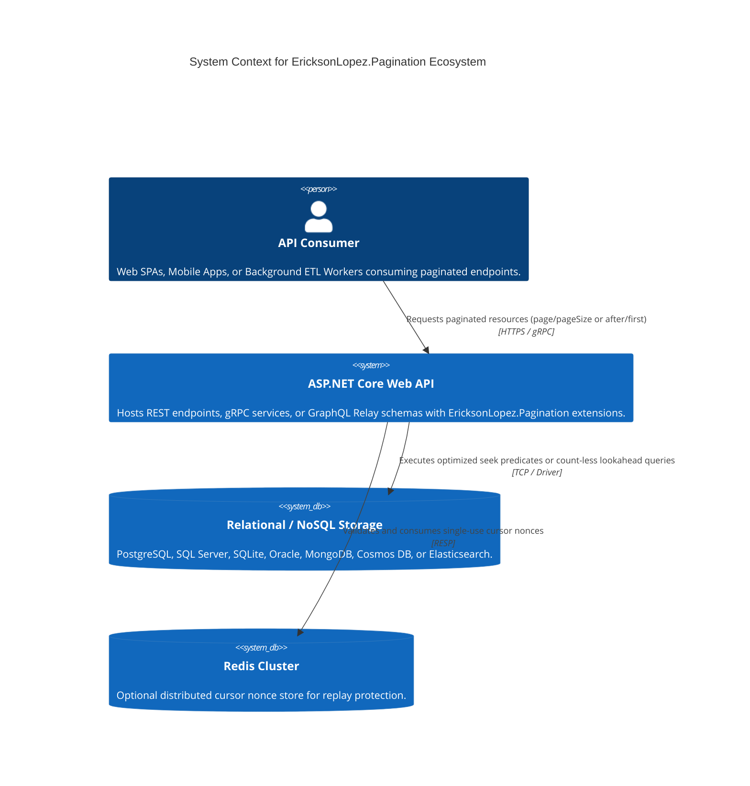
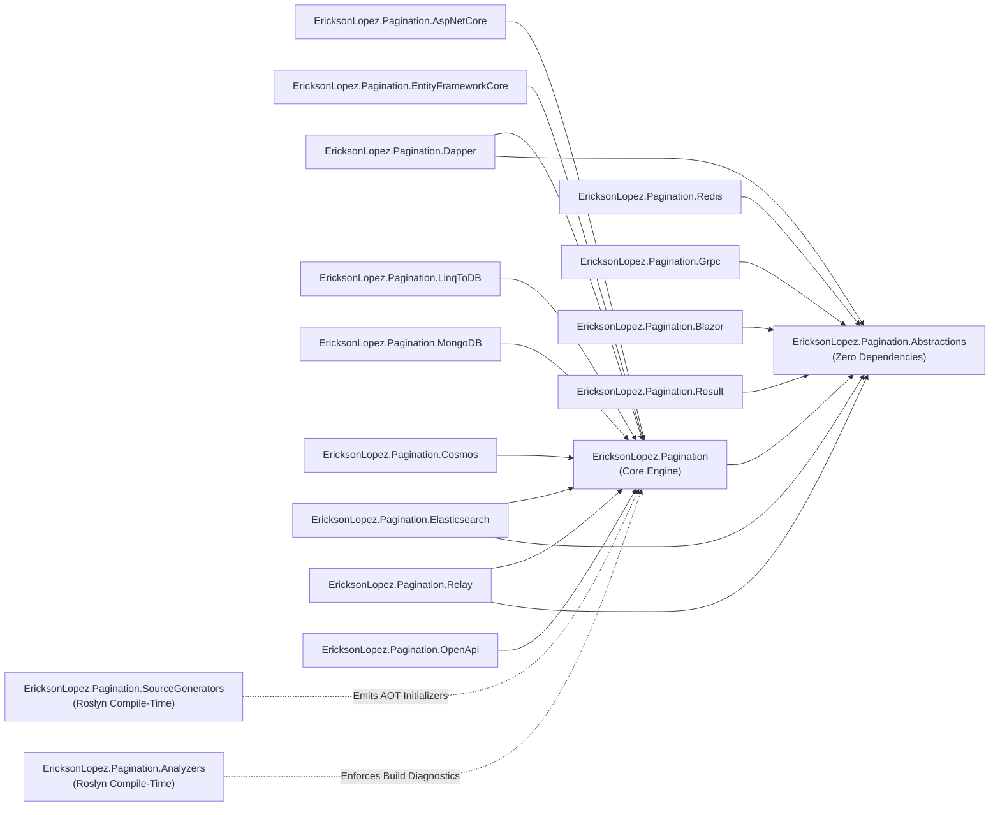
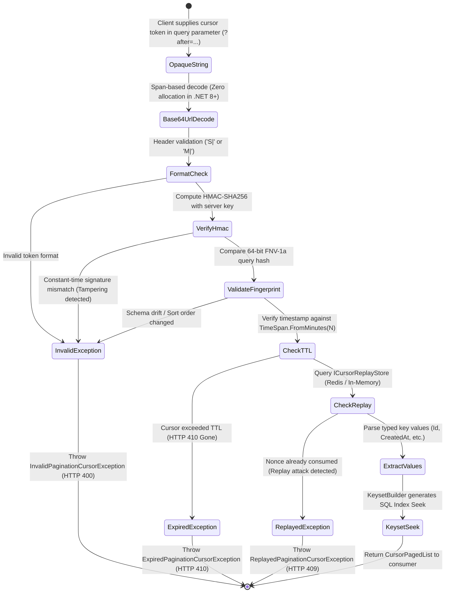
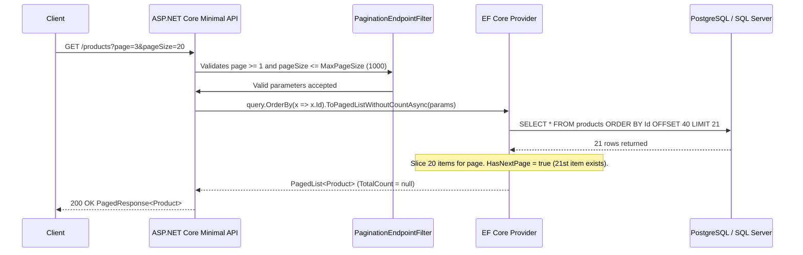
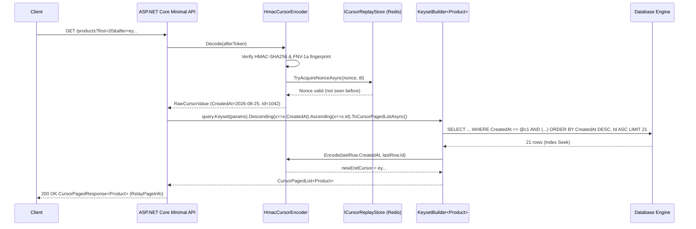

# System Architecture

`EricksonLopez.Pagination` is an enterprise-grade, zero-allocation universal pagination standard for modern .NET applications (.NET 8, .NET 9, .NET 10). 
It establishes a strict separation of concerns by defining clean, framework-agnostic pagination contracts (interfaces, structs, and primitives) independent of any specific data access technology, paired with specialized, high-performance integration extensions for relational ORMs, NoSQL databases, search engines, and modern transport protocols.

---

## Core Design Principles

1. **Persistence-Agnostic Core**: Core contracts (`IPagedList<T>`, `ICursorPagedList<T>`, `PaginationParameters`, `CursorPaginationParameters`, `ICursorEncoder`) have zero database dependencies.
2. **Zero-Coupling to HTTP in Domain**: Pagination semantics model dataset traversal independently of HTTP headers, query strings, or JSON response envelopes.
3. **Explicit over Magic**: No implicit `COUNT(*)` queries, no silent fallback to sequential scans, and no hidden round trips without consumer opt-in.
4. **Deterministic Keyset Seeking ($O(\log N)$)**: Keyset queries require a strictly unique tiebreaker column (enforced at compile-time via Roslyn analyzer `PAG002`–`PAG004`).
5. **Index-Seek Bounding Optimization (ADR-0019)**: Injects primary column seek bounds (`WHERE CreatedAt >= @p1 AND ...`) to guarantee relational query planners execute B-Tree Index Seeks rather than degraded index scans.
6. **Cryptographic Tamper-Proof Cursors (ADR-0017)**: High-throughput HMAC-SHA256 authenticated wire formats (`S|` single-column, `M|` multi-column) with optional TTL and distributed nonce replay protection (ADR-0035).
7. **Schema Drift Immunity (ADR-0007)**: FNV-1a 64-bit deterministic fingerprinting binds cursor tokens to keyset sort signatures, preventing corrupt page traversal during rolling deployments.
8. **Native AOT First**: Zero runtime reflection on hot paths; compile-time code generation via Roslyn Source Generators for cursor decoding and filter expression providers.

---

## Context Diagram (C4 Level 1)

The reference implementation `/samples/DemoApp` showcases the library operating within a Clean Architecture / CQRS boundary:



---

## Component Architecture

```mermaid
graph TD
    subgraph "Application Layer (ASP.NET Core / Web)"
        EP["Minimal API Endpoints / MVC Controllers"]
        MB["Model Binders:<br/>PaginationParametersModelBinder<br/>CursorPaginationParametersModelBinder"]
        F["Endpoint Filter:<br/>PaginationEndpointFilter"]
        R["Response Models:<br/>PagedResponse<T><br/>CursorPagedResponse<T><br/>Relay Connection<T>"]
    end

    subgraph "Core Library (EricksonLopez.Pagination)"
        PCO["PaginationCoreOptions"]
        CPCO["PaginationCursorOptions"]
        PL["PagedList<T> & CountedPagedList<T>"]
        CPL["CursorPagedList<T> & CountedCursorPagedList<T>"]
        HmacEnc["HmacCursorEncoder (HMAC-SHA256)"]
        B64Enc["Base64CursorEncoder"]
        Fnv["FNV-1a Fingerprint Engine"]
        Cache["PaginationExpressionCache"]
    end

    subgraph "Abstractions Layer (Zero Dependencies)"
        IPL["IPagedList<T> & ICountedPagedList<T>"]
        ICPL["ICursorPagedList<T> & ICursorPagedList"]
        Params["PaginationParameters & CursorPaginationParameters"]
        SortFilter["SortParameters & FilterParameters"]
        IEFilter["IFilterProvider<T> & IFilterOperatorProvider"]
        SecProt["ICursorEncoder, ICursorDecoderRegistry, ICursorReplayStore"]
    end

    subgraph "Infrastructure & Data Access Adapters"
        EF["EF Core:<br/>KeysetBuilder<T>, ToPagedListAsync"]
        Dap["Dapper:<br/>DapperKeysetBuilder<T>, ToPagedListAsync"]
        LtDb["LinqToDB:<br/>LinqToDBKeysetBuilder<T>"]
        Mdb["MongoDB:<br/>FindFluent & IMongoQueryable Extensions"]
        Cos["Cosmos DB:<br/>FeedIterator Continuation Translators"]
        Es["Elasticsearch:<br/>search_after SearchDescriptor Mappers"]
        Red["Redis:<br/>RedisCursorReplayStore"]
    end

    EP -->|Binds Struct Parameters| MB
    EP -->|Validates Input Ranges| F
    MB --> Params
    F --> Params
    
    EP -->|Executes Query| EF
    EP -->|Executes Query| Dap
    EP -->|Executes Query| LtDb
    EP -->|Executes Query| Mdb
    EP -->|Executes Query| Cos
    EP -->|Executes Query| Es
    
    EF -->|Produces| PL
    EF -->|Produces| CPL
    Dap -->|Produces| PL
    Dap -->|Produces| CPL
    LtDb -->|Produces| PL
    LtDb -->|Produces| CPL
    
    PL -.-> IPL
    CPL -.-> ICPL
    
    HmacEnc --> Fnv
    HmacEnc -.-> SecProt
    Red -.-> SecProt
    
    EP -->|Serializes Response| R
    R -.-> PL
    R -.-> CPL
```



---

## Package Dependency Graph

The 17 packages in the ecosystem adhere to a strict layered dependency structure:



---

## Keyset Index-Seek Mechanics (ADR-0019)

Traditional multi-column keyset queries without bounding conditions often cause relational query planners to choose suboptimal index skip-scans. `KeysetBuilder<T>` injects **Seek Bounding Predicates**:

```sql
-- Query generated for ORDER BY CreatedAt DESC, Id ASC with Cursor (CreatedAt=@c1, Id=@c2)
SELECT "Id", "CreatedAt", "Name"
FROM "Products"
WHERE "CreatedAt" <= @c1
  AND ("CreatedAt" < @c1 OR ("CreatedAt" = @c1 AND "Id" > @c2))
ORDER BY "CreatedAt" DESC, "Id" ASC
LIMIT 21;
```

1. **Bounding Guard (`"CreatedAt" <= @c1`)**: Immediately restricts the B-Tree index scan to pages matching or preceding `@c1`.
2. **Composite Tuple Disjunction**: Eliminates skipped or duplicate rows when adjacent records share identical timestamps.
3. **Lookahead Slicing (`LIMIT pageSize + 1`)**: Fetches one extra record to compute `HasNextPage` without running a separate `COUNT(*)` query.

---

## Cryptographic Cursor Lifecycle & State Machine (ADR-0017 / ADR-0035)



---

## Primary Execution Flows

### 1. Count-less Offset Lookahead Query



### 2. High-Performance Keyset Traversal


