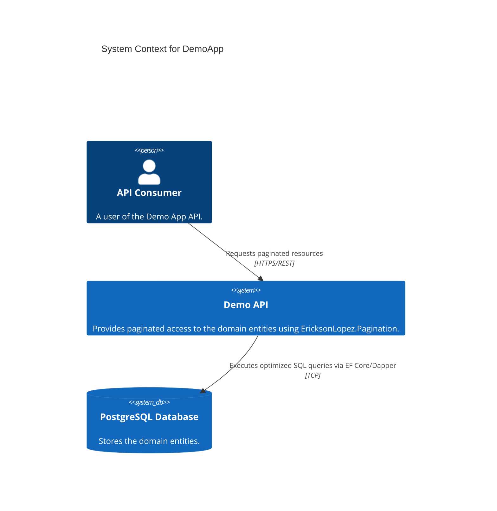
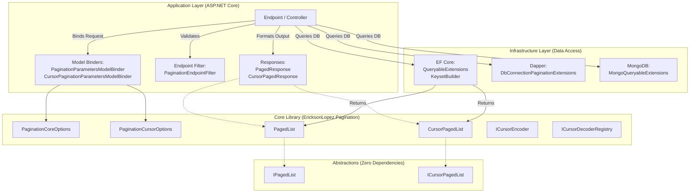
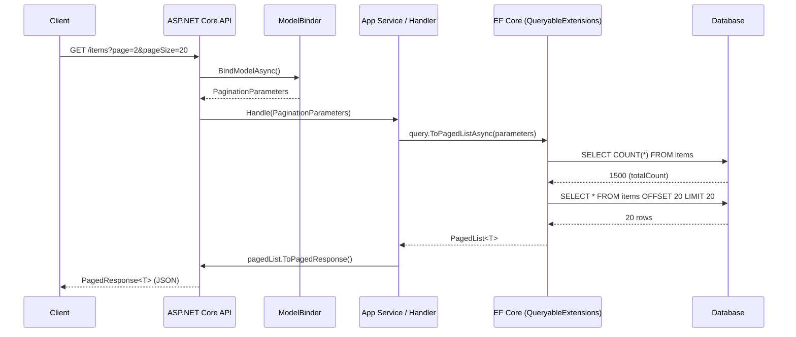
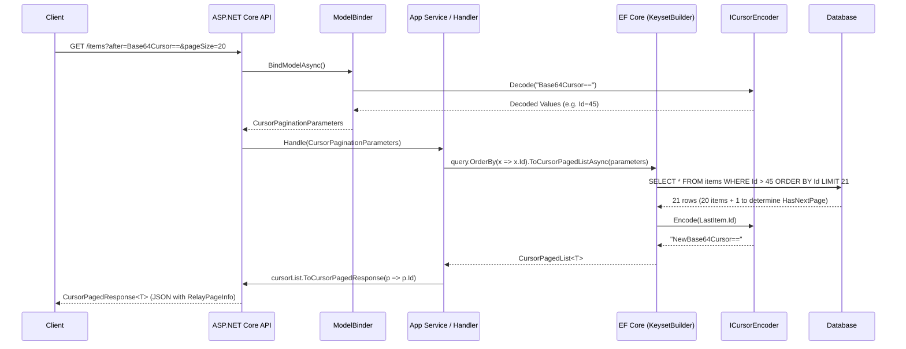
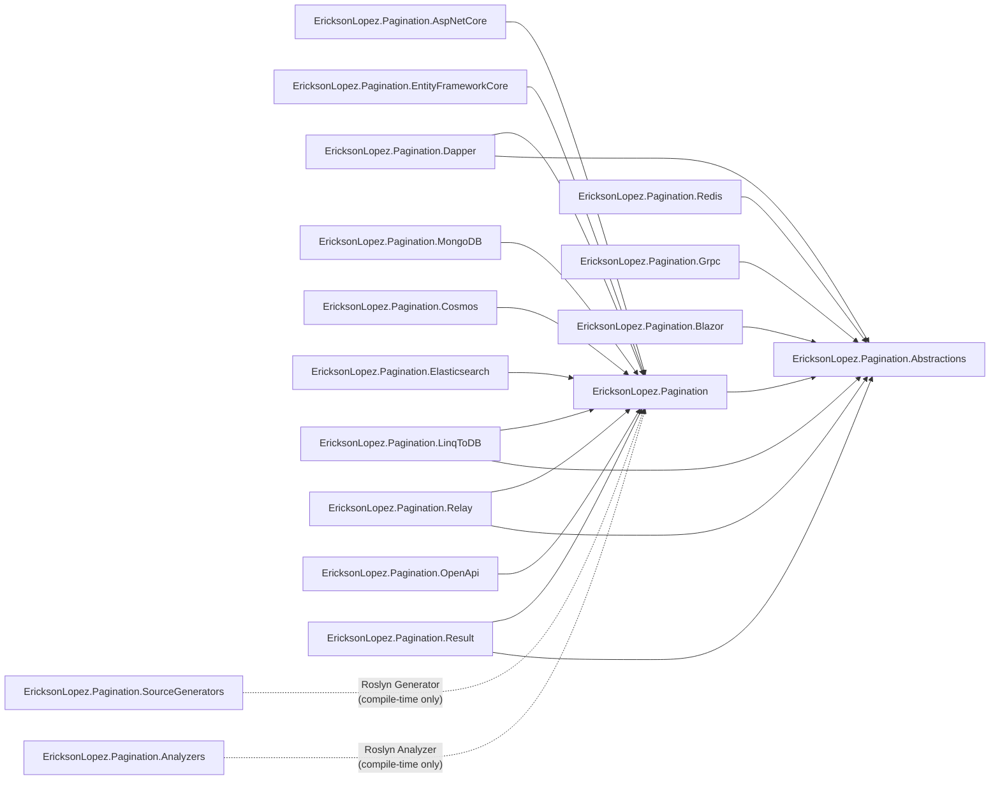

# System Architecture

`EricksonLopez.Pagination` is a highly-optimized, zero-allocation universal pagination standard for .NET applications. 
It establishes a strict separation of concerns by defining clean pagination contracts (interfaces, DTOs, and primitives) independent of any specific data access technology, and offering specialized, high-performance integration extensions for various ORMs.

## Core Design Principles

1. **Abstractions First**: The contract is completely independent of the implementation.
2. **Performance by Default**: Avoiding `COUNT(*)` when unnecessary, zero-allocation structures where possible, and natively supporting `IAsyncEnumerable`.
3. **O(log n) Keyset Pagination (When Indexed)**: Native support for Keyset (Cursor) Pagination, avoiding the performance degradation of `OFFSET/FETCH` at large depths. Requires a database index on the keyset column(s) — without one, the database falls back to a sequential scan.

## Context Diagram (C4 Level 1)

The `/samples/DemoApp` project acts as a reference implementation of the library in a Clean Architecture context.

## Component Architecture

## Primary Flow: Offset Pagination

## Primary Flow: Keyset (Cursor) Pagination

## Package Dependency Graph

> [!NOTE]
> The dependency graph above reflects the actual `ProjectReference` entries in each `.csproj` file. `Blazor`, `Grpc`, and `Redis` depend only on `Abstractions` (not `Core`), keeping their dependency footprint minimal. `OpenApi` depends on `Core` (not `AspNetCore`). `SourceGenerators` and `Analyzers` are Roslyn analyzers that run at compile-time and do not create runtime dependencies. `EricksonLopez.Pagination.Result` currently only targets `net10.0`.
