# 📊 Benchmark Results (Multi-Engine)
This document is automatically generated by `BenchmarkRunner`.

## 🖥️ Environment & Setup
- **Dataset**: 1,000,000 records seeded in each database engine.
- **Indexes**: Optimal indexes applied (e.g., `IX_Products_Price_CreatedAt` for Keyset/Sort).
- **EF Core**: All queries are executed using `AsNoTracking()` to isolate translation and execution speed without Change Tracker overhead.
- **Isolation**: No ambient transactions are used during reading to prevent lock contention.
- **Framework**: .NET 10.0 with Release configuration.

## 🏆 Legend
- **🚀 EricksonLopez**: The reference implementation under test (Our Library).
- **🔧 RawSqlOffset / RawSqlKeyset**: The raw Entity Framework Core SQL baseline.
- **✅ Best 🥇**: The fastest provider for a given parameter block.
- **❌ Worst**: The slowest provider for a given parameter block.

## 🚀 Keyset vs Offset at Scale (Deep Pagination)
This benchmark demonstrates the fundamental limitation of `OFFSET` SQL and why Keyset (Cursor) pagination is required for large datasets.

**Dataset**: 1,000,000 rows (PostgreSQL 16 via Testcontainers).
**Scenario**: Fetching `PageSize=100` at depths: Page 1 (0 rows skipped), Page 100 (9,900 rows skipped), Page 10,000 (999,900 rows skipped).
**Environment**: AMD Ryzen 7 9800X3D (8C/8T @ 4.70 GHz), .NET 10.0.10 Release, Windows 11.

```
BenchmarkDotNet v0.15.8, Windows 11 (10.0.26200.9168/25H2/2025Update/HudsonValley2)
AMD Ryzen 7 9800X3D 4.70GHz, 1 CPU, 8 logical and 8 physical cores
.NET SDK 10.0.302
  [Host]     : .NET 10.0.10 (10.0.10, 10.0.1026.32716), X64 RyuJIT x86-64-v4
  Job-CNUJVU : .NET 10.0.10 (10.0.10, 10.0.1026.32716), X64 RyuJIT x86-64-v4
```

| Method             | TargetPage | Rows Skipped | Mean Latency | Median Latency | Allocated | Speedup (Mean / Median) |
|------------------- |-----------:|-------------:|-------------:|---------------:|----------:|------------------------:|
| Offset_Degradation | 1          | 0            | 17.07 ms     | 15.21 ms       | 46.61 KB  | 1.0x (Baseline)         |
| Keyset_Stability   | 1          | 0            |  8.85 ms     |  7.18 ms       | 54.61 KB  | **1.9x / 2.1x**         |
|                    |            |              |              |                |           |                         |
| Offset_Degradation | 100        | 9,900        | 13.68 ms     | 13.16 ms       | 47.55 KB  | 1.0x (Baseline)         |
| Keyset_Stability   | 100        | 9,900        |  2.34 ms     |  1.88 ms       | 57.05 KB  | **5.9x / 7.0x**         |
|                    |            |              |              |                |           |                         |
| Offset_Degradation | 10,000     | 999,900      | 93.76 ms     | 82.02 ms       | 47.39 KB  | 1.0x (Baseline)         |
| Keyset_Stability   | 10,000     | 999,900      | 12.03 ms     |  9.72 ms       | 52.61 KB  | **7.8x / 8.4x**         |

### 📊 Why does this happen?
*   **Offset (O(N))**: To fetch page 10,000, the database executes `OFFSET 999900 LIMIT 100`. It must read, count, and discard 999,900 rows before returning the 100 requested rows. As depth increases, latency degrades from 13.7 ms to 93.8 ms.
*   **Keyset (O(log N))**: Keyset executes `WHERE Age >= @p1 AND (Age > @p1 OR (Age = @p1 AND Id > @p2)) LIMIT 100`. Because `Age, Id` is indexed, the database performs a B-Tree index seek directly to the seek target and reads the next 100 rows.
*   **Bounding Conditions (ADR 0019)**: Our implementation explicitly injects index-seek bounding conditions (`Age >= @p1`) to guarantee the query planner never degrades to index scans for deep multi-column OR expressions.
*   **Cryptographic Overhead Included (ADR 0020)**: Keyset measurements include end-to-end cursor parsing, Base64 decoding, HMAC-SHA256 signature verification, constant-time comparison, and next/prev cursor generation.

---

## 🌐 Keyset Scalability up to 10 Million Rows
To verify true asymptotic $O(\log N)$ performance, we benchmarked keyset seek queries on PostgreSQL across datasets scaling up to 10,000,000 rows.

| Method            | Depth (Rows Skipped) | Mean Latency | Median Latency | Allocated | Latency Scaling |
|------------------ |---------------------:|-------------:|---------------:|----------:|----------------:|
| Keyset_Page1      | 0                    | 3.75 ms      | 2.12 ms        | 48.57 KB  | $O(\log N)$     |
| Keyset_Depth_100K | 100,000              | 2.05 ms      | 1.76 ms        | 21.43 KB  | **Flat**        |
| Keyset_Depth_1M   | 1,000,000            | 2.23 ms      | 1.70 ms        | 21.39 KB  | **Flat**        |
| Keyset_Depth_10M  | 10,000,000           | 1.69 ms      | 1.61 ms        | 21.57 KB  | **Flat**        |
| Offset_Depth_100K | 100,000              | 5.94 ms      | 5.44 ms        | 18.75 KB  | $O(N)$ Degraded |
| Offset_Depth_1M   | 1,000,000            | 6.04 ms      | 5.52 ms        | 18.69 KB  | $O(N)$ Degraded |

> **Takeaway**: Keyset seek latency remains strictly bounded between 1.6 ms and 2.2 ms whether querying row 100, row 100,000, or row 10,000,000.

---

## 🔒 Keyset vs Raw SQL ADO.NET Baseline & Isolated Codec Cost
To determine the library's abstraction overhead above raw ADO.NET SQL execution, we compared:
1. `RawSql_Keyset`: Hand-crafted parameterized `NpgsqlCommand` executing `WHERE "Id" > @afterId ORDER BY "Id" LIMIT 100`.
2. `RawSql_Offset`: `NpgsqlCommand` executing `ORDER BY "Id" OFFSET 49900 LIMIT 100`.
3. `EricksonLopez_Keyset_Full`: Full library pipeline (cursor string parsing, HMAC decode, expression generation, EF Core compilation & materialization, cursor HMAC encoding).
4. `Cursor_Codec_Only`: Isolated C# cursor decoding + HMAC verification + encoding.

| Method                    | Mean Latency | Median Latency | Allocated | Description |
|-------------------------- |-------------:|---------------:|----------:|-------------|
| Cursor_Codec_Only         |     0.77 μs  |       0.77 μs  |     640 B | Cryptographic decode + HMAC + encode token |
| RawSql_Keyset             |   902.22 μs  |     791.61 μs  |   2,345 B | Raw ADO.NET index seek (zero ORM overhead) |
| EricksonLopez_Keyset_Full | 1,934.07 μs  |   1,677.91 μs  |  52,978 B | Full EF Core Keyset pipeline + HMAC security |
| RawSql_Offset             | 4,028.65 μs  |   3,258.31 μs  |   2,238 B | Raw ADO.NET offset scan at row 49,900 |

> **Key Insight**: The cryptographic codec adds less than **1 microsecond (0.77 μs)** of CPU overhead. The difference between `RawSql_Keyset` and `EricksonLopez_Keyset_Full` is the standard EF Core LINQ translation and entity materialization overhead (~1 ms), not cursor encryption.

---

## 🔐 Cryptographic Cursor Codec Benchmark (Base64 vs HMAC-SHA256 vs TTL)
This in-memory microbenchmark isolates cursor generation and validation across single-column, multi-column (composite), and TTL-enabled configurations.

```
BenchmarkDotNet v0.15.8, Windows 11 (10.0.26200.9168)
AMD Ryzen 7 9800X3D 4.70GHz, 1 CPU, 8 logical and 8 physical cores, .NET 10.0.10
```

| Method               | Mean Latency | StdDev   | Gen0 / 1k Ops | Allocated | Security Guarantee |
|--------------------- |-------------:|---------:|--------------:|----------:|--------------------|
| Base64_Encode_Single |     327.1 ns |  1.36 ns |        0.0086 |     448 B | None (Obfuscation only) |
| Hmac_Encode_Single   | **259.9 ns** |  2.45 ns |        0.0086 |     448 B | 🔒 HMAC-SHA256 Authenticated |
| Base64_Decode_Single |     445.0 ns |  1.44 ns |        0.0038 |     208 B | None |
| Hmac_Decode_Single   | **364.6 ns** |  1.77 ns |        0.0038 |     208 B | 🔒 Signature Verified |
| Base64_Encode_Multi  |     347.0 ns |  3.50 ns |        0.0134 |     680 B | None |
| Hmac_Encode_Multi    | **272.9 ns** |  5.49 ns |        0.0134 |     680 B | 🔒 Multi-column Signed |
| Base64_Decode_Multi  |     441.9 ns |  5.38 ns |        0.0081 |     416 B | None |
| Hmac_Decode_Multi    | **379.7 ns** |  9.41 ns |        0.0081 |     416 B | 🔒 Multi-column Verified |
| Hmac_Encode_WithTTL  |     347.9 ns |  3.44 ns |        0.0100 |     520 B | 🔒 HMAC + TTL Expiration |
| Hmac_Decode_WithTTL  |     394.6 ns |  4.66 ns |        0.0057 |     304 B | 🔒 Signature + Timestamp Checked |

> **Conclusion**: `HmacCursorEncoder` provides cryptographic tamper-proofing in **sub-400 nanoseconds** per request with minimal allocations (208–680 B) and zero Gen1/Gen2 garbage collection pressure.

---

## ⚡ Warm Start vs Cold Start EF Core Benchmark
Comparing steady-state execution (query plan cached) versus startup execution (DbContext model creation and expression tree compilation).

**Dataset**: 100,000 rows (PostgreSQL 16 via Testcontainers), PageSize = 100, Target Page = 50.

| Method               | Mean Latency | Median Latency | Allocated Memory | State Type |
|--------------------- |-------------:|---------------:|-----------------:|------------|
| WarmStart_MRKeyset   |     1.020 ms |       0.926 ms |         45.68 KB | Warm (Cached) |
| WarmStart_Keyset     |     1.798 ms |       1.680 ms |         48.77 KB | Warm (Cached) |
| WarmStart_XPagedList |     4.974 ms |       4.350 ms |         43.94 KB | Warm (Cached) |
| WarmStart_Offset     |     5.183 ms |       4.545 ms |         43.26 KB | Warm (Cached) |
| ColdStart_MRKeyset   |     8.257 ms |       7.603 ms |      1,391.70 KB | Cold (New Context) |
| ColdStart_Keyset     |     8.972 ms |       8.528 ms |      1,396.43 KB | Cold (New Context) |
| ColdStart_Offset     |    13.558 ms |      12.174 ms |      1,447.95 KB | Cold (New Context) |
| ColdStart_XPagedList |    14.512 ms |      13.176 ms |      1,448.09 KB | Cold (New Context) |

---

## ⚡ Filter Expression AST Compilation & Cache Benchmark
Measures the latency of `FilterExpression.Build<T>()` parsing DSL strings like `Name~=John,Age>=18`.

| Method               | Mean Latency | StdDev    | Gen0 / 1k Ops | Allocated | Speedup |
|--------------------- |-------------:|----------:|--------------:|----------:|--------:|
| BuildExpression_Warm |  **32.64 ns**|  1.15 ns  |        0.0035 |     176 B | **25.5x** |
| BuildExpression_Cold |     833.34 ns| 20.36 ns  |        0.0381 |   2,064 B | Baseline |

---

## ⚡ Executive Summary
The table below shows the overall dominant pagination provider per database engine across all benchmarks.

| Database Engine | Overall Winner |
|----------------|----------------|
| MySQL | 🔧 RawSqlOffset |
| Oracle | Sieve |
| PostgreSQL | 🚀 **EricksonLopez** |
| SQLite | 🚀 **EricksonLopez** |
| SQLServer | 🚀 **EricksonLopez** |

## Filter Pagination Benchmark

```

BenchmarkDotNet v0.15.8, Windows 11 (10.0.26200.8875/25H2/2025Update/HudsonValley2)
AMD Ryzen 7 9800X3D 4.70GHz, 1 CPU, 8 logical and 8 physical cores
.NET SDK 10.0.302
  [Host]     : .NET 10.0.10 (10.0.10, 10.0.1026.32716), X64 RyuJIT x86-64-v4
  Job-CNUJVU : .NET 10.0.10 (10.0.10, 10.0.1026.32716), X64 RyuJIT x86-64-v4

InvocationCount=1  UnrollFactor=1  

```
### 📈 Performance Trend (PageSize 10, Page 1)


```mermaid
xychart-beta
    title "Filter Pagination Benchmark (Latency in us)"
    x-axis ["PostgreSQL"]
    y-axis "Latency (us)"
    bar "EricksonLopez" [916]
    bar "Ardalis" [949]
    bar "RawSqlOffset" [957]
    bar "Sieve" [1493]
```

| Method        | PageSize | PageNumber | Engine     | Mean         | Error        | StdDev        | Median       | Min          | Max          | Ratio | RatioSD | Rank | Gen0      | Allocated    | Alloc Ratio |
|-------------- |--------- |----------- |----------- |-------------:|-------------:|--------------:|-------------:|-------------:|-------------:|------:|--------:|-----:|----------:|-------------:|------------:|
| 🚀 **EricksonLopez** ✅ Best 🥇 | 10       | 1          | PostgreSQL |     915.6 μs |     25.92 μs |      71.82 μs |     903.7 μs |     819.6 μs |   1,137.3 μs |  0.96 |    0.08 |    1 |         - |     28.24 KB |        0.91 |
| Ardalis       | 10       | 1          | PostgreSQL |     949.2 μs |     18.49 μs |      29.33 μs |     944.5 μs |     901.7 μs |   1,010.8 μs |  0.99 |    0.05 |    1 |         - |     28.61 KB |        0.92 |
| 🔧 RawSqlOffset  | 10       | 1          | PostgreSQL |     957.4 μs |     19.08 μs |      36.31 μs |     954.3 μs |     895.3 μs |   1,059.5 μs |  1.00 |    0.05 |    1 |         - |     31.08 KB |        1.00 |
| Sieve ❌ Worst         | 10       | 1          | PostgreSQL |   1,492.7 μs |     29.47 μs |      73.39 μs |   1,483.9 μs |   1,370.6 μs |   1,701.9 μs |  1.56 |    0.10 |    2 |         - |     54.57 KB |        1.76 |
| | | | | | | | | | | | | | | |
| 🚀 **EricksonLopez** ✅ Best 🥇 | 10       | 1          | SQLServer  |   1,320.8 μs |     67.11 μs |     185.97 μs |   1,272.3 μs |   1,093.7 μs |   1,841.6 μs |  0.55 |    0.26 |    1 |         - |     43.83 KB |        0.93 |
| Ardalis       | 10       | 1          | SQLServer  |   1,468.9 μs |     48.01 μs |     129.80 μs |   1,428.3 μs |   1,304.6 μs |   1,915.8 μs |  0.62 |    0.28 |    2 |         - |     34.16 KB |        0.72 |
| Sieve         | 10       | 1          | SQLServer  |   2,396.8 μs |    180.23 μs |     490.32 μs |   2,206.4 μs |   1,859.2 μs |   3,993.6 μs |  1.00 |    0.49 |    3 |         - |     71.09 KB |        1.51 |
| 🔧 RawSqlOffset ❌ Worst  | 10       | 1          | SQLServer  |   3,159.6 μs |    692.15 μs |   1,974.74 μs |   2,416.4 μs |   1,357.4 μs |   8,662.7 μs |  1.32 |    1.07 |    3 |         - |      47.2 KB |        1.00 |
| | | | | | | | | | | | | | | |
| 🚀 **EricksonLopez** ✅ Best 🥇 | 10       | 1          | MySQL      |   2,310.9 μs |     45.64 μs |      35.64 μs |   2,307.2 μs |   2,239.7 μs |   2,357.5 μs |  0.95 |    0.05 |    1 |         - |    159.84 KB |        1.06 |
| 🔧 RawSqlOffset  | 10       | 1          | MySQL      |   2,433.9 μs |     48.64 μs |     123.81 μs |   2,426.7 μs |   2,171.8 μs |   2,751.9 μs |  1.00 |    0.07 |    1 |         - |    151.24 KB |        1.00 |
| Ardalis       | 10       | 1          | MySQL      |   2,985.3 μs |    281.58 μs |     780.25 μs |   2,653.9 μs |   2,246.1 μs |   5,507.2 μs |  1.23 |    0.33 |    2 |         - |       148 KB |        0.98 |
| Sieve ❌ Worst         | 10       | 1          | MySQL      |   4,645.5 μs |    652.40 μs |   1,850.74 μs |   4,051.8 μs |   2,898.3 μs |   9,491.1 μs |  1.91 |    0.77 |    3 |         - |    174.76 KB |        1.16 |
| | | | | | | | | | | | | | | |
| Ardalis ✅ Best 🥇       | 10       | 1          | Oracle     |   1,075.3 μs |     28.51 μs |      82.26 μs |   1,051.3 μs |     960.5 μs |   1,323.0 μs |  0.05 |    0.01 |    1 |         - |     39.08 KB |        0.68 |
| 🚀 **EricksonLopez** | 10       | 1          | Oracle     |   1,086.1 μs |     21.66 μs |      61.43 μs |   1,083.9 μs |     957.1 μs |   1,236.1 μs |  0.05 |    0.01 |    1 |         - |     53.11 KB |        0.93 |
| 🔧 RawSqlOffset  | 10       | 1          | Oracle     |  21,262.9 μs |  1,234.67 μs |   3,601.60 μs |  20,690.8 μs |  15,251.5 μs |  31,237.5 μs |  1.03 |    0.24 |    2 |         - |     57.35 KB |        1.00 |
| Sieve ❌ Worst         | 10       | 1          | Oracle     |  22,602.5 μs |  1,004.28 μs |   2,897.56 μs |  22,321.3 μs |  17,221.8 μs |  31,832.2 μs |  1.09 |    0.23 |    2 |         - |     81.54 KB |        1.42 |
| | | | | | | | | | | | | | | |
| 🚀 **EricksonLopez** ✅ Best 🥇 | 10       | 1          | SQLite     |     307.8 μs |     14.68 μs |      42.82 μs |     306.1 μs |     232.9 μs |     427.7 μs |  0.98 |    0.16 |    1 |         - |     37.65 KB |        0.97 |
| 🔧 RawSqlOffset  | 10       | 1          | SQLite     |     315.7 μs |      9.01 μs |      25.70 μs |     314.4 μs |     251.8 μs |     375.3 μs |  1.01 |    0.12 |    1 |         - |     38.95 KB |        1.00 |
| Ardalis       | 10       | 1          | SQLite     |     318.5 μs |     11.41 μs |      33.11 μs |     313.1 μs |     248.9 μs |     398.6 μs |  1.02 |    0.14 |    1 |         - |     36.45 KB |        0.94 |
| Sieve ❌ Worst         | 10       | 1          | SQLite     |     742.0 μs |     14.50 μs |      25.78 μs |     737.4 μs |     698.8 μs |     813.4 μs |  2.37 |    0.21 |    2 |         - |     62.52 KB |        1.60 |
| | | | | | | | | | | | | | | |
| 🚀 **EricksonLopez** ✅ Best 🥇 | 10       | 100        | PostgreSQL |     969.5 μs |     19.37 μs |      32.36 μs |     965.2 μs |     907.8 μs |   1,036.7 μs |  0.11 |    0.02 |    1 |         - |     28.37 KB |        0.90 |
| Ardalis       | 10       | 100        | PostgreSQL |   8,889.7 μs |    692.09 μs |   1,917.78 μs |   8,259.1 μs |   7,043.5 μs |  15,161.9 μs |  1.03 |    0.31 |    2 |         - |     31.84 KB |        1.01 |
| 🔧 RawSqlOffset  | 10       | 100        | PostgreSQL |   9,118.5 μs |    928.88 μs |   2,542.79 μs |   8,280.5 μs |   6,782.3 μs |  16,561.7 μs |  1.06 |    0.37 |    2 |         - |     31.41 KB |        1.00 |
| Sieve ❌ Worst         | 10       | 100        | PostgreSQL |   9,179.6 μs |    380.36 μs |   1,109.54 μs |   8,985.4 μs |   7,506.0 μs |  11,892.7 μs |  1.06 |    0.25 |    2 |         - |     54.52 KB |        1.74 |
| | | | | | | | | | | | | | | |
| 🚀 **EricksonLopez** ✅ Best 🥇 | 10       | 100        | SQLServer  |   2,097.0 μs |    289.67 μs |     807.49 μs |   1,722.5 μs |   1,415.1 μs |   4,605.9 μs |  0.13 |    0.05 |    1 |         - |     40.74 KB |        0.86 |
| Sieve         | 10       | 100        | SQLServer  |  15,216.4 μs |    284.79 μs |     687.80 μs |  15,097.4 μs |  13,855.1 μs |  16,771.6 μs |  0.97 |    0.11 |    2 |         - |     71.04 KB |        1.50 |
| 🔧 RawSqlOffset  | 10       | 100        | SQLServer  |  15,936.6 μs |    651.30 μs |   1,782.92 μs |  15,547.5 μs |  13,542.5 μs |  21,635.6 μs |  1.01 |    0.15 |    2 |         - |     47.23 KB |        1.00 |
| Ardalis ❌ Worst       | 10       | 100        | SQLServer  |  16,313.8 μs |    804.76 μs |   2,256.64 μs |  16,028.6 μs |  13,243.9 μs |  23,275.1 μs |  1.04 |    0.18 |    2 |         - |     47.55 KB |        1.01 |
| | | | | | | | | | | | | | | |
| Ardalis ✅ Best 🥇       | 10       | 100        | MySQL      |   3,213.5 μs |     63.66 μs |     152.52 μs |   3,205.3 μs |   2,880.0 μs |   3,568.2 μs |  0.64 |    0.21 |    1 |         - |    152.14 KB |        1.00 |
| Sieve         | 10       | 100        | MySQL      |   3,732.7 μs |     76.10 μs |     215.88 μs |   3,696.4 μs |   3,392.8 μs |   4,311.1 μs |  0.75 |    0.25 |    2 |         - |    175.02 KB |        1.15 |
| 🔧 RawSqlOffset  | 10       | 100        | MySQL      |   5,667.9 μs |    756.47 μs |   2,182.59 μs |   5,036.4 μs |   3,217.7 μs |  11,675.1 μs |  1.13 |    0.59 |    3 |         - |    152.05 KB |        1.00 |
| 🚀 **EricksonLopez** ❌ Worst | 10       | 100        | MySQL      |   6,351.9 μs |  1,204.33 μs |   3,396.84 μs |   5,386.6 μs |   2,715.5 μs |  15,784.0 μs |  1.27 |    0.82 |    3 |         - |    155.57 KB |        1.02 |
| | | | | | | | | | | | | | | |
| 🚀 **EricksonLopez** ✅ Best 🥇 | 10       | 100        | Oracle     |   1,391.4 μs |     36.21 μs |     103.88 μs |   1,357.9 μs |   1,252.1 μs |   1,684.1 μs |  0.06 |    0.01 |    1 |         - |     53.39 KB |        0.90 |
| Ardalis       | 10       | 100        | Oracle     |  22,052.8 μs |    933.55 μs |   2,723.21 μs |  21,577.3 μs |  17,800.8 μs |  30,019.7 μs |  0.99 |    0.19 |    2 |         - |     57.67 KB |        0.97 |
| 🔧 RawSqlOffset  | 10       | 100        | Oracle     |  22,721.1 μs |  1,341.01 μs |   3,738.21 μs |  21,613.5 μs |  17,094.4 μs |  34,352.1 μs |  1.02 |    0.23 |    2 |         - |     59.24 KB |        1.00 |
| Sieve ❌ Worst         | 10       | 100        | Oracle     |  23,686.0 μs |  1,444.36 μs |   4,190.35 μs |  22,397.1 μs |  17,643.1 μs |  34,565.9 μs |  1.07 |    0.25 |    2 |         - |     82.77 KB |        1.40 |
| | | | | | | | | | | | | | | |
| 🚀 **EricksonLopez** ✅ Best 🥇 | 10       | 100        | SQLite     |   1,067.0 μs |     20.70 μs |      34.01 μs |   1,058.5 μs |     997.9 μs |   1,138.4 μs |  0.31 |    0.01 |    1 |         - |     446.6 KB |        0.97 |
| 🔧 RawSqlOffset  | 10       | 100        | SQLite     |   3,455.6 μs |     55.48 μs |      54.49 μs |   3,442.2 μs |   3,379.5 μs |   3,577.3 μs |  1.00 |    0.02 |    2 |         - |    461.48 KB |        1.00 |
| Ardalis       | 10       | 100        | SQLite     |   3,618.2 μs |     72.05 μs |     101.00 μs |   3,615.1 μs |   3,448.8 μs |   3,818.8 μs |  1.05 |    0.03 |    2 |         - |    455.55 KB |        0.99 |
| Sieve ❌ Worst         | 10       | 100        | SQLite     |   4,149.8 μs |     82.97 μs |     140.89 μs |   4,130.5 μs |   3,935.1 μs |   4,486.0 μs |  1.20 |    0.04 |    3 |         - |    478.56 KB |        1.04 |
| | | | | | | | | | | | | | | |
| Ardalis ✅ Best 🥇       | 10       | 10000      | PostgreSQL |  14,886.9 μs |    781.30 μs |   2,177.95 μs |  14,604.5 μs |  11,003.4 μs |  20,175.6 μs |  0.76 |    0.30 |    1 |         - |     22.83 KB |        1.01 |
| 🚀 **EricksonLopez** | 10       | 10000      | PostgreSQL |  16,410.0 μs |    766.00 μs |   2,096.91 μs |  16,071.1 μs |  13,581.9 μs |  22,795.2 μs |  0.84 |    0.32 |    1 |         - |     28.05 KB |        1.24 |
| Sieve         | 10       | 10000      | PostgreSQL |  16,772.3 μs |  1,495.07 μs |   4,361.18 μs |  15,994.8 μs |  10,164.6 μs |  28,833.8 μs |  0.85 |    0.39 |    1 |         - |     45.63 KB |        2.02 |
| 🔧 RawSqlOffset ❌ Worst  | 10       | 10000      | PostgreSQL |  21,837.7 μs |  2,253.05 μs |   6,536.51 μs |  22,026.8 μs |  10,322.9 μs |  38,441.6 μs |  1.11 |    0.53 |    2 |         - |     22.59 KB |        1.00 |
| | | | | | | | | | | | | | | |
| 🚀 **EricksonLopez** ✅ Best 🥇 | 10       | 10000      | SQLServer  |  30,985.8 μs |    575.09 μs |     928.66 μs |  30,909.3 μs |  29,223.8 μs |  33,692.4 μs |  0.12 |    0.02 |    1 |         - |     40.36 KB |        1.10 |
| Ardalis       | 10       | 10000      | SQLServer  | 243,570.1 μs | 16,081.56 μs |  43,751.07 μs | 224,320.0 μs | 206,761.9 μs | 406,105.8 μs |  0.95 |    0.25 |    2 |         - |      36.8 KB |        1.01 |
| 🔧 RawSqlOffset  | 10       | 10000      | SQLServer  | 268,166.2 μs | 23,955.63 μs |  67,174.17 μs | 241,085.5 μs | 210,238.5 μs | 458,206.7 μs |  1.05 |    0.33 |    2 |         - |     36.59 KB |        1.00 |
| Sieve ❌ Worst         | 10       | 10000      | SQLServer  | 419,493.2 μs | 51,483.53 μs | 151,800.36 μs | 494,901.5 μs | 212,313.3 μs | 683,021.2 μs |  1.64 |    0.68 |    3 |         - |     59.48 KB |        1.63 |
| | | | | | | | | | | | | | | |
| 🔧 RawSqlOffset ✅ Best 🥇  | 10       | 10000      | MySQL      |  15,916.2 μs |    562.40 μs |   1,622.66 μs |  15,898.4 μs |  13,027.1 μs |  20,020.9 μs |  1.01 |    0.14 |    1 |         - |     67.67 KB |        1.00 |
| Ardalis       | 10       | 10000      | MySQL      |  21,104.3 μs |  1,162.64 μs |   3,182.70 μs |  20,800.7 μs |  16,212.3 μs |  31,272.0 μs |  1.34 |    0.24 |    2 |         - |     67.15 KB |        0.99 |
| Sieve         | 10       | 10000      | MySQL      |  22,298.4 μs |  1,983.74 μs |   5,659.73 μs |  20,737.5 μs |  14,484.6 μs |  38,023.0 μs |  1.42 |    0.39 |    2 |         - |      90.7 KB |        1.34 |
| 🚀 **EricksonLopez** ❌ Worst | 10       | 10000      | MySQL      |  40,005.0 μs |  2,311.66 μs |   6,405.59 μs |  37,233.6 μs |  34,878.0 μs |  63,007.3 μs |  2.54 |    0.48 |    3 |         - |     152.2 KB |        2.25 |
| | | | | | | | | | | | | | | |
| Sieve ✅ Best 🥇         | 10       | 10000      | Oracle     |  30,704.3 μs |  1,309.93 μs |   3,673.19 μs |  30,152.5 μs |  24,094.2 μs |  40,213.2 μs |  1.01 |    0.17 |    1 |         - |      67.8 KB |        1.58 |
| 🔧 RawSqlOffset  | 10       | 10000      | Oracle     |  30,930.8 μs |  1,313.23 μs |   3,660.75 μs |  30,555.8 μs |  24,862.9 μs |  41,863.9 μs |  1.01 |    0.17 |    1 |         - |     42.96 KB |        1.00 |
| Ardalis       | 10       | 10000      | Oracle     |  31,486.6 μs |  1,687.95 μs |   4,733.19 μs |  30,260.3 μs |  24,088.2 μs |  44,093.2 μs |  1.03 |    0.20 |    1 |         - |     43.59 KB |        1.01 |
| 🚀 **EricksonLopez** ❌ Worst | 10       | 10000      | Oracle     |  58,625.6 μs |  4,672.06 μs |  13,628.62 μs |  53,165.3 μs |  42,893.9 μs | 102,254.5 μs |  1.92 |    0.50 |    2 |         - |     49.38 KB |        1.15 |
| | | | | | | | | | | | | | | |
| 🔧 RawSqlOffset ✅ Best 🥇  | 10       | 10000      | SQLite     |  45,315.0 μs |    899.88 μs |   1,346.90 μs |  45,397.1 μs |  43,142.9 μs |  48,144.8 μs |  1.00 |    0.04 |    1 |         - |   5740.65 KB |        1.00 |
| Ardalis       | 10       | 10000      | SQLite     |  46,141.0 μs |    823.50 μs |   1,586.61 μs |  45,692.7 μs |  43,990.1 μs |  50,538.7 μs |  1.02 |    0.05 |    1 |         - |   5741.13 KB |        1.00 |
| Sieve         | 10       | 10000      | SQLite     |  47,776.2 μs |    929.79 μs |   1,603.84 μs |  47,546.2 μs |  45,429.4 μs |  51,148.4 μs |  1.06 |    0.05 |    1 |         - |   5764.97 KB |        1.00 |
| 🚀 **EricksonLopez** ❌ Worst | 10       | 10000      | SQLite     |  54,598.2 μs |    583.78 μs |     487.48 μs |  54,690.7 μs |  53,465.1 μs |  55,245.4 μs |  1.21 |    0.04 |    2 |         - |  41645.48 KB |        7.25 |
| | | | | | | | | | | | | | | |
| 🚀 **EricksonLopez** ✅ Best 🥇 | 100      | 1          | PostgreSQL |   1,089.6 μs |     21.35 μs |      33.87 μs |   1,082.5 μs |   1,033.0 μs |   1,174.8 μs |  0.68 |    0.03 |    1 |         - |    111.26 KB |        0.99 |
| Ardalis       | 100      | 1          | PostgreSQL |   1,591.9 μs |     31.32 μs |      39.61 μs |   1,598.6 μs |   1,520.8 μs |   1,674.1 μs |  1.00 |    0.05 |    2 |         - |    109.13 KB |        0.97 |
| 🔧 RawSqlOffset  | 100      | 1          | PostgreSQL |   1,594.2 μs |     31.50 μs |      65.05 μs |   1,583.8 μs |   1,463.9 μs |   1,752.0 μs |  1.00 |    0.06 |    2 |         - |    112.05 KB |        1.00 |
| Sieve ❌ Worst         | 100      | 1          | PostgreSQL |   2,017.8 μs |     38.86 μs |      43.19 μs |   2,023.0 μs |   1,938.3 μs |   2,088.1 μs |  1.27 |    0.06 |    3 |         - |     135.2 KB |        1.21 |
| | | | | | | | | | | | | | | |
| 🚀 **EricksonLopez** ✅ Best 🥇 | 100      | 1          | SQLServer  |   3,250.3 μs |    403.56 μs |   1,138.26 μs |   2,862.0 μs |   1,878.2 μs |   6,197.6 μs |  0.98 |    0.41 |    1 |         - |    180.42 KB |        0.98 |
| Sieve         | 100      | 1          | SQLServer  |   3,306.0 μs |     65.17 μs |      66.93 μs |   3,307.2 μs |   3,157.9 μs |   3,428.3 μs |  0.99 |    0.22 |    1 |         - |    209.54 KB |        1.14 |
| 🔧 RawSqlOffset  | 100      | 1          | SQLServer  |   3,543.0 μs |    355.53 μs |     991.06 μs |   3,147.1 μs |   2,580.6 μs |   6,264.8 μs |  1.06 |    0.38 |    1 |         - |    183.88 KB |        1.00 |
| Ardalis ❌ Worst       | 100      | 1          | SQLServer  |   3,621.6 μs |    207.23 μs |     584.50 μs |   3,512.2 μs |   2,711.2 μs |   5,363.6 μs |  1.09 |    0.30 |    1 |         - |    170.95 KB |        0.93 |
| | | | | | | | | | | | | | | |
| 🔧 RawSqlOffset ✅ Best 🥇  | 100      | 1          | MySQL      |   3,420.0 μs |    125.04 μs |     350.62 μs |   3,323.2 μs |   2,966.9 μs |   4,408.3 μs |  1.01 |    0.14 |    1 |         - |    903.05 KB |        1.00 |
| 🚀 **EricksonLopez** | 100      | 1          | MySQL      |   3,511.6 μs |    128.10 μs |     352.83 μs |   3,451.8 μs |   2,905.1 μs |   4,648.3 μs |  1.04 |    0.14 |    1 |         - |    906.16 KB |        1.00 |
| Ardalis       | 100      | 1          | MySQL      |   4,016.5 μs |    363.61 μs |   1,013.60 μs |   3,646.1 μs |   2,903.9 μs |   7,070.1 μs |  1.19 |    0.32 |    1 |         - |    899.04 KB |        1.00 |
| Sieve ❌ Worst         | 100      | 1          | MySQL      |   4,835.6 μs |    411.79 μs |   1,154.70 μs |   4,759.7 μs |   3,350.4 μs |   7,860.0 μs |  1.43 |    0.37 |    2 |         - |    926.84 KB |        1.03 |
| | | | | | | | | | | | | | | |
| 🚀 **EricksonLopez** ✅ Best 🥇 | 100      | 1          | Oracle     |   5,615.9 μs |    112.12 μs |     299.28 μs |   5,612.8 μs |   4,838.8 μs |   6,464.7 μs |  0.22 |    0.03 |    1 |         - |    209.85 KB |        1.11 |
| Ardalis       | 100      | 1          | Oracle     |   7,214.4 μs |    334.68 μs |     949.44 μs |   7,092.9 μs |   5,821.6 μs |   9,856.9 μs |  0.28 |    0.05 |    2 |         - |    172.76 KB |        0.91 |
| 🔧 RawSqlOffset  | 100      | 1          | Oracle     |  26,342.8 μs |  1,308.10 μs |   3,753.20 μs |  25,195.1 μs |  20,860.8 μs |  36,330.4 μs |  1.02 |    0.20 |    3 |         - |    189.38 KB |        1.00 |
| Sieve ❌ Worst         | 100      | 1          | Oracle     |  31,329.8 μs |  2,355.88 μs |   6,721.47 μs |  29,556.5 μs |  22,518.3 μs |  50,341.4 μs |  1.21 |    0.30 |    4 |         - |    214.61 KB |        1.13 |
| | | | | | | | | | | | | | | |
| Ardalis ✅ Best 🥇       | 100      | 1          | SQLite     |     677.0 μs |     17.79 μs |      50.75 μs |     677.0 μs |     579.8 μs |     814.4 μs |  0.93 |    0.13 |    1 |         - |    171.09 KB |        0.98 |
| 🚀 **EricksonLopez** | 100      | 1          | SQLite     |     694.5 μs |     26.39 μs |      77.40 μs |     687.1 μs |     571.0 μs |     899.6 μs |  0.96 |    0.15 |    1 |         - |    173.91 KB |        1.00 |
| 🔧 RawSqlOffset  | 100      | 1          | SQLite     |     733.5 μs |     28.69 μs |      84.14 μs |     725.3 μs |     592.8 μs |     927.4 μs |  1.01 |    0.16 |    1 |         - |    173.76 KB |        1.00 |
| Sieve ❌ Worst         | 100      | 1          | SQLite     |   1,055.6 μs |     17.34 μs |      17.81 μs |   1,058.9 μs |   1,020.9 μs |   1,085.9 μs |  1.46 |    0.16 |    2 |         - |    197.28 KB |        1.14 |
| | | | | | | | | | | | | | | |
| 🚀 **EricksonLopez** ✅ Best 🥇 | 100      | 100        | PostgreSQL |   2,323.7 μs |     45.35 μs |      63.57 μs |   2,324.7 μs |   2,204.9 μs |   2,433.2 μs |  0.17 |    0.02 |    1 |         - |    111.73 KB |        1.03 |
| 🔧 RawSqlOffset  | 100      | 100        | PostgreSQL |  13,803.1 μs |    576.90 μs |   1,655.22 μs |  13,669.6 μs |  10,589.8 μs |  18,431.3 μs |  1.01 |    0.17 |    2 |         - |    108.15 KB |        1.00 |
| Sieve         | 100      | 100        | PostgreSQL |  15,037.0 μs |  1,049.40 μs |   2,959.84 μs |  14,870.4 μs |  10,508.3 μs |  24,324.5 μs |  1.10 |    0.25 |    2 |         - |    135.59 KB |        1.25 |
| Ardalis ❌ Worst       | 100      | 100        | PostgreSQL |  17,595.2 μs |  1,962.42 μs |   5,724.46 μs |  16,385.2 μs |  10,795.1 μs |  33,188.8 μs |  1.29 |    0.45 |    2 |         - |    108.45 KB |        1.00 |
| | | | | | | | | | | | | | | |
| 🚀 **EricksonLopez** ✅ Best 🥇 | 100      | 100        | SQLServer  |   5,401.0 μs |    210.93 μs |     591.47 μs |   5,320.2 μs |   4,439.0 μs |   6,934.7 μs |  0.03 |    0.00 |    1 |         - |    180.77 KB |        0.98 |
| 🔧 RawSqlOffset  | 100      | 100        | SQLServer  | 157,904.1 μs |  3,153.05 μs |   4,908.92 μs | 156,563.2 μs | 152,402.3 μs | 172,620.3 μs |  1.00 |    0.04 |    2 |         - |    183.97 KB |        1.00 |
| Ardalis       | 100      | 100        | SQLServer  | 166,839.9 μs |  4,904.64 μs |  13,508.80 μs | 161,166.3 μs | 154,060.5 μs | 208,969.8 μs |  1.06 |    0.09 |    2 |         - |    183.63 KB |        1.00 |
| Sieve ❌ Worst         | 100      | 100        | SQLServer  | 168,582.1 μs |  5,075.24 μs |  14,231.53 μs | 163,180.1 μs | 153,732.8 μs | 207,976.9 μs |  1.07 |    0.10 |    2 |         - |    206.16 KB |        1.12 |
| | | | | | | | | | | | | | | |
| 🚀 **EricksonLopez** ✅ Best 🥇 | 100      | 100        | MySQL      |   6,775.6 μs |    135.00 μs |     312.89 μs |   6,702.7 μs |   6,289.4 μs |   7,720.2 μs |  0.47 |    0.07 |    1 |         - |    905.65 KB |        1.00 |
| Ardalis       | 100      | 100        | MySQL      |  13,028.0 μs |    267.78 μs |     759.65 μs |  13,132.7 μs |  11,357.5 μs |  15,212.8 μs |  0.91 |    0.14 |    2 |         - |     903.6 KB |        1.00 |
| 🔧 RawSqlOffset  | 100      | 100        | MySQL      |  14,671.7 μs |    789.60 μs |   2,252.77 μs |  14,428.7 μs |  11,590.1 μs |  20,937.4 μs |  1.02 |    0.21 |    3 |         - |    903.49 KB |        1.00 |
| Sieve ❌ Worst         | 100      | 100        | MySQL      |  20,357.8 μs |  1,759.70 μs |   5,188.51 μs |  19,118.5 μs |  12,528.4 μs |  33,125.9 μs |  1.42 |    0.41 |    4 |         - |    926.05 KB |        1.02 |
| | | | | | | | | | | | | | | |
| 🚀 **EricksonLopez** ✅ Best 🥇 | 100      | 100        | Oracle     |   8,707.6 μs |    312.38 μs |     916.17 μs |   8,599.8 μs |   7,062.3 μs |  11,387.5 μs |  0.23 |    0.05 |    1 |         - |    207.46 KB |        1.10 |
| Sieve         | 100      | 100        | Oracle     |  34,439.5 μs |    920.66 μs |   2,581.63 μs |  34,013.2 μs |  28,001.4 μs |  42,599.8 μs |  0.92 |    0.18 |    2 |         - |    213.88 KB |        1.13 |
| Ardalis       | 100      | 100        | Oracle     |  36,596.0 μs |  2,227.65 μs |   6,355.61 μs |  34,253.6 μs |  28,152.3 μs |  55,187.8 μs |  0.98 |    0.25 |    2 |         - |    189.77 KB |        1.00 |
| 🔧 RawSqlOffset ❌ Worst  | 100      | 100        | Oracle     |  38,791.5 μs |  2,488.29 μs |   7,139.37 μs |  39,308.9 μs |  26,881.2 μs |  60,196.3 μs |  1.03 |    0.27 |    2 |         - |    188.88 KB |        1.00 |
| | | | | | | | | | | | | | | |
| 🚀 **EricksonLopez** ✅ Best 🥇 | 100      | 100        | SQLite     |   8,529.1 μs |    240.77 μs |     621.51 μs |   8,334.0 μs |   7,165.6 μs |  10,195.4 μs |  0.26 |    0.02 |    1 |         - |   4291.63 KB |        1.00 |
| 🔧 RawSqlOffset  | 100      | 100        | SQLite     |  32,562.1 μs |    617.83 μs |   1,701.69 μs |  31,733.8 μs |  30,282.8 μs |  37,115.5 μs |  1.00 |    0.07 |    2 |         - |   4303.81 KB |        1.00 |
| Ardalis       | 100      | 100        | SQLite     |  34,067.2 μs |    662.77 μs |     992.00 μs |  34,109.2 μs |  32,098.6 μs |  35,651.9 μs |  1.05 |    0.06 |    2 |         - |   4304.88 KB |        1.00 |
| Sieve ❌ Worst         | 100      | 100        | SQLite     |  35,044.8 μs |  1,147.36 μs |   3,383.02 μs |  33,413.8 μs |  31,679.6 μs |  44,162.8 μs |  1.08 |    0.12 |    2 |         - |   4324.86 KB |        1.00 |
| | | | | | | | | | | | | | | |
| 🔧 RawSqlOffset ✅ Best 🥇  | 100      | 10000      | PostgreSQL |  12,500.9 μs |    690.29 μs |   1,924.25 μs |  11,929.2 μs |  10,160.9 μs |  19,063.3 μs |  1.02 |    0.21 |    1 |         - |     22.29 KB |        1.00 |
| Sieve         | 100      | 10000      | PostgreSQL |  14,198.4 μs |    819.82 μs |   2,365.37 μs |  13,814.6 μs |  10,587.5 μs |  20,955.8 μs |  1.16 |    0.25 |    2 |         - |     45.91 KB |        2.06 |
| Ardalis       | 100      | 10000      | PostgreSQL |  16,886.0 μs |  1,509.97 μs |   4,356.62 μs |  15,800.2 μs |  10,937.6 μs |  28,531.3 μs |  1.38 |    0.40 |    2 |         - |     29.31 KB |        1.32 |
| 🚀 **EricksonLopez** ❌ Worst | 100      | 10000      | PostgreSQL | 150,589.7 μs |  3,811.56 μs |  10,750.58 μs | 147,153.5 μs | 138,565.2 μs | 182,221.2 μs | 12.29 |    1.86 |    3 |         - |     16.56 KB |        0.74 |
| | | | | | | | | | | | | | | |
| 🔧 RawSqlOffset ✅ Best 🥇  | 100      | 10000      | SQLServer  | 215,004.4 μs |  3,736.47 μs |   6,925.78 μs | 212,866.8 μs | 207,329.5 μs | 233,355.3 μs |  1.00 |    0.04 |    1 |         - |      37.2 KB |        1.00 |
| Ardalis       | 100      | 10000      | SQLServer  | 228,403.3 μs |  7,504.67 μs |  21,532.30 μs | 218,452.1 μs | 206,759.2 μs | 293,724.6 μs |  1.06 |    0.10 |    1 |         - |     38.79 KB |        1.04 |
| 🚀 **EricksonLopez** | 100      | 10000      | SQLServer  | 273,807.0 μs |  4,962.94 μs |   3,874.74 μs | 272,992.0 μs | 269,349.7 μs | 280,125.6 μs |  1.27 |    0.04 |    2 |         - |     29.45 KB |        0.79 |
| Sieve ❌ Worst         | 100      | 10000      | SQLServer  | 380,568.3 μs | 47,756.97 μs | 140,812.52 μs | 399,364.7 μs | 208,789.3 μs | 635,536.1 μs |  1.77 |    0.65 |    3 |         - |     59.41 KB |        1.60 |
| | | | | | | | | | | | | | | |
| 🔧 RawSqlOffset ✅ Best 🥇  | 100      | 10000      | MySQL      |  17,143.6 μs |    971.94 μs |   2,725.43 μs |  16,360.3 μs |  13,650.7 μs |  23,460.4 μs |  1.02 |    0.22 |    1 |         - |     67.55 KB |        1.00 |
| Ardalis       | 100      | 10000      | MySQL      |  17,304.4 μs |    736.04 μs |   2,076.00 μs |  17,154.8 μs |  14,263.1 μs |  22,785.7 μs |  1.03 |    0.20 |    1 |         - |     67.58 KB |        1.00 |
| Sieve         | 100      | 10000      | MySQL      |  19,110.9 μs |  1,287.33 μs |   3,651.94 μs |  17,696.9 μs |  14,758.1 μs |  30,118.8 μs |  1.14 |    0.28 |    1 |         - |     90.91 KB |        1.35 |
| 🚀 **EricksonLopez** ❌ Worst | 100      | 10000      | MySQL      | 301,271.8 μs |  3,168.32 μs |   2,473.62 μs | 300,626.0 μs | 298,804.9 μs | 308,086.4 μs | 17.99 |    2.64 |    2 |         - |     60.97 KB |        0.90 |
| | | | | | | | | | | | | | | |
| 🔧 RawSqlOffset ✅ Best 🥇  | 100      | 10000      | Oracle     |  29,947.7 μs |    897.01 μs |   2,500.49 μs |  29,189.0 μs |  26,402.7 μs |  37,341.7 μs |  1.01 |    0.11 |    1 |         - |     43.15 KB |        1.00 |
| Ardalis       | 100      | 10000      | Oracle     |  30,045.5 μs |    962.58 μs |   2,730.69 μs |  29,577.4 μs |  25,440.5 μs |  38,117.2 μs |  1.01 |    0.12 |    1 |         - |     43.35 KB |        1.00 |
| Sieve         | 100      | 10000      | Oracle     |  31,726.7 μs |  1,235.83 μs |   3,424.48 μs |  31,135.1 μs |  26,614.8 μs |  41,426.1 μs |  1.07 |    0.14 |    1 |         - |     67.99 KB |        1.58 |
| 🚀 **EricksonLopez** ❌ Worst | 100      | 10000      | Oracle     | 413,716.1 μs | 14,664.37 μs |  42,776.64 μs | 399,331.3 μs | 353,667.7 μs | 515,208.0 μs | 13.90 |    1.79 |    2 |         - |     34.87 KB |        0.81 |
| | | | | | | | | | | | | | | |
| Ardalis ✅ Best 🥇       | 100      | 10000      | SQLite     |  45,040.0 μs |    881.08 μs |   1,496.13 μs |  45,013.7 μs |  42,361.4 μs |  47,763.5 μs |  0.99 |    0.05 |    1 |         - |   5741.13 KB |        1.00 |
| 🔧 RawSqlOffset  | 100      | 10000      | SQLite     |  45,594.4 μs |    906.84 μs |   1,892.90 μs |  44,753.3 μs |  43,281.4 μs |  50,216.5 μs |  1.00 |    0.06 |    1 |         - |   5740.96 KB |        1.00 |
| Sieve         | 100      | 10000      | SQLite     |  47,275.8 μs |    933.90 μs |   1,246.73 μs |  47,044.3 μs |  44,560.6 μs |  49,764.2 μs |  1.04 |    0.05 |    1 |         - |   5764.81 KB |        1.00 |
| 🚀 **EricksonLopez** ❌ Worst | 100      | 10000      | SQLite     | 464,823.0 μs |  5,386.40 μs |   5,038.44 μs | 465,144.0 μs | 457,269.6 μs | 474,193.7 μs | 10.21 |    0.42 |    2 | 7000.0000 | 374933.73 KB |       65.31 |
| | | | | | | | | | | | | | | |
### 💡 Insights & Conclusions
> [!NOTE]
> **Filter Pagination**: Applying dynamic `Where` clauses adds complexity. EricksonLopez is highly optimized for this, generating lean expression trees. In some deep pagination scenarios (e.g. MySQL at Page 10,000), Raw SQL might slightly edge out due to the raw driver bypassing EF Core translation completely.

## Offset Pagination Benchmark

```

BenchmarkDotNet v0.15.8, Windows 11 (10.0.26200.8875/25H2/2025Update/HudsonValley2)
AMD Ryzen 7 9800X3D 4.70GHz, 1 CPU, 8 logical and 8 physical cores
.NET SDK 10.0.302
  [Host]     : .NET 10.0.10 (10.0.10, 10.0.1026.32716), X64 RyuJIT x86-64-v4
  Job-CNUJVU : .NET 10.0.10 (10.0.10, 10.0.1026.32716), X64 RyuJIT x86-64-v4

InvocationCount=1  UnrollFactor=1  

```
### 📈 Performance Trend (PageSize 10, Page 1)


```mermaid
xychart-beta
    title "Offset Pagination Benchmark (Latency in us)"
    x-axis ["PostgreSQL"]
    y-axis "Latency (us)"
    bar "EricksonLopez" [774]
    bar "RawSqlOffset" [807]
    bar "Ardalis" [815]
    bar "Sieve" [881]
    bar "XPagedList" [32798]
```

| Method        | PageSize | PageNumber | Engine     | Mean         | Error        | StdDev        | Median         | Min          | Max            | Ratio  | RatioSD | Rank | Allocated | Alloc Ratio |
|-------------- |--------- |----------- |----------- |-------------:|-------------:|--------------:|---------------:|-------------:|---------------:|-------:|--------:|-----:|----------:|------------:|
| 🚀 **EricksonLopez** ✅ Best 🥇 | 10       | 1          | PostgreSQL |     774.3 μs |     14.67 μs |      16.31 μs |       772.7 μs |     752.3 μs |       805.1 μs |   0.96 |    0.05 |    1 |  23.39 KB |        1.05 |
| 🔧 RawSqlOffset  | 10       | 1          | PostgreSQL |     807.1 μs |     15.98 μs |      40.95 μs |       806.2 μs |     732.4 μs |       900.4 μs |   1.00 |    0.07 |    1 |   22.2 KB |        1.00 |
| Ardalis       | 10       | 1          | PostgreSQL |     814.9 μs |     16.20 μs |      43.79 μs |       816.8 μs |     727.1 μs |       913.0 μs |   1.01 |    0.07 |    1 |  20.44 KB |        0.92 |
| Sieve         | 10       | 1          | PostgreSQL |     881.4 μs |     17.44 μs |      47.74 μs |       874.6 μs |     802.2 μs |     1,007.9 μs |   1.09 |    0.08 |    2 |  29.24 KB |        1.32 |
| XPagedList ❌ Worst    | 10       | 1          | PostgreSQL |  32,797.8 μs |  3,446.34 μs |  10,107.51 μs |    29,227.2 μs |  18,256.9 μs |    61,279.8 μs |  40.74 |   12.67 |    3 |  27.07 KB |        1.22 |
| | | | | | | | | | | | | | | |
| Ardalis ✅ Best 🥇       | 10       | 1          | SQLServer  |   1,470.2 μs |    228.95 μs |     634.43 μs |     1,173.3 μs |     985.4 μs |     3,309.5 μs |   0.63 |    0.47 |    1 |  25.55 KB |        0.76 |
| 🚀 **EricksonLopez** | 10       | 1          | SQLServer  |   1,488.9 μs |    265.18 μs |     698.60 μs |     1,187.3 μs |   1,012.0 μs |     4,341.5 μs |   0.64 |    0.50 |    1 |  35.36 KB |        1.05 |
| 🔧 RawSqlOffset  | 10       | 1          | SQLServer  |   3,525.9 μs |    956.19 μs |   2,601.37 μs |     2,678.3 μs |   1,072.7 μs |    13,018.6 μs |   1.51 |    1.54 |    2 |  33.83 KB |        1.00 |
| Sieve         | 10       | 1          | SQLServer  |   3,835.7 μs |  1,306.31 μs |   3,663.05 μs |     2,007.9 μs |   1,016.3 μs |    13,409.3 μs |   1.65 |    2.02 |    2 |  41.18 KB |        1.22 |
| XPagedList ❌ Worst    | 10       | 1          | SQLServer  | 106,421.0 μs |  5,894.27 μs |  16,721.06 μs |   106,382.0 μs |  80,613.8 μs |   150,827.8 μs |  45.70 |   27.08 |    3 |  42.22 KB |        1.25 |
| | | | | | | | | | | | | | | |
| 🚀 **EricksonLopez** ✅ Best 🥇 | 10       | 1          | MySQL      |   2,937.2 μs |    264.80 μs |     724.89 μs |     2,695.8 μs |   2,120.5 μs |     5,246.4 μs |   0.91 |    0.43 |    1 | 148.45 KB |        1.07 |
| Ardalis       | 10       | 1          | MySQL      |   3,389.1 μs |    587.57 μs |   1,598.52 μs |     2,625.6 μs |   2,148.9 μs |     8,577.3 μs |   1.05 |    0.67 |    1 | 137.51 KB |        0.99 |
| 🔧 RawSqlOffset  | 10       | 1          | MySQL      |   4,165.4 μs |    911.17 μs |   2,569.96 μs |     2,876.2 μs |   2,169.7 μs |    12,891.1 μs |   1.29 |    0.99 |    1 | 139.36 KB |        1.00 |
| Sieve         | 10       | 1          | MySQL      |   5,487.5 μs |  1,401.68 μs |   3,953.47 μs |     3,530.2 μs |   2,294.5 μs |    18,708.2 μs |   1.69 |    1.46 |    1 | 146.59 KB |        1.05 |
| XPagedList ❌ Worst    | 10       | 1          | MySQL      |  64,108.7 μs |  2,244.67 μs |   6,068.60 μs |    61,217.4 μs |  58,363.5 μs |    85,149.8 μs |  19.78 |    8.02 |    2 | 156.84 KB |        1.13 |
| | | | | | | | | | | | | | | |
| Ardalis ✅ Best 🥇       | 10       | 1          | Oracle     |     843.9 μs |     18.23 μs |      49.90 μs |       839.5 μs |     746.7 μs |       979.8 μs |   0.85 |    0.08 |    1 |  30.45 KB |        0.66 |
| 🚀 **EricksonLopez** | 10       | 1          | Oracle     |     930.8 μs |     18.04 μs |      39.59 μs |       925.1 μs |     873.2 μs |     1,036.0 μs |   0.94 |    0.08 |    2 |  47.28 KB |        1.03 |
| Sieve         | 10       | 1          | Oracle     |     962.6 μs |     19.13 μs |      35.47 μs |       962.4 μs |     885.0 μs |     1,052.2 μs |   0.97 |    0.08 |    2 |  52.68 KB |        1.14 |
| 🔧 RawSqlOffset  | 10       | 1          | Oracle     |     993.1 μs |     27.40 μs |      76.84 μs |       982.3 μs |     869.1 μs |     1,189.1 μs |   1.01 |    0.11 |    2 |  46.04 KB |        1.00 |
| XPagedList ❌ Worst    | 10       | 1          | Oracle     |  11,419.0 μs |    486.44 μs |   1,372.02 μs |    10,801.0 μs |   9,781.1 μs |    15,481.2 μs |  11.56 |    1.63 |    3 |  56.98 KB |        1.24 |
| | | | | | | | | | | | | | | |
| 🚀 **EricksonLopez** ✅ Best 🥇 | 10       | 1          | SQLite     |     218.5 μs |      6.86 μs |      18.90 μs |       226.2 μs |     178.6 μs |       262.3 μs |   0.97 |    0.15 |    1 |  27.93 KB |        1.06 |
| 🔧 RawSqlOffset  | 10       | 1          | SQLite     |     228.5 μs |     10.16 μs |      29.15 μs |       225.7 μs |     172.9 μs |       304.3 μs |   1.02 |    0.19 |    1 |  26.41 KB |        1.00 |
| Ardalis       | 10       | 1          | SQLite     |     229.4 μs |     10.29 μs |      30.03 μs |       225.2 μs |     168.9 μs |       314.9 μs |   1.02 |    0.19 |    1 |  24.76 KB |        0.94 |
| Sieve         | 10       | 1          | SQLite     |     283.4 μs |     10.16 μs |      29.32 μs |       279.4 μs |     229.3 μs |       360.2 μs |   1.26 |    0.21 |    2 |  33.75 KB |        1.28 |
| XPagedList ❌ Worst    | 10       | 1          | SQLite     |  26,074.8 μs |    511.91 μs |     502.76 μs |    26,002.0 μs |  25,020.8 μs |    27,270.2 μs | 116.04 |   15.41 |    3 |  34.91 KB |        1.32 |
| | | | | | | | | | | | | | | |
| 🔧 RawSqlOffset ✅ Best 🥇  | 10       | 100        | PostgreSQL |     853.0 μs |     16.41 μs |      23.53 μs |       853.6 μs |     794.0 μs |       906.3 μs |   1.00 |    0.04 |    1 |  22.35 KB |        1.00 |
| 🚀 **EricksonLopez** | 10       | 100        | PostgreSQL |     873.5 μs |     17.33 μs |      16.21 μs |       874.7 μs |     850.6 μs |       906.8 μs |   1.02 |    0.03 |    1 |  23.52 KB |        1.05 |
| Sieve         | 10       | 100        | PostgreSQL |     905.9 μs |     18.11 μs |      33.56 μs |       902.0 μs |     857.6 μs |       982.7 μs |   1.06 |    0.05 |    1 |   29.7 KB |        1.33 |
| Ardalis       | 10       | 100        | PostgreSQL |     908.8 μs |     21.94 μs |      61.89 μs |       901.0 μs |     819.9 μs |     1,082.4 μs |   1.07 |    0.08 |    1 |   22.6 KB |        1.01 |
| XPagedList ❌ Worst    | 10       | 100        | PostgreSQL |  27,918.8 μs |  2,693.09 μs |   7,726.98 μs |    26,494.0 μs |  16,210.7 μs |    50,713.6 μs |  32.75 |    9.07 |    2 |  27.41 KB |        1.23 |
| | | | | | | | | | | | | | | |
| 🔧 RawSqlOffset ✅ Best 🥇  | 10       | 100        | SQLServer  |   1,463.7 μs |     43.97 μs |     119.62 μs |     1,427.8 μs |   1,301.3 μs |     1,858.2 μs |   1.01 |    0.11 |    1 |  33.76 KB |        1.00 |
| Sieve         | 10       | 100        | SQLServer  |   1,522.1 μs |     35.31 μs |      99.02 μs |     1,500.2 μs |   1,371.1 μs |     1,824.5 μs |   1.05 |    0.10 |    1 |  41.11 KB |        1.22 |
| 🚀 **EricksonLopez** | 10       | 100        | SQLServer  |   1,536.7 μs |     80.29 μs |     211.53 μs |     1,472.8 μs |   1,276.1 μs |     2,448.9 μs |   1.06 |    0.16 |    1 |  35.25 KB |        1.04 |
| Ardalis       | 10       | 100        | SQLServer  |   1,556.1 μs |     80.24 μs |     219.66 μs |     1,502.3 μs |   1,310.3 μs |     2,279.1 μs |   1.07 |    0.17 |    1 |  34.01 KB |        1.01 |
| XPagedList ❌ Worst    | 10       | 100        | SQLServer  |  88,272.8 μs |  3,849.21 μs |  10,666.14 μs |    83,785.4 μs |  77,883.9 μs |   121,341.9 μs |  60.67 |    8.57 |    2 |  42.15 KB |        1.25 |
| | | | | | | | | | | | | | | |
| 🔧 RawSqlOffset ✅ Best 🥇  | 10       | 100        | MySQL      |   2,746.9 μs |    111.94 μs |     306.43 μs |     2,683.8 μs |   2,421.9 μs |     3,594.8 μs |   1.01 |    0.15 |    1 | 139.23 KB |        1.00 |
| 🚀 **EricksonLopez** | 10       | 100        | MySQL      |   2,832.1 μs |    132.94 μs |     366.15 μs |     2,699.2 μs |   2,350.7 μs |     4,161.7 μs |   1.04 |    0.17 |    1 | 148.09 KB |        1.06 |
| Ardalis       | 10       | 100        | MySQL      |   3,765.0 μs |    542.00 μs |   1,483.71 μs |     3,094.7 μs |   2,408.8 μs |     8,664.2 μs |   1.39 |    0.56 |    2 | 139.48 KB |        1.00 |
| Sieve         | 10       | 100        | MySQL      |   8,881.0 μs |  1,983.24 μs |   5,593.77 μs |     7,953.4 μs |   2,722.2 μs |    25,420.9 μs |   3.27 |    2.08 |    3 | 146.58 KB |        1.05 |
| XPagedList ❌ Worst    | 10       | 100        | MySQL      |  60,900.7 μs |  1,205.13 μs |   2,378.81 μs |    60,356.6 μs |  57,415.4 μs |    67,053.1 μs |  22.41 |    2.35 |    4 | 156.25 KB |        1.12 |
| | | | | | | | | | | | | | | |
| 🔧 RawSqlOffset ✅ Best 🥇  | 10       | 100        | Oracle     |   1,112.3 μs |     21.50 μs |      30.15 μs |     1,109.2 μs |   1,056.5 μs |     1,170.5 μs |   1.00 |    0.04 |    1 |   44.8 KB |        1.00 |
| 🚀 **EricksonLopez** | 10       | 100        | Oracle     |   1,156.2 μs |     22.30 μs |      33.38 μs |     1,156.7 μs |   1,101.9 μs |     1,257.5 μs |   1.04 |    0.04 |    1 |  46.76 KB |        1.04 |
| Sieve         | 10       | 100        | Oracle     |   1,187.0 μs |     23.57 μs |      33.04 μs |     1,189.8 μs |   1,108.6 μs |     1,258.3 μs |   1.07 |    0.04 |    1 |  52.15 KB |        1.16 |
| Ardalis       | 10       | 100        | Oracle     |   1,198.9 μs |     23.91 μs |      64.65 μs |     1,203.3 μs |   1,066.3 μs |     1,357.3 μs |   1.08 |    0.06 |    1 |  45.05 KB |        1.01 |
| XPagedList ❌ Worst    | 10       | 100        | Oracle     |  12,456.8 μs |    559.42 μs |   1,596.05 μs |    12,132.5 μs |  10,018.6 μs |    17,206.1 μs |  11.21 |    1.46 |    2 |  55.09 KB |        1.23 |
| | | | | | | | | | | | | | | |
| 🔧 RawSqlOffset ✅ Best 🥇  | 10       | 100        | SQLite     |     231.6 μs |     10.04 μs |      28.96 μs |       232.7 μs |     165.9 μs |       296.3 μs |   1.02 |    0.19 |    1 |  26.02 KB |        1.00 |
| Ardalis       | 10       | 100        | SQLite     |     232.5 μs |      4.34 μs |       4.06 μs |       231.3 μs |     228.1 μs |       241.4 μs |   1.02 |    0.14 |    1 |  26.27 KB |        1.01 |
| 🚀 **EricksonLopez** | 10       | 100        | SQLite     |     243.8 μs |     10.71 μs |      30.72 μs |       239.4 μs |     186.6 μs |       321.6 μs |   1.07 |    0.20 |    1 |  27.59 KB |        1.06 |
| Sieve         | 10       | 100        | SQLite     |     303.6 μs |      9.74 μs |      27.63 μs |       302.8 μs |     240.4 μs |       376.6 μs |   1.33 |    0.21 |    2 |  33.37 KB |        1.28 |
| XPagedList ❌ Worst    | 10       | 100        | SQLite     |  26,399.8 μs |    516.02 μs |     594.25 μs |    26,406.2 μs |  25,199.3 μs |    27,663.2 μs | 115.87 |   15.54 |    3 |  34.64 KB |        1.33 |
| | | | | | | | | | | | | | | |
| 🔧 RawSqlOffset ✅ Best 🥇  | 10       | 10000      | PostgreSQL |  12,172.2 μs |    466.42 μs |   1,330.74 μs |    11,898.5 μs |  10,044.1 μs |    15,866.2 μs |   1.01 |    0.15 |    1 |  22.55 KB |        1.00 |
| Sieve         | 10       | 10000      | PostgreSQL |  17,695.1 μs |  2,012.59 μs |   5,902.58 μs |    16,022.1 μs |  11,306.4 μs |    30,819.5 μs |   1.47 |    0.51 |    2 |   29.9 KB |        1.33 |
| 🚀 **EricksonLopez** | 10       | 10000      | PostgreSQL |  22,510.9 μs |  2,022.91 μs |   5,964.59 μs |    22,009.8 μs |  12,346.7 μs |    40,186.1 μs |   1.87 |    0.53 |    3 |  22.55 KB |        1.00 |
| Ardalis       | 10       | 10000      | PostgreSQL |  26,564.7 μs |  1,573.58 μs |   4,463.98 μs |    28,358.1 μs |  13,776.5 μs |    31,664.2 μs |   2.21 |    0.43 |    4 |  21.09 KB |        0.94 |
| XPagedList ❌ Worst    | 10       | 10000      | PostgreSQL |  40,486.9 μs |  3,203.67 μs |   9,395.81 μs |    38,554.5 μs |  27,086.9 μs |    64,236.0 μs |   3.36 |    0.85 |    5 |  27.42 KB |        1.22 |
| | | | | | | | | | | | | | | |
| 🚀 **EricksonLopez** ✅ Best 🥇 | 10       | 10000      | SQLServer  |  25,825.8 μs |    513.15 μs |     951.15 μs |    25,713.0 μs |  24,165.5 μs |    28,241.1 μs |   0.75 |    0.20 |    1 |   35.3 KB |        1.06 |
| Ardalis       | 10       | 10000      | SQLServer  |  26,382.7 μs |    693.68 μs |   1,945.15 μs |    25,747.1 μs |  23,683.2 μs |    32,229.5 μs |   0.76 |    0.21 |    1 |  33.48 KB |        1.01 |
| Sieve         | 10       | 10000      | SQLServer  |  28,775.1 μs |  1,492.08 μs |   4,134.56 μs |    27,071.5 μs |  24,469.0 μs |    40,821.0 μs |   0.83 |    0.25 |    1 |  40.36 KB |        1.21 |
| 🔧 RawSqlOffset  | 10       | 10000      | SQLServer  |  37,558.6 μs |  4,154.35 μs |  11,919.62 μs |    32,919.0 μs |  25,326.5 μs |    75,595.4 μs |   1.09 |    0.45 |    2 |   33.3 KB |        1.00 |
| XPagedList ❌ Worst    | 10       | 10000      | SQLServer  | 113,778.1 μs |  3,431.71 μs |   9,566.23 μs |   110,074.9 μs | 103,585.8 μs |   142,145.5 μs |   3.29 |    0.90 |    3 |   42.3 KB |        1.27 |
| | | | | | | | | | | | | | | |
| 🚀 **EricksonLopez** ✅ Best 🥇 | 10       | 10000      | MySQL      |  30,225.4 μs |    555.62 μs |   1,231.23 μs |    29,763.9 μs |  28,748.2 μs |    34,217.0 μs |   0.98 |    0.06 |    1 |  147.6 KB |        1.07 |
| Ardalis       | 10       | 10000      | MySQL      |  30,388.6 μs |    607.61 μs |   1,371.47 μs |    30,029.9 μs |  28,838.4 μs |    34,303.3 μs |   0.98 |    0.06 |    1 | 138.32 KB |        1.00 |
| Sieve         | 10       | 10000      | MySQL      |  30,831.5 μs |    593.96 μs |   1,352.75 μs |    30,426.5 μs |  29,166.4 μs |    35,344.4 μs |   1.00 |    0.06 |    1 | 145.73 KB |        1.05 |
| 🔧 RawSqlOffset  | 10       | 10000      | MySQL      |  30,999.7 μs |    616.15 μs |   1,579.43 μs |    30,468.0 μs |  29,140.7 μs |    36,143.8 μs |   1.00 |    0.07 |    1 | 138.29 KB |        1.00 |
| XPagedList ❌ Worst    | 10       | 10000      | MySQL      |  89,100.0 μs |  1,743.43 μs |   3,053.48 μs |    88,686.0 μs |  85,011.4 μs |    98,864.4 μs |   2.88 |    0.17 |    2 | 156.39 KB |        1.13 |
| | | | | | | | | | | | | | | |
| Ardalis ✅ Best 🥇       | 10       | 10000      | Oracle     |  43,028.3 μs |  1,816.07 μs |   5,151.88 μs |    41,515.3 μs |  35,999.3 μs |    56,774.9 μs |   0.98 |    0.19 |    1 |   42.2 KB |        1.00 |
| 🔧 RawSqlOffset  | 10       | 10000      | Oracle     |  45,115.1 μs |  2,702.46 μs |   7,753.86 μs |    42,538.6 μs |  35,275.9 μs |    66,152.2 μs |   1.03 |    0.24 |    1 |  42.02 KB |        1.00 |
| Sieve         | 10       | 10000      | Oracle     |  45,199.1 μs |  3,088.12 μs |   9,008.19 μs |    44,344.9 μs |  32,492.2 μs |    67,579.1 μs |   1.03 |    0.26 |    1 |  49.08 KB |        1.17 |
| 🚀 **EricksonLopez** | 10       | 10000      | Oracle     |  46,774.9 μs |  2,242.72 μs |   6,288.82 μs |    45,398.7 μs |  39,056.6 μs |    65,597.0 μs |   1.06 |    0.22 |    1 |  43.98 KB |        1.05 |
| XPagedList ❌ Worst    | 10       | 10000      | Oracle     |  53,784.3 μs |  1,295.35 μs |   3,545.99 μs |    53,114.7 μs |  48,583.4 μs |    65,729.7 μs |   1.22 |    0.20 |    2 |  53.91 KB |        1.28 |
| | | | | | | | | | | | | | | |
| 🔧 RawSqlOffset ✅ Best 🥇  | 10       | 10000      | SQLite     |  17,181.5 μs |    274.36 μs |     256.64 μs |    17,192.1 μs |  16,847.6 μs |    17,592.9 μs |   1.00 |    0.02 |    1 |  26.41 KB |        1.00 |
| 🚀 **EricksonLopez** | 10       | 10000      | SQLite     |  17,779.3 μs |    347.90 μs |     414.15 μs |    17,703.7 μs |  17,080.3 μs |    18,743.7 μs |   1.04 |    0.03 |    1 |   28.2 KB |        1.07 |
| Ardalis       | 10       | 10000      | SQLite     |  18,070.7 μs |    358.85 μs |     756.94 μs |    17,953.2 μs |  16,929.5 μs |    19,814.5 μs |   1.05 |    0.05 |    1 |  26.66 KB |        1.01 |
| Sieve         | 10       | 10000      | SQLite     |  18,096.7 μs |    301.29 μs |     251.59 μs |    18,084.2 μs |  17,765.9 μs |    18,690.3 μs |   1.05 |    0.02 |    1 |  33.76 KB |        1.28 |
| XPagedList ❌ Worst    | 10       | 10000      | SQLite     |  46,674.7 μs |    920.12 μs |   1,537.32 μs |    46,550.3 μs |  44,309.2 μs |    50,394.1 μs |   2.72 |    0.10 |    2 |  36.63 KB |        1.39 |
| | | | | | | | | | | | | | | |
| Sieve ✅ Best 🥇         | 100      | 1          | PostgreSQL |   1,044.9 μs |     16.61 μs |      13.87 μs |     1,044.3 μs |   1,026.1 μs |     1,076.7 μs |   0.65 |    0.24 |    1 | 111.05 KB |        1.07 |
| Ardalis       | 100      | 1          | PostgreSQL |   1,169.3 μs |     50.76 μs |     148.07 μs |     1,173.2 μs |     959.2 μs |     1,644.9 μs |   0.73 |    0.28 |    1 | 101.95 KB |        0.98 |
| 🚀 **EricksonLopez** | 100      | 1          | PostgreSQL |   1,207.2 μs |    105.11 μs |     282.38 μs |     1,087.2 μs |     948.8 μs |     2,228.6 μs |   0.75 |    0.33 |    1 | 106.99 KB |        1.03 |
| 🔧 RawSqlOffset  | 100      | 1          | PostgreSQL |   1,900.4 μs |    326.99 μs |     895.13 μs |     1,622.4 μs |     964.9 μs |     5,224.3 μs |   1.18 |    0.73 |    2 |  103.8 KB |        1.00 |
| XPagedList ❌ Worst    | 100      | 1          | PostgreSQL |  20,233.1 μs |  1,073.40 μs |   3,131.15 μs |    19,288.5 μs |  16,074.7 μs |    29,033.6 μs |  12.58 |    5.01 |    3 | 109.61 KB |        1.06 |
| | | | | | | | | | | | | | | |
| 🔧 RawSqlOffset ✅ Best 🥇  | 100      | 1          | SQLServer  |   2,248.6 μs |    209.60 μs |     580.80 μs |     2,093.8 μs |   1,564.1 μs |     4,155.4 μs |   1.06 |    0.36 |    1 | 171.47 KB |        1.00 |
| Sieve         | 100      | 1          | SQLServer  |   2,286.3 μs |    139.74 μs |     377.80 μs |     2,198.4 μs |   1,790.9 μs |     3,661.2 μs |   1.07 |    0.29 |    1 | 179.13 KB |        1.04 |
| Ardalis       | 100      | 1          | SQLServer  |   3,004.6 μs |    582.72 μs |   1,614.72 μs |     2,469.9 μs |   1,469.3 μs |     7,922.8 μs |   1.41 |    0.83 |    1 |  163.2 KB |        0.95 |
| 🚀 **EricksonLopez** | 100      | 1          | SQLServer  |   3,553.0 μs |    912.47 μs |   2,497.86 μs |     2,400.3 μs |   1,556.4 μs |    12,264.5 μs |   1.67 |    1.24 |    1 | 174.78 KB |        1.02 |
| XPagedList ❌ Worst    | 100      | 1          | SQLServer  |  93,279.9 μs |  3,226.86 μs |   9,206.43 μs |    90,142.1 μs |  80,307.3 μs |   121,821.3 μs |  43.78 |   10.30 |    2 | 182.38 KB |        1.06 |
| | | | | | | | | | | | | | | |
| 🔧 RawSqlOffset ✅ Best 🥇  | 100      | 1          | MySQL      |   3,149.7 μs |    144.48 μs |     393.07 μs |     3,044.4 μs |   2,692.7 μs |     4,551.3 μs |   1.01 |    0.17 |    1 | 891.09 KB |        1.00 |
| 🚀 **EricksonLopez** | 100      | 1          | MySQL      |   3,202.5 μs |    139.40 μs |     386.27 μs |     3,149.3 μs |   2,768.6 μs |     4,376.7 μs |   1.03 |    0.17 |    1 | 902.58 KB |        1.01 |
| Ardalis       | 100      | 1          | MySQL      |   3,267.6 μs |    211.19 μs |     585.20 μs |     3,101.5 μs |   2,704.5 μs |     5,135.8 μs |   1.05 |    0.22 |    1 | 888.78 KB |        1.00 |
| Sieve         | 100      | 1          | MySQL      |   4,342.5 μs |    499.54 μs |   1,350.55 μs |     3,854.1 μs |   2,936.5 μs |     8,942.1 μs |   1.40 |    0.46 |    2 | 898.45 KB |        1.01 |
| XPagedList ❌ Worst    | 100      | 1          | MySQL      |  68,087.8 μs |  2,591.90 μs |   7,394.83 μs |    65,720.1 μs |  59,064.4 μs |    90,309.0 μs |  21.91 |    3.37 |    3 |  904.6 KB |        1.02 |
| | | | | | | | | | | | | | | |
| Sieve ✅ Best 🥇         | 100      | 1          | Oracle     |   5,156.4 μs |     83.47 μs |      78.08 μs |     5,150.2 μs |   5,032.9 μs |     5,312.8 μs |   0.97 |    0.05 |    1 | 204.78 KB |        1.04 |
| 🚀 **EricksonLopez** | 100      | 1          | Oracle     |   5,253.8 μs |    102.03 μs |     254.09 μs |     5,212.4 μs |   4,675.3 μs |     5,939.5 μs |   0.99 |    0.07 |    1 | 205.66 KB |        1.04 |
| Ardalis       | 100      | 1          | Oracle     |   5,309.7 μs |    104.99 μs |     251.55 μs |     5,278.9 μs |   4,736.9 μs |     5,847.5 μs |   1.00 |    0.07 |    1 |  182.7 KB |        0.93 |
| 🔧 RawSqlOffset  | 100      | 1          | Oracle     |   5,335.4 μs |    105.38 μs |     264.37 μs |     5,388.0 μs |   4,796.1 μs |     5,789.6 μs |   1.00 |    0.07 |    1 | 197.43 KB |        1.00 |
| XPagedList ❌ Worst    | 100      | 1          | Oracle     |  18,126.4 μs |  1,762.43 μs |   5,168.90 μs |    15,815.6 μs |  13,287.5 μs |    31,914.2 μs |   3.41 |    0.98 |    2 |  191.5 KB |        0.97 |
| | | | | | | | | | | | | | | |
| 🔧 RawSqlOffset ✅ Best 🥇  | 100      | 1          | SQLite     |     485.4 μs |     13.40 μs |      36.47 μs |       484.6 μs |     414.2 μs |       591.3 μs |   1.01 |    0.10 |    1 | 122.88 KB |        1.00 |
| Ardalis       | 100      | 1          | SQLite     |     526.7 μs |     27.98 μs |      81.18 μs |       495.4 μs |     409.1 μs |       717.1 μs |   1.09 |    0.19 |    1 | 121.13 KB |        0.99 |
| 🚀 **EricksonLopez** | 100      | 1          | SQLite     |     556.4 μs |     34.16 μs |     100.17 μs |       502.1 μs |     415.0 μs |       854.6 μs |   1.15 |    0.22 |    1 | 126.17 KB |        1.03 |
| Sieve         | 100      | 1          | SQLite     |     566.5 μs |     15.42 μs |      43.99 μs |       562.6 μs |     473.3 μs |       665.4 μs |   1.17 |    0.12 |    1 | 130.12 KB |        1.06 |
| XPagedList ❌ Worst    | 100      | 1          | SQLite     |  26,341.2 μs |    522.00 μs |   1,480.84 μs |    25,915.7 μs |  24,075.3 μs |    30,215.4 μs |  54.56 |    4.99 |    2 | 136.17 KB |        1.11 |
| | | | | | | | | | | | | | | |
| Ardalis ✅ Best 🥇       | 100      | 100        | PostgreSQL |   1,701.6 μs |     32.85 μs |      37.83 μs |     1,693.2 μs |   1,652.7 μs |     1,782.4 μs |   0.85 |    0.07 |    1 | 102.89 KB |        1.00 |
| 🚀 **EricksonLopez** | 100      | 100        | PostgreSQL |   1,706.4 μs |     34.09 μs |      48.89 μs |     1,700.2 μs |   1,623.1 μs |     1,855.0 μs |   0.85 |    0.07 |    1 | 105.59 KB |        1.03 |
| Sieve         | 100      | 100        | PostgreSQL |   1,751.4 μs |     32.25 μs |      38.39 μs |     1,750.2 μs |   1,698.2 μs |     1,836.4 μs |   0.87 |    0.07 |    1 | 109.99 KB |        1.07 |
| 🔧 RawSqlOffset  | 100      | 100        | PostgreSQL |   2,017.7 μs |     62.75 μs |     175.95 μs |     2,002.9 μs |   1,729.7 μs |     2,554.8 μs |   1.01 |    0.12 |    2 |    103 KB |        1.00 |
| XPagedList ❌ Worst    | 100      | 100        | PostgreSQL |  25,413.2 μs |  2,628.37 μs |   7,625.37 μs |    24,857.2 μs |  15,539.0 μs |    44,722.6 μs |  12.69 |    3.94 |    3 | 106.48 KB |        1.03 |
| | | | | | | | | | | | | | | |
| Sieve ✅ Best 🥇         | 100      | 100        | SQLServer  |   4,279.7 μs |    169.43 μs |     475.10 μs |     4,231.5 μs |   3,663.8 μs |     5,738.0 μs |   0.73 |    0.28 |    1 |  178.4 KB |        1.04 |
| Ardalis       | 100      | 100        | SQLServer  |   4,997.6 μs |    552.06 μs |   1,520.53 μs |     4,378.2 μs |   3,625.1 μs |     9,413.7 μs |   0.86 |    0.42 |    1 |  171.3 KB |        1.00 |
| 🚀 **EricksonLopez** | 100      | 100        | SQLServer  |   5,064.3 μs |    458.76 μs |   1,278.83 μs |     4,652.8 μs |   3,554.1 μs |     8,868.4 μs |   0.87 |    0.39 |    1 | 174.38 KB |        1.02 |
| 🔧 RawSqlOffset  | 100      | 100        | SQLServer  |   6,973.4 μs |  1,199.64 μs |   3,363.91 μs |     5,487.6 μs |   3,713.7 μs |    17,108.5 μs |   1.20 |    0.75 |    1 | 171.05 KB |        1.00 |
| XPagedList ❌ Worst    | 100      | 100        | SQLServer  |  88,233.2 μs |  2,223.86 μs |   6,308.71 μs |    86,212.7 μs |  80,256.8 μs |   106,471.8 μs |  15.15 |    5.65 |    2 | 181.96 KB |        1.06 |
| | | | | | | | | | | | | | | |
| 🔧 RawSqlOffset ✅ Best 🥇  | 100      | 100        | MySQL      |   5,643.8 μs |    110.85 μs |     131.95 μs |     5,648.4 μs |   5,365.6 μs |     5,951.7 μs |   1.00 |    0.03 |    1 |  886.3 KB |        1.00 |
| Sieve         | 100      | 100        | MySQL      |   5,722.3 μs |    111.33 μs |     144.77 μs |     5,721.7 μs |   5,527.4 μs |     6,060.6 μs |   1.01 |    0.03 |    1 | 893.65 KB |        1.01 |
| 🚀 **EricksonLopez** | 100      | 100        | MySQL      |   5,859.2 μs |    114.74 μs |     218.31 μs |     5,833.0 μs |   5,506.4 μs |     6,381.2 μs |   1.04 |    0.05 |    1 | 897.06 KB |        1.01 |
| Ardalis       | 100      | 100        | MySQL      |   7,291.3 μs |    740.81 μs |   2,002.83 μs |     6,473.2 μs |   5,659.1 μs |    14,952.6 μs |   1.29 |    0.35 |    2 | 886.26 KB |        1.00 |
| XPagedList ❌ Worst    | 100      | 100        | MySQL      |  61,891.2 μs |  1,232.78 μs |   1,419.68 μs |    62,186.7 μs |  59,583.3 μs |    64,252.8 μs |  10.97 |    0.35 |    3 | 900.34 KB |        1.02 |
| | | | | | | | | | | | | | | |
| Sieve ✅ Best 🥇         | 100      | 100        | Oracle     |   7,563.4 μs |    146.75 μs |     130.09 μs |     7,611.3 μs |   7,348.9 μs |     7,724.6 μs |   0.98 |    0.06 |    1 | 205.22 KB |        1.10 |
| Ardalis       | 100      | 100        | Oracle     |   7,676.4 μs |    152.68 μs |     275.31 μs |     7,606.8 μs |   7,210.7 μs |     8,277.6 μs |   0.99 |    0.07 |    1 | 198.98 KB |        1.06 |
| 🔧 RawSqlOffset  | 100      | 100        | Oracle     |   7,749.5 μs |    172.46 μs |     472.11 μs |     7,672.3 μs |   7,050.5 μs |     9,140.4 μs |   1.00 |    0.08 |    1 | 187.15 KB |        1.00 |
| 🚀 **EricksonLopez** | 100      | 100        | Oracle     |   7,896.8 μs |    220.48 μs |     610.94 μs |     7,879.9 μs |   6,772.4 μs |     9,490.2 μs |   1.02 |    0.10 |    1 | 187.97 KB |        1.00 |
| XPagedList ❌ Worst    | 100      | 100        | Oracle     |  20,244.2 μs |  1,297.52 μs |   3,722.81 μs |    19,640.8 μs |  15,934.4 μs |    30,258.7 μs |   2.62 |    0.50 |    2 | 190.26 KB |        1.02 |
| | | | | | | | | | | | | | | |
| Ardalis ✅ Best 🥇       | 100      | 100        | SQLite     |   2,019.9 μs |     38.85 μs |      34.44 μs |     2,012.7 μs |   1,967.4 μs |     2,098.4 μs |   0.99 |    0.03 |    1 |  122.2 KB |        1.00 |
| 🔧 RawSqlOffset  | 100      | 100        | SQLite     |   2,039.4 μs |     39.55 μs |      45.54 μs |     2,035.8 μs |   1,956.1 μs |     2,151.4 μs |   1.00 |    0.03 |    1 | 121.95 KB |        1.00 |
| Sieve         | 100      | 100        | SQLite     |   2,049.0 μs |     40.37 μs |      59.18 μs |     2,059.6 μs |   1,954.1 μs |     2,163.7 μs |   1.01 |    0.04 |    1 |  129.3 KB |        1.06 |
| 🚀 **EricksonLopez** | 100      | 100        | SQLite     |   2,162.9 μs |     42.96 μs |     116.13 μs |     2,181.9 μs |   1,913.4 μs |     2,452.4 μs |   1.06 |    0.06 |    1 | 125.35 KB |        1.03 |
| XPagedList ❌ Worst    | 100      | 100        | SQLite     |  27,933.5 μs |    537.05 μs |     448.46 μs |    27,938.1 μs |  27,171.0 μs |    28,682.9 μs |  13.70 |    0.36 |    2 | 135.98 KB |        1.12 |
| | | | | | | | | | | | | | | |
| 🚀 **EricksonLopez** ✅ Best 🥇 | 100      | 10000      | PostgreSQL | 124,805.3 μs |  2,305.47 μs |   2,831.33 μs |   124,374.2 μs | 119,165.7 μs |   131,470.3 μs |   0.99 |    0.07 |    1 |  99.81 KB |        1.03 |
| 🔧 RawSqlOffset  | 100      | 10000      | PostgreSQL | 126,734.3 μs |  3,310.71 μs |   9,337.92 μs |   122,585.7 μs | 117,627.7 μs |   159,438.7 μs |   1.00 |    0.10 |    1 |  97.28 KB |        1.00 |
| Ardalis       | 100      | 10000      | PostgreSQL | 126,824.5 μs |  2,467.01 μs |   6,005.03 μs |   124,899.6 μs | 119,391.8 μs |   145,279.3 μs |   1.01 |    0.08 |    1 |  97.47 KB |        1.00 |
| Sieve         | 100      | 10000      | PostgreSQL | 127,916.5 μs |  3,112.57 μs |   8,676.59 μs |   124,675.9 μs | 118,945.1 μs |   154,872.5 μs |   1.01 |    0.10 |    1 | 104.34 KB |        1.07 |
| XPagedList ❌ Worst    | 100      | 10000      | PostgreSQL | 137,723.9 μs |  2,404.87 μs |   2,008.17 μs |   137,340.2 μs | 135,436.2 μs |   142,994.2 μs |   1.09 |    0.07 |    1 | 107.85 KB |        1.11 |
| | | | | | | | | | | | | | | |
| 🚀 **EricksonLopez** ✅ Best 🥇 | 100      | 10000      | SQLServer  | 249,387.2 μs |  3,699.51 μs |   3,279.52 μs |   249,047.2 μs | 244,064.2 μs |   254,159.9 μs |   0.94 |    0.05 |    1 | 174.33 KB |        1.02 |
| Sieve         | 100      | 10000      | SQLServer  | 249,812.7 μs |  4,938.00 μs |   4,619.01 μs |   248,555.1 μs | 246,428.5 μs |   263,562.5 μs |   0.94 |    0.05 |    1 | 179.29 KB |        1.05 |
| Ardalis       | 100      | 10000      | SQLServer  | 253,530.5 μs |  4,431.59 μs |   5,275.49 μs |   252,275.9 μs | 246,581.9 μs |   266,991.8 μs |   0.96 |    0.06 |    1 | 171.98 KB |        1.00 |
| 🔧 RawSqlOffset  | 100      | 10000      | SQLServer  | 266,284.8 μs |  5,388.81 μs |  15,287.17 μs |   264,174.7 μs | 245,497.8 μs |   316,612.0 μs |   1.00 |    0.08 |    1 | 171.52 KB |        1.00 |
| XPagedList ❌ Worst    | 100      | 10000      | SQLServer  | 333,689.0 μs |  6,344.50 μs |   6,788.55 μs |   332,408.5 μs | 324,002.2 μs |   351,146.0 μs |   1.26 |    0.07 |    2 | 183.23 KB |        1.07 |
| | | | | | | | | | | | | | | |
| Sieve ✅ Best 🥇         | 100      | 10000      | MySQL      | 281,712.6 μs |  5,551.24 μs |  10,289.59 μs |   277,090.5 μs | 271,085.9 μs |   309,319.6 μs |   0.99 |    0.06 |    1 | 888.27 KB |        1.01 |
| 🔧 RawSqlOffset  | 100      | 10000      | MySQL      | 285,183.5 μs |  5,698.73 μs |  16,166.35 μs |   279,722.8 μs | 268,991.4 μs |   326,968.9 μs |   1.00 |    0.08 |    1 | 880.98 KB |        1.00 |
| XPagedList    | 100      | 10000      | MySQL      | 350,116.6 μs |  7,482.09 μs |  21,103.36 μs |   340,612.5 μs | 329,515.1 μs |   415,477.2 μs |   1.23 |    0.10 |    2 | 902.19 KB |        1.02 |
| Ardalis       | 100      | 10000      | MySQL      | 500,024.3 μs | 57,502.97 μs | 169,548.83 μs |   500,325.0 μs | 275,202.2 μs |   870,010.9 μs |   1.76 |    0.60 |    3 | 881.46 KB |        1.00 |
| 🚀 **EricksonLopez** ❌ Worst | 100      | 10000      | MySQL      | 659,330.1 μs | 36,457.07 μs | 107,494.49 μs |   679,349.8 μs | 324,293.7 μs |   863,401.8 μs |   2.32 |    0.40 |    4 | 883.66 KB |        1.00 |
| | | | | | | | | | | | | | | |
| 🔧 RawSqlOffset ✅ Best 🥇  | 100      | 10000      | Oracle     | 474,311.7 μs | 34,179.41 μs |  90,638.95 μs |   446,030.0 μs | 378,670.1 μs |   856,384.2 μs |   1.03 |    0.25 |    1 |  177.3 KB |        1.00 |
| 🚀 **EricksonLopez** | 100      | 10000      | Oracle     | 490,246.5 μs | 24,889.60 μs |  71,812.21 μs |   478,302.8 μs | 387,681.2 μs |   687,461.3 μs |   1.06 |    0.23 |    1 | 177.97 KB |        1.00 |
| Sieve         | 100      | 10000      | Oracle     | 619,937.9 μs | 80,372.04 μs | 236,978.80 μs |   481,895.5 μs | 378,354.7 μs | 1,072,574.4 μs |   1.34 |    0.56 |    1 | 182.64 KB |        1.03 |
| Ardalis       | 100      | 10000      | Oracle     | 645,365.9 μs | 68,653.56 μs | 202,426.59 μs |   580,558.5 μs | 390,607.0 μs | 1,045,680.6 μs |   1.40 |    0.49 |    1 | 178.34 KB |        1.01 |
| XPagedList ❌ Worst    | 100      | 10000      | Oracle     | 964,436.6 μs | 56,076.59 μs | 165,343.11 μs | 1,039,437.7 μs | 416,423.6 μs | 1,173,807.2 μs |   2.09 |    0.48 |    2 | 194.03 KB |        1.09 |
| | | | | | | | | | | | | | | |
| Sieve ✅ Best 🥇         | 100      | 10000      | SQLite     | 178,215.0 μs |  2,227.00 μs |   2,083.14 μs |   178,460.6 μs | 174,224.9 μs |   181,600.5 μs |   1.00 |    0.02 |    1 | 127.45 KB |        1.06 |
| 🔧 RawSqlOffset  | 100      | 10000      | SQLite     | 179,121.0 μs |  3,474.00 μs |   3,567.54 μs |   180,003.5 μs | 172,553.4 μs |   183,954.0 μs |   1.00 |    0.03 |    1 |  120.1 KB |        1.00 |
| Ardalis       | 100      | 10000      | SQLite     | 179,905.1 μs |  3,425.06 μs |   3,517.28 μs |   179,324.0 μs | 173,472.0 μs |   186,280.7 μs |   1.00 |    0.03 |    1 | 120.35 KB |        1.00 |
| 🚀 **EricksonLopez** | 100      | 10000      | SQLite     | 182,938.7 μs |  2,286.77 μs |   2,139.04 μs |   182,905.9 μs | 180,027.2 μs |   187,444.2 μs |   1.02 |    0.02 |    1 | 122.41 KB |        1.02 |
| XPagedList ❌ Worst    | 100      | 10000      | SQLite     | 206,530.1 μs |  2,825.96 μs |   2,643.41 μs |   206,337.9 μs | 201,646.4 μs |   210,836.1 μs |   1.15 |    0.03 |    2 | 132.51 KB |        1.10 |
| | | | | | | | | | | | | | | |
### 💡 Insights & Conclusions
> [!NOTE]
> **Offset Pagination**: EricksonLopez generally matches or beats Raw SQL. However, notice how latency increases linearly with the `PageNumber` (Deep Pagination). This is a structural limitation of Offset-based pagination in relational databases (the database must scan and skip N rows before reading the target rows).

## Total Count Pagination Benchmark

```

BenchmarkDotNet v0.15.8, Windows 11 (10.0.26200.8875/25H2/2025Update/HudsonValley2)
AMD Ryzen 7 9800X3D 4.70GHz, 1 CPU, 8 logical and 8 physical cores
.NET SDK 10.0.302
  [Host]     : .NET 10.0.10 (10.0.10, 10.0.1026.32716), X64 RyuJIT x86-64-v4
  Job-CNUJVU : .NET 10.0.10 (10.0.10, 10.0.1026.32716), X64 RyuJIT x86-64-v4

InvocationCount=1  UnrollFactor=1  

```
### 📈 Performance Trend (PageSize 10, Page 1)


```mermaid
xychart-beta
    title "Total Count Pagination Benchmark (Latency in us)"
    x-axis ["PostgreSQL"]
    y-axis "Latency (us)"
    bar "Ardalis" [16000]
    bar "EricksonLopez" [16070]
    bar "XPagedList" [16560]
    bar "RawSqlOffset" [17580]
    bar "Sieve" [17980]
```

| Method        | PageSize | PageNumber | Engine     | Mean      | Error     | StdDev     | Median    | Min        | Max       | Ratio | RatioSD | Rank | Allocated | Alloc Ratio |
|-------------- |--------- |----------- |----------- |----------:|----------:|-----------:|----------:|-----------:|----------:|------:|--------:|-----:|----------:|------------:|
| Ardalis ✅ Best 🥇       | 10       | 1          | PostgreSQL |  16.00 ms |  0.382 ms |   1.059 ms |  15.75 ms |  14.131 ms |  19.31 ms |  0.93 |    0.13 |    1 |   26.4 KB |        0.96 |
| 🚀 **EricksonLopez** | 10       | 1          | PostgreSQL |  16.07 ms |  0.361 ms |   1.001 ms |  15.86 ms |  14.466 ms |  18.81 ms |  0.93 |    0.13 |    1 |  29.02 KB |        1.05 |
| XPagedList    | 10       | 1          | PostgreSQL |  16.56 ms |  0.559 ms |   1.568 ms |  16.12 ms |  14.469 ms |  21.86 ms |  0.96 |    0.15 |    1 |  29.24 KB |        1.06 |
| 🔧 RawSqlOffset  | 10       | 1          | PostgreSQL |  17.58 ms |  0.843 ms |   2.365 ms |  17.04 ms |  14.433 ms |  23.95 ms |  1.02 |    0.18 |    1 |  27.63 KB |        1.00 |
| Sieve ❌ Worst         | 10       | 1          | PostgreSQL |  17.98 ms |  0.845 ms |   2.355 ms |  17.04 ms |  15.264 ms |  24.74 ms |  1.04 |    0.19 |    1 |  34.83 KB |        1.26 |
| | | | | | | | | | | | | | | |
| 🔧 RawSqlOffset ✅ Best 🥇  | 10       | 1          | SQLServer  |  80.46 ms |  1.099 ms |   0.917 ms |  80.52 ms |  78.884 ms |  82.16 ms |  1.00 |    0.02 |    1 |  41.02 KB |        1.00 |
| XPagedList    | 10       | 1          | SQLServer  |  81.05 ms |  1.301 ms |   1.217 ms |  80.89 ms |  79.115 ms |  83.48 ms |  1.01 |    0.02 |    1 |   42.8 KB |        1.04 |
| Sieve         | 10       | 1          | SQLServer  |  81.95 ms |  1.477 ms |   2.426 ms |  81.74 ms |  78.084 ms |  87.65 ms |  1.02 |    0.03 |    1 |  48.04 KB |        1.17 |
| 🚀 **EricksonLopez** | 10       | 1          | SQLServer  |  82.30 ms |  1.625 ms |   2.278 ms |  81.57 ms |  79.287 ms |  87.52 ms |  1.02 |    0.03 |    1 |  42.35 KB |        1.03 |
| Ardalis ❌ Worst       | 10       | 1          | SQLServer  |  82.56 ms |  1.612 ms |   1.583 ms |  82.92 ms |  79.939 ms |  85.11 ms |  1.03 |    0.02 |    1 |  32.83 KB |        0.80 |
| | | | | | | | | | | | | | | |
| Sieve ✅ Best 🥇         | 10       | 1          | MySQL      |  59.39 ms |  1.173 ms |   1.255 ms |  59.43 ms |  57.146 ms |  61.91 ms |  0.98 |    0.04 |    1 | 163.39 KB |        1.05 |
| Ardalis       | 10       | 1          | MySQL      |  59.43 ms |  1.172 ms |   1.605 ms |  59.00 ms |  57.174 ms |  63.33 ms |  0.99 |    0.04 |    1 | 153.32 KB |        0.99 |
| 🚀 **EricksonLopez** | 10       | 1          | MySQL      |  59.71 ms |  0.832 ms |   0.778 ms |  59.85 ms |  57.780 ms |  60.52 ms |  0.99 |    0.03 |    1 | 157.42 KB |        1.01 |
| XPagedList    | 10       | 1          | MySQL      |  60.13 ms |  1.197 ms |   1.330 ms |  60.22 ms |  57.135 ms |  63.26 ms |  1.00 |    0.04 |    1 | 156.73 KB |        1.01 |
| 🔧 RawSqlOffset ❌ Worst  | 10       | 1          | MySQL      |  60.39 ms |  1.133 ms |   2.014 ms |  60.09 ms |  57.037 ms |  65.42 ms |  1.00 |    0.05 |    1 | 155.18 KB |        1.00 |
| | | | | | | | | | | | | | | |
| XPagedList ✅ Best 🥇    | 10       | 1          | Oracle     |  10.85 ms |  0.207 ms |   0.526 ms |  10.86 ms |   9.964 ms |  11.95 ms |  0.98 |    0.11 |    1 |  55.12 KB |        1.00 |
| 🔧 RawSqlOffset  | 10       | 1          | Oracle     |  11.23 ms |  0.417 ms |   1.197 ms |  10.82 ms |   9.690 ms |  14.68 ms |  1.01 |    0.15 |    1 |  55.21 KB |        1.00 |
| Ardalis       | 10       | 1          | Oracle     |  11.84 ms |  0.571 ms |   1.656 ms |  11.21 ms |   9.687 ms |  15.83 ms |  1.07 |    0.18 |    1 |  40.02 KB |        0.72 |
| 🚀 **EricksonLopez** | 10       | 1          | Oracle     |  11.91 ms |  0.615 ms |   1.754 ms |  11.34 ms |   9.896 ms |  16.58 ms |  1.07 |    0.19 |    1 |   56.6 KB |        1.03 |
| Sieve ❌ Worst         | 10       | 1          | Oracle     |  12.55 ms |  0.446 ms |   1.273 ms |  12.46 ms |  10.441 ms |  16.11 ms |  1.13 |    0.16 |    1 |  62.69 KB |        1.14 |
| | | | | | | | | | | | | | | |
| 🚀 **EricksonLopez** ✅ Best 🥇 | 10       | 1          | SQLite     |  24.79 ms |  0.474 ms |   0.420 ms |  24.98 ms |  23.809 ms |  25.23 ms |  0.99 |    0.04 |    1 |  34.46 KB |        1.04 |
| 🔧 RawSqlOffset  | 10       | 1          | SQLite     |  25.08 ms |  0.481 ms |   1.036 ms |  24.88 ms |  23.338 ms |  27.75 ms |  1.00 |    0.06 |    1 |  33.03 KB |        1.00 |
| Sieve         | 10       | 1          | SQLite     |  25.21 ms |  0.492 ms |   0.808 ms |  25.13 ms |  23.688 ms |  27.25 ms |  1.01 |    0.05 |    1 |  40.56 KB |        1.23 |
| Ardalis       | 10       | 1          | SQLite     |  25.61 ms |  0.504 ms |   1.469 ms |  25.17 ms |  22.784 ms |  29.26 ms |  1.02 |    0.07 |    1 |  34.13 KB |        1.03 |
| XPagedList ❌ Worst    | 10       | 1          | SQLite     |  26.20 ms |  0.548 ms |   1.607 ms |  25.82 ms |  23.627 ms |  31.17 ms |  1.05 |    0.08 |    1 |  36.96 KB |        1.12 |
| | | | | | | | | | | | | | | |
| XPagedList ✅ Best 🥇    | 10       | 100        | PostgreSQL |  16.11 ms |  0.384 ms |   1.059 ms |  15.86 ms |  14.446 ms |  19.31 ms |  0.88 |    0.14 |    1 |  29.85 KB |        1.07 |
| 🚀 **EricksonLopez** | 10       | 100        | PostgreSQL |  16.70 ms |  0.426 ms |   1.210 ms |  16.39 ms |  14.988 ms |  20.21 ms |  0.92 |    0.15 |    1 |  29.83 KB |        1.07 |
| Ardalis       | 10       | 100        | PostgreSQL |  17.64 ms |  0.642 ms |   1.820 ms |  17.24 ms |  15.181 ms |  22.37 ms |  0.97 |    0.17 |    1 |  28.05 KB |        1.00 |
| Sieve         | 10       | 100        | PostgreSQL |  17.86 ms |  0.775 ms |   2.186 ms |  17.26 ms |  15.018 ms |  24.04 ms |  0.98 |    0.19 |    1 |   35.8 KB |        1.28 |
| 🔧 RawSqlOffset ❌ Worst  | 10       | 100        | PostgreSQL |  18.70 ms |  1.153 ms |   3.271 ms |  17.47 ms |  15.188 ms |  28.41 ms |  1.03 |    0.23 |    1 |  27.92 KB |        1.00 |
| | | | | | | | | | | | | | | |
| 🚀 **EricksonLopez** ✅ Best 🥇 | 10       | 100        | SQLServer  |  82.04 ms |  1.630 ms |   1.744 ms |  81.88 ms |  79.526 ms |  86.48 ms |  1.00 |    0.03 |    1 |  42.28 KB |        1.03 |
| Sieve         | 10       | 100        | SQLServer  |  82.10 ms |  1.619 ms |   1.352 ms |  81.91 ms |  80.120 ms |  84.70 ms |  1.00 |    0.02 |    1 |  48.31 KB |        1.18 |
| 🔧 RawSqlOffset  | 10       | 100        | SQLServer  |  82.13 ms |  1.561 ms |   1.304 ms |  82.27 ms |  79.976 ms |  84.68 ms |  1.00 |    0.02 |    1 |  40.95 KB |        1.00 |
| XPagedList    | 10       | 100        | SQLServer  |  82.63 ms |  1.546 ms |   1.291 ms |  82.42 ms |  81.120 ms |  85.53 ms |  1.01 |    0.02 |    1 |   42.3 KB |        1.03 |
| Ardalis ❌ Worst       | 10       | 100        | SQLServer  |  83.15 ms |  1.658 ms |   3.032 ms |  82.56 ms |  79.361 ms |  90.30 ms |  1.01 |    0.04 |    1 |  41.05 KB |        1.00 |
| | | | | | | | | | | | | | | |
| 🔧 RawSqlOffset ✅ Best 🥇  | 10       | 100        | MySQL      |  59.98 ms |  1.182 ms |   2.415 ms |  59.35 ms |  56.831 ms |  67.68 ms |  1.00 |    0.06 |    1 | 154.59 KB |        1.00 |
| Ardalis       | 10       | 100        | MySQL      |  64.15 ms |  1.273 ms |   3.026 ms |  63.34 ms |  59.501 ms |  73.28 ms |  1.07 |    0.06 |    2 | 154.79 KB |        1.00 |
| 🚀 **EricksonLopez** | 10       | 100        | MySQL      |  70.11 ms |  3.166 ms |   8.878 ms |  66.86 ms |  59.652 ms |  95.03 ms |  1.17 |    0.15 |    2 |  156.2 KB |        1.01 |
| Sieve         | 10       | 100        | MySQL      | 138.14 ms | 18.071 ms |  52.426 ms | 139.92 ms |  62.493 ms | 290.36 ms |  2.31 |    0.88 |    3 | 161.95 KB |        1.05 |
| XPagedList ❌ Worst    | 10       | 100        | MySQL      | 162.36 ms | 16.956 ms |  49.729 ms | 162.00 ms |  60.724 ms | 289.27 ms |  2.71 |    0.83 |    3 | 156.22 KB |        1.01 |
| | | | | | | | | | | | | | | |
| Ardalis ✅ Best 🥇       | 10       | 100        | Oracle     |  11.94 ms |  0.309 ms |   0.881 ms |  11.76 ms |  10.597 ms |  14.33 ms |  0.86 |    0.16 |    1 |  55.09 KB |        1.00 |
| Sieve         | 10       | 100        | Oracle     |  11.96 ms |  0.262 ms |   0.757 ms |  11.81 ms |  10.641 ms |  13.85 ms |  0.86 |    0.16 |    1 |  62.19 KB |        1.13 |
| 🚀 **EricksonLopez** | 10       | 100        | Oracle     |  13.44 ms |  0.612 ms |   1.736 ms |  13.13 ms |  10.935 ms |  18.44 ms |  0.97 |    0.21 |    2 |  54.72 KB |        1.00 |
| XPagedList    | 10       | 100        | Oracle     |  13.55 ms |  0.725 ms |   2.102 ms |  13.22 ms |  10.356 ms |  19.99 ms |  0.98 |    0.23 |    2 |  56.23 KB |        1.03 |
| 🔧 RawSqlOffset ❌ Worst  | 10       | 100        | Oracle     |  14.35 ms |  1.026 ms |   2.893 ms |  13.22 ms |  11.242 ms |  22.02 ms |  1.03 |    0.27 |    2 |  54.83 KB |        1.00 |
| | | | | | | | | | | | | | | |
| 🚀 **EricksonLopez** ✅ Best 🥇 | 10       | 100        | SQLite     |  25.39 ms |  0.500 ms |   0.556 ms |  25.30 ms |  24.492 ms |  26.59 ms |  0.97 |    0.04 |    1 |  34.08 KB |        1.05 |
| XPagedList    | 10       | 100        | SQLite     |  25.91 ms |  0.509 ms |   0.746 ms |  25.78 ms |  24.715 ms |  27.73 ms |  0.99 |    0.05 |    1 |  34.17 KB |        1.05 |
| 🔧 RawSqlOffset  | 10       | 100        | SQLite     |  26.19 ms |  0.500 ms |   1.087 ms |  25.86 ms |  24.451 ms |  29.23 ms |  1.00 |    0.06 |    1 |  32.59 KB |        1.00 |
| Sieve         | 10       | 100        | SQLite     |  26.35 ms |  0.516 ms |   0.876 ms |  26.31 ms |  24.826 ms |  28.65 ms |  1.01 |    0.05 |    1 |  40.18 KB |        1.23 |
| Ardalis ❌ Worst       | 10       | 100        | SQLite     |  27.44 ms |  0.518 ms |   1.261 ms |  27.12 ms |  24.923 ms |  30.49 ms |  1.05 |    0.06 |    1 |  35.05 KB |        1.08 |
| | | | | | | | | | | | | | | |
| Ardalis ✅ Best 🥇       | 10       | 10000      | PostgreSQL |  29.83 ms |  0.623 ms |   1.758 ms |  29.61 ms |  26.641 ms |  34.08 ms |  0.98 |    0.08 |    1 |  25.68 KB |        1.00 |
| XPagedList    | 10       | 10000      | PostgreSQL |  29.97 ms |  0.813 ms |   2.199 ms |  29.36 ms |  26.199 ms |  37.19 ms |  0.98 |    0.09 |    1 |   26.8 KB |        1.05 |
| Sieve         | 10       | 10000      | PostgreSQL |  30.62 ms |  0.841 ms |   2.329 ms |  29.93 ms |  26.636 ms |  37.92 ms |  1.00 |    0.10 |    1 |  33.17 KB |        1.30 |
| 🔧 RawSqlOffset  | 10       | 10000      | PostgreSQL |  30.65 ms |  0.745 ms |   2.027 ms |  30.41 ms |  26.937 ms |  37.33 ms |  1.00 |    0.09 |    1 |   25.6 KB |        1.00 |
| 🚀 **EricksonLopez** ❌ Worst | 10       | 10000      | PostgreSQL |  33.69 ms |  2.142 ms |   6.145 ms |  31.39 ms |  26.040 ms |  52.33 ms |  1.10 |    0.21 |    1 |   27.4 KB |        1.07 |
| | | | | | | | | | | | | | | |
| Sieve ✅ Best 🥇         | 10       | 10000      | SQLServer  | 108.03 ms |  2.101 ms |   2.580 ms | 107.46 ms | 104.882 ms | 114.53 ms |  0.98 |    0.03 |    1 |  48.58 KB |        1.18 |
| 🔧 RawSqlOffset  | 10       | 10000      | SQLServer  | 109.76 ms |  1.894 ms |   2.326 ms | 109.69 ms | 107.122 ms | 117.31 ms |  1.00 |    0.03 |    1 |   41.1 KB |        1.00 |
| XPagedList    | 10       | 10000      | SQLServer  | 110.83 ms |  1.898 ms |   4.865 ms | 109.10 ms | 105.291 ms | 125.62 ms |  1.01 |    0.05 |    1 |  41.98 KB |        1.02 |
| Ardalis       | 10       | 10000      | SQLServer  | 199.33 ms | 24.933 ms |  73.516 ms | 218.33 ms | 106.317 ms | 329.66 ms |  1.82 |    0.67 |    2 |  40.84 KB |        0.99 |
| 🚀 **EricksonLopez** ❌ Worst | 10       | 10000      | SQLServer  | 261.97 ms | 28.326 ms |  83.521 ms | 279.45 ms | 110.096 ms | 450.62 ms |  2.39 |    0.76 |    3 |  41.96 KB |        1.02 |
| | | | | | | | | | | | | | | |
| 🔧 RawSqlOffset ✅ Best 🥇  | 10       | 10000      | MySQL      |  89.53 ms |  1.790 ms |   3.966 ms |  88.13 ms |  84.917 ms | 102.65 ms |  1.00 |    0.06 |    1 | 154.73 KB |        1.00 |
| XPagedList    | 10       | 10000      | MySQL      |  90.36 ms |  1.766 ms |   2.950 ms |  89.32 ms |  85.663 ms |  99.41 ms |  1.01 |    0.05 |    1 | 156.36 KB |        1.01 |
| Sieve         | 10       | 10000      | MySQL      | 200.36 ms | 23.402 ms |  66.769 ms | 201.44 ms |  90.485 ms | 363.27 ms |  2.24 |    0.75 |    2 | 162.09 KB |        1.05 |
| Ardalis       | 10       | 10000      | MySQL      | 258.17 ms | 29.984 ms |  86.510 ms | 263.05 ms |  94.856 ms | 481.23 ms |  2.89 |    0.97 |    3 | 188.09 KB |        1.22 |
| 🚀 **EricksonLopez** ❌ Worst | 10       | 10000      | MySQL      | 391.65 ms | 42.469 ms | 123.209 ms | 372.48 ms | 197.419 ms | 700.47 ms |  4.38 |    1.38 |    4 | 189.21 KB |        1.22 |
| | | | | | | | | | | | | | | |
| Sieve ✅ Best 🥇         | 10       | 10000      | Oracle     | 122.36 ms |  2.416 ms |   5.201 ms | 124.07 ms | 107.239 ms | 129.68 ms |  0.98 |    0.05 |    1 |  59.05 KB |        1.13 |
| 🚀 **EricksonLopez** | 10       | 10000      | Oracle     | 123.51 ms |  2.418 ms |   2.688 ms | 124.17 ms | 113.592 ms | 126.03 ms |  0.99 |    0.04 |    1 |  53.85 KB |        1.03 |
| 🔧 RawSqlOffset  | 10       | 10000      | Oracle     | 124.95 ms |  2.346 ms |   4.109 ms | 124.68 ms | 113.747 ms | 134.71 ms |  1.00 |    0.05 |    1 |  52.29 KB |        1.00 |
| XPagedList    | 10       | 10000      | Oracle     | 129.20 ms |  2.566 ms |   6.893 ms | 126.91 ms | 106.069 ms | 151.17 ms |  1.04 |    0.06 |    1 |  53.33 KB |        1.02 |
| Ardalis ❌ Worst       | 10       | 10000      | Oracle     | 130.15 ms |  2.597 ms |   7.196 ms | 127.61 ms | 109.083 ms | 150.82 ms |  1.04 |    0.07 |    1 |  52.19 KB |        1.00 |
| | | | | | | | | | | | | | | |
| XPagedList ✅ Best 🥇    | 10       | 10000      | SQLite     |  46.12 ms |  0.837 ms |   1.173 ms |  45.87 ms |  44.502 ms |  48.61 ms |  0.99 |    0.03 |    1 |  34.25 KB |        0.94 |
| Ardalis       | 10       | 10000      | SQLite     |  46.68 ms |  0.922 ms |   1.591 ms |  46.32 ms |  44.224 ms |  50.96 ms |  1.00 |    0.04 |    1 |  35.95 KB |        0.98 |
| 🔧 RawSqlOffset  | 10       | 10000      | SQLite     |  46.82 ms |  0.816 ms |   1.002 ms |  46.77 ms |  44.675 ms |  48.92 ms |  1.00 |    0.03 |    1 |  36.54 KB |        1.00 |
| 🚀 **EricksonLopez** | 10       | 10000      | SQLite     |  47.15 ms |  0.937 ms |   1.218 ms |  46.89 ms |  44.933 ms |  49.92 ms |  1.01 |    0.03 |    1 |  34.16 KB |        0.93 |
| Sieve ❌ Worst         | 10       | 10000      | SQLite     |  47.49 ms |  0.937 ms |   0.876 ms |  47.19 ms |  46.467 ms |  49.39 ms |  1.01 |    0.03 |    1 |  40.57 KB |        1.11 |
| | | | | | | | | | | | | | | |
| 🚀 **EricksonLopez** ✅ Best 🥇 | 100      | 1          | PostgreSQL |  16.61 ms |  0.379 ms |   1.025 ms |  16.45 ms |  14.886 ms |  19.77 ms |  0.51 |    0.10 |    1 | 107.02 KB |        1.04 |
| Sieve         | 100      | 1          | PostgreSQL |  30.30 ms |  2.421 ms |   6.867 ms |  29.42 ms |  19.586 ms |  48.68 ms |  0.93 |    0.28 |    2 | 110.91 KB |        1.08 |
| Ardalis       | 100      | 1          | PostgreSQL |  30.32 ms |  2.657 ms |   7.667 ms |  28.20 ms |  17.389 ms |  53.09 ms |  0.93 |    0.30 |    2 | 100.81 KB |        0.98 |
| XPagedList    | 100      | 1          | PostgreSQL |  34.02 ms |  2.641 ms |   7.363 ms |  31.09 ms |  24.180 ms |  57.09 ms |  1.04 |    0.31 |    2 | 105.25 KB |        1.02 |
| 🔧 RawSqlOffset ❌ Worst  | 100      | 1          | PostgreSQL |  34.21 ms |  2.862 ms |   7.930 ms |  31.62 ms |  24.455 ms |  57.08 ms |  1.05 |    0.32 |    2 | 102.77 KB |        1.00 |
| | | | | | | | | | | | | | | |
| 🔧 RawSqlOffset ✅ Best 🥇  | 100      | 1          | SQLServer  |  80.30 ms |  1.368 ms |   1.280 ms |  80.12 ms |  78.475 ms |  82.14 ms |  1.00 |    0.02 |    1 | 179.78 KB |        1.00 |
| Sieve         | 100      | 1          | SQLServer  |  82.06 ms |  1.607 ms |   1.425 ms |  82.04 ms |  79.966 ms |  84.64 ms |  1.02 |    0.02 |    1 | 186.27 KB |        1.04 |
| Ardalis       | 100      | 1          | SQLServer  |  82.37 ms |  1.539 ms |   1.581 ms |  82.42 ms |  80.059 ms |  86.12 ms |  1.03 |    0.02 |    1 | 171.59 KB |        0.95 |
| 🚀 **EricksonLopez** | 100      | 1          | SQLServer  |  85.23 ms |  1.686 ms |   3.443 ms |  84.49 ms |  79.956 ms |  93.68 ms |  1.06 |    0.05 |    1 | 179.71 KB |        1.00 |
| XPagedList ❌ Worst    | 100      | 1          | SQLServer  |  86.03 ms |  2.150 ms |   6.099 ms |  83.74 ms |  78.996 ms | 105.14 ms |  1.07 |    0.08 |    1 | 180.24 KB |        1.00 |
| | | | | | | | | | | | | | | |
| 🔧 RawSqlOffset ✅ Best 🥇  | 100      | 1          | MySQL      |  60.45 ms |  1.172 ms |   1.718 ms |  60.49 ms |  57.138 ms |  64.63 ms |  1.00 |    0.04 |    1 |  900.6 KB |        1.00 |
| Ardalis       | 100      | 1          | MySQL      |  60.77 ms |  1.080 ms |   1.775 ms |  60.61 ms |  58.371 ms |  65.41 ms |  1.01 |    0.04 |    1 | 898.66 KB |        1.00 |
| Sieve         | 100      | 1          | MySQL      |  60.93 ms |  1.133 ms |   1.893 ms |  60.76 ms |  57.607 ms |  65.09 ms |  1.01 |    0.04 |    1 | 908.83 KB |        1.01 |
| XPagedList    | 100      | 1          | MySQL      |  63.01 ms |  1.168 ms |   1.147 ms |  62.52 ms |  61.843 ms |  65.95 ms |  1.04 |    0.03 |    1 | 902.96 KB |        1.00 |
| 🚀 **EricksonLopez** ❌ Worst | 100      | 1          | MySQL      |  69.56 ms |  4.870 ms |  13.656 ms |  62.68 ms |  56.505 ms | 109.99 ms |  1.15 |    0.23 |    1 | 901.45 KB |        1.00 |
| | | | | | | | | | | | | | | |
| Sieve ✅ Best 🥇         | 100      | 1          | Oracle     |  14.93 ms |  0.296 ms |   0.385 ms |  14.93 ms |  14.092 ms |  15.77 ms |  0.95 |    0.07 |    1 | 214.82 KB |        1.15 |
| Ardalis       | 100      | 1          | Oracle     |  14.94 ms |  0.277 ms |   0.486 ms |  14.80 ms |  14.233 ms |  16.41 ms |  0.95 |    0.07 |    1 | 192.75 KB |        1.03 |
| 🚀 **EricksonLopez** | 100      | 1          | Oracle     |  15.27 ms |  0.322 ms |   0.928 ms |  15.15 ms |  13.818 ms |  17.69 ms |  0.97 |    0.09 |    1 | 189.46 KB |        1.02 |
| 🔧 RawSqlOffset  | 100      | 1          | Oracle     |  15.84 ms |  0.412 ms |   1.106 ms |  15.59 ms |  14.320 ms |  19.42 ms |  1.00 |    0.10 |    1 | 186.35 KB |        1.00 |
| XPagedList ❌ Worst    | 100      | 1          | Oracle     |  17.11 ms |  1.190 ms |   3.338 ms |  16.13 ms |  13.241 ms |  27.06 ms |  1.08 |    0.22 |    1 | 190.18 KB |        1.02 |
| | | | | | | | | | | | | | | |
| Ardalis ✅ Best 🥇       | 100      | 1          | SQLite     |  25.75 ms |  0.514 ms |   0.991 ms |  25.63 ms |  24.195 ms |  28.12 ms |  0.98 |    0.06 |    1 | 128.09 KB |        0.99 |
| 🚀 **EricksonLopez** | 100      | 1          | SQLite     |  26.27 ms |  0.500 ms |   0.491 ms |  26.20 ms |  25.294 ms |  27.42 ms |  1.00 |    0.05 |    1 | 133.83 KB |        1.04 |
| 🔧 RawSqlOffset  | 100      | 1          | SQLite     |  26.39 ms |  0.526 ms |   1.240 ms |  26.35 ms |  24.246 ms |  29.23 ms |  1.00 |    0.07 |    1 | 129.24 KB |        1.00 |
| Sieve         | 100      | 1          | SQLite     |  26.72 ms |  0.532 ms |   1.098 ms |  26.59 ms |  25.002 ms |  28.67 ms |  1.01 |    0.06 |    1 | 136.93 KB |        1.06 |
| XPagedList ❌ Worst    | 100      | 1          | SQLite     |  26.75 ms |  0.534 ms |   1.237 ms |  26.51 ms |  24.375 ms |  29.97 ms |  1.02 |    0.07 |    1 | 131.31 KB |        1.02 |
| | | | | | | | | | | | | | | |
| XPagedList ✅ Best 🥇    | 100      | 100        | PostgreSQL |  17.66 ms |  0.376 ms |   1.072 ms |  17.50 ms |  15.631 ms |  20.58 ms |  0.80 |    0.17 |    1 | 105.96 KB |        1.04 |
| Ardalis       | 100      | 100        | PostgreSQL |  17.70 ms |  0.454 ms |   1.251 ms |  17.39 ms |  15.548 ms |  21.30 ms |  0.80 |    0.18 |    1 | 104.27 KB |        1.02 |
| Sieve         | 100      | 100        | PostgreSQL |  19.27 ms |  0.692 ms |   1.964 ms |  18.80 ms |  15.723 ms |  24.01 ms |  0.87 |    0.20 |    2 | 111.44 KB |        1.09 |
| 🚀 **EricksonLopez** | 100      | 100        | PostgreSQL |  20.55 ms |  1.527 ms |   4.306 ms |  18.65 ms |  15.943 ms |  32.34 ms |  0.93 |    0.28 |    2 | 105.96 KB |        1.04 |
| 🔧 RawSqlOffset ❌ Worst  | 100      | 100        | PostgreSQL |  23.25 ms |  1.911 ms |   5.513 ms |  21.46 ms |  16.192 ms |  39.42 ms |  1.05 |    0.33 |    2 | 102.01 KB |        1.00 |
| | | | | | | | | | | | | | | |
| 🔧 RawSqlOffset ✅ Best 🥇  | 100      | 100        | SQLServer  |  84.19 ms |  1.672 ms |   1.717 ms |  84.56 ms |  81.318 ms |  86.80 ms |  1.00 |    0.03 |    1 | 178.39 KB |        1.00 |
| 🚀 **EricksonLopez** | 100      | 100        | SQLServer  |  86.59 ms |  1.731 ms |   2.427 ms |  85.66 ms |  82.907 ms |  91.71 ms |  1.03 |    0.03 |    1 | 179.38 KB |        1.01 |
| Sieve         | 100      | 100        | SQLServer  |  89.02 ms |  1.760 ms |   3.712 ms |  88.06 ms |  82.787 ms |  98.18 ms |  1.06 |    0.05 |    1 | 185.03 KB |        1.04 |
| Ardalis       | 100      | 100        | SQLServer  |  90.80 ms |  2.669 ms |   7.440 ms |  88.07 ms |  82.745 ms | 116.54 ms |  1.08 |    0.09 |    1 | 177.98 KB |        1.00 |
| XPagedList ❌ Worst    | 100      | 100        | SQLServer  |  93.01 ms |  2.720 ms |   7.627 ms |  90.13 ms |  83.619 ms | 113.98 ms |  1.11 |    0.09 |    1 | 179.82 KB |        1.01 |
| | | | | | | | | | | | | | | |
| XPagedList ✅ Best 🥇    | 100      | 100        | MySQL      |  62.13 ms |  1.216 ms |   2.192 ms |  61.70 ms |  57.780 ms |  68.82 ms |  0.97 |    0.05 |    1 | 897.66 KB |        1.00 |
| 🚀 **EricksonLopez** | 100      | 100        | MySQL      |  62.76 ms |  1.241 ms |   1.274 ms |  62.47 ms |  60.198 ms |  64.71 ms |  0.98 |    0.04 |    1 | 897.45 KB |        1.00 |
| 🔧 RawSqlOffset  | 100      | 100        | MySQL      |  64.25 ms |  1.272 ms |   2.294 ms |  63.75 ms |  60.315 ms |  70.31 ms |  1.00 |    0.05 |    1 | 895.62 KB |        1.00 |
| Sieve         | 100      | 100        | MySQL      |  64.68 ms |  1.304 ms |   3.548 ms |  63.51 ms |  59.370 ms |  76.20 ms |  1.01 |    0.07 |    1 | 902.69 KB |        1.01 |
| Ardalis ❌ Worst       | 100      | 100        | MySQL      |  64.74 ms |  1.230 ms |   1.090 ms |  65.01 ms |  61.642 ms |  66.07 ms |  1.01 |    0.04 |    1 | 896.32 KB |        1.00 |
| | | | | | | | | | | | | | | |
| Ardalis ✅ Best 🥇       | 100      | 100        | Oracle     |  18.38 ms |  0.437 ms |   1.239 ms |  18.41 ms |  16.285 ms |  21.60 ms |  0.77 |    0.19 |    1 | 187.09 KB |        1.00 |
| Sieve         | 100      | 100        | Oracle     |  18.75 ms |  0.417 ms |   1.202 ms |  18.47 ms |  16.361 ms |  21.53 ms |  0.79 |    0.20 |    1 | 193.33 KB |        1.03 |
| XPagedList    | 100      | 100        | Oracle     |  18.92 ms |  0.374 ms |   0.524 ms |  18.92 ms |  17.970 ms |  20.43 ms |  0.80 |    0.19 |    1 | 210.01 KB |        1.12 |
| 🚀 **EricksonLopez** | 100      | 100        | Oracle     |  20.39 ms |  0.754 ms |   2.090 ms |  20.44 ms |  16.330 ms |  26.12 ms |  0.86 |    0.22 |    1 | 187.36 KB |        1.00 |
| 🔧 RawSqlOffset ❌ Worst  | 100      | 100        | Oracle     |  25.44 ms |  2.535 ms |   7.355 ms |  22.21 ms |  16.924 ms |  48.78 ms |  1.07 |    0.41 |    1 | 186.94 KB |        1.00 |
| | | | | | | | | | | | | | | |
| 🚀 **EricksonLopez** ✅ Best 🥇 | 100      | 100        | SQLite     |  27.28 ms |  0.545 ms |   0.689 ms |  27.35 ms |  25.915 ms |  28.75 ms |  0.97 |    0.04 |    1 | 133.01 KB |        1.03 |
| Ardalis       | 100      | 100        | SQLite     |  27.45 ms |  0.504 ms |   0.842 ms |  27.18 ms |  26.485 ms |  30.17 ms |  0.98 |    0.04 |    1 | 129.02 KB |        1.00 |
| Sieve         | 100      | 100        | SQLite     |  27.68 ms |  0.482 ms |   0.905 ms |  27.58 ms |  26.195 ms |  29.80 ms |  0.98 |    0.05 |    1 | 136.11 KB |        1.06 |
| 🔧 RawSqlOffset  | 100      | 100        | SQLite     |  28.17 ms |  0.543 ms |   0.993 ms |  28.15 ms |  26.295 ms |  30.56 ms |  1.00 |    0.05 |    1 | 128.77 KB |        1.00 |
| XPagedList ❌ Worst    | 100      | 100        | SQLite     |  28.69 ms |  0.564 ms |   0.988 ms |  28.58 ms |  27.136 ms |  31.24 ms |  1.02 |    0.05 |    1 |  130.8 KB |        1.02 |
| | | | | | | | | | | | | | | |
| Ardalis ✅ Best 🥇       | 100      | 10000      | PostgreSQL | 145.59 ms |  2.911 ms |   6.389 ms | 144.17 ms | 135.739 ms | 166.10 ms |  0.98 |    0.11 |    1 | 102.61 KB |        1.00 |
| 🔧 RawSqlOffset  | 100      | 10000      | PostgreSQL | 150.50 ms |  6.481 ms |  17.959 ms | 144.50 ms | 132.229 ms | 202.14 ms |  1.01 |    0.16 |    1 | 102.84 KB |        1.00 |
| XPagedList    | 100      | 10000      | PostgreSQL | 151.54 ms |  3.777 ms |  10.467 ms | 148.81 ms | 138.274 ms | 181.76 ms |  1.02 |    0.13 |    1 | 104.45 KB |        1.02 |
| 🚀 **EricksonLopez** | 100      | 10000      | PostgreSQL | 154.62 ms |  5.312 ms |  15.240 ms | 150.09 ms | 133.609 ms | 200.58 ms |  1.04 |    0.15 |    1 | 103.86 KB |        1.01 |
| Sieve ❌ Worst         | 100      | 10000      | PostgreSQL | 157.51 ms |  5.218 ms |  14.803 ms | 152.07 ms | 139.094 ms | 196.70 ms |  1.06 |    0.15 |    1 | 109.91 KB |        1.07 |
| | | | | | | | | | | | | | | |
| Sieve ✅ Best 🥇         | 100      | 10000      | SQLServer  | 334.58 ms |  6.615 ms |   9.274 ms | 330.76 ms | 324.502 ms | 362.94 ms |  0.93 |    0.10 |    1 | 186.48 KB |        1.04 |
| 🚀 **EricksonLopez** | 100      | 10000      | SQLServer  | 335.66 ms |  6.092 ms |  10.828 ms | 330.97 ms | 325.679 ms | 365.34 ms |  0.93 |    0.10 |    1 | 180.37 KB |        1.01 |
| XPagedList    | 100      | 10000      | SQLServer  | 339.90 ms |  6.631 ms |  10.707 ms | 336.12 ms | 323.450 ms | 368.37 ms |  0.94 |    0.10 |    1 | 181.09 KB |        1.01 |
| Ardalis       | 100      | 10000      | SQLServer  | 340.25 ms |  6.734 ms |  14.922 ms | 333.77 ms | 325.870 ms | 384.04 ms |  0.95 |    0.10 |    1 | 179.05 KB |        1.00 |
| 🔧 RawSqlOffset ❌ Worst  | 100      | 10000      | SQLServer  | 364.32 ms | 17.476 ms |  46.038 ms | 345.98 ms | 327.006 ms | 571.34 ms |  1.01 |    0.16 |    1 | 178.85 KB |        1.00 |
| | | | | | | | | | | | | | | |
| Sieve ✅ Best 🥇         | 100      | 10000      | MySQL      | 336.01 ms |  6.308 ms |   6.196 ms | 333.67 ms | 329.605 ms | 350.39 ms |  0.96 |    0.05 |    1 | 905.55 KB |        1.01 |
| 🔧 RawSqlOffset  | 100      | 10000      | MySQL      | 349.90 ms |  6.971 ms |  17.745 ms | 344.91 ms | 331.274 ms | 406.32 ms |  1.00 |    0.07 |    1 | 897.71 KB |        1.00 |
| Ardalis       | 100      | 10000      | MySQL      | 354.15 ms |  6.452 ms |  14.953 ms | 350.58 ms | 334.073 ms | 401.49 ms |  1.01 |    0.06 |    1 |  898.2 KB |        1.00 |
| 🚀 **EricksonLopez** | 100      | 10000      | MySQL      | 356.50 ms |  7.044 ms |  18.801 ms | 348.26 ms | 333.799 ms | 413.17 ms |  1.02 |    0.07 |    1 | 899.33 KB |        1.00 |
| XPagedList ❌ Worst    | 100      | 10000      | MySQL      | 357.96 ms |  7.825 ms |  21.943 ms | 349.68 ms | 330.110 ms | 419.22 ms |  1.03 |    0.08 |    1 | 899.76 KB |        1.00 |
| | | | | | | | | | | | | | | |
| Sieve ✅ Best 🥇         | 100      | 10000      | Oracle     | 402.68 ms |  9.032 ms |  25.622 ms | 398.42 ms | 366.486 ms | 469.84 ms |  0.91 |    0.09 |    1 | 194.34 KB |        1.05 |
| XPagedList    | 100      | 10000      | Oracle     | 406.52 ms |  8.221 ms |  23.719 ms | 400.98 ms | 368.967 ms | 476.64 ms |  0.92 |    0.09 |    1 | 186.73 KB |        1.01 |
| 🚀 **EricksonLopez** | 100      | 10000      | Oracle     | 429.51 ms | 18.692 ms |  50.214 ms | 414.18 ms | 375.180 ms | 634.71 ms |  0.97 |    0.14 |    1 | 186.02 KB |        1.01 |
| 🔧 RawSqlOffset  | 100      | 10000      | Oracle     | 443.70 ms | 12.504 ms |  35.674 ms | 437.58 ms | 391.818 ms | 551.03 ms |  1.01 |    0.11 |    1 |  184.8 KB |        1.00 |
| Ardalis ❌ Worst       | 100      | 10000      | Oracle     | 445.20 ms | 28.375 ms |  79.568 ms | 414.50 ms | 362.897 ms | 685.15 ms |  1.01 |    0.20 |    1 | 188.48 KB |        1.02 |
| | | | | | | | | | | | | | | |
| 🔧 RawSqlOffset ✅ Best 🥇  | 100      | 10000      | SQLite     | 198.42 ms |  2.346 ms |   2.194 ms | 198.34 ms | 194.644 ms | 202.33 ms |  1.00 |    0.02 |    1 | 128.35 KB |        1.00 |
| XPagedList    | 100      | 10000      | SQLite     | 199.12 ms |  2.378 ms |   2.225 ms | 198.99 ms | 194.479 ms | 202.36 ms |  1.00 |    0.02 |    1 | 130.33 KB |        1.02 |
| Sieve         | 100      | 10000      | SQLite     | 203.48 ms |  4.049 ms |   4.663 ms | 203.53 ms | 192.649 ms | 211.14 ms |  1.03 |    0.03 |    1 |  135.7 KB |        1.06 |
| 🚀 **EricksonLopez** | 100      | 10000      | SQLite     | 204.06 ms |  2.590 ms |   2.422 ms | 204.42 ms | 199.767 ms | 207.26 ms |  1.03 |    0.02 |    1 | 129.53 KB |        1.01 |
| Ardalis ❌ Worst       | 100      | 10000      | SQLite     | 208.58 ms |  3.601 ms |   3.369 ms | 208.22 ms | 203.900 ms | 214.29 ms |  1.05 |    0.02 |    1 |  128.6 KB |        1.00 |
| | | | | | | | | | | | | | | |
### 💡 Insights & Conclusions
> [!NOTE]
> **Total Count Pagination**: Executing a `COUNT(*)` prior to fetching the page doubles the latency, as it triggers two sequential trips to the database. EricksonLopez mitigates this by allowing `countTotal: true` internally while efficiently parallelizing or optimizing the query translation.


## 🥊 Head-to-Head: EricksonLopez vs. MR.EntityFrameworkCore.KeysetPagination

**Dataset**: 100,000 rows (PostgreSQL 16 via Testcontainers).
**Scenario**: Fetching `PageSize=100` using a composite keyset (`Age ASC, Id ASC`) at depth 49,900 rows skipped.

```
BenchmarkDotNet v0.15.8, Windows 11 (10.0.26200.9168)
AMD Ryzen 7 9800X3D 4.70GHz, 1 CPU, 8 logical and 8 physical cores, .NET 10.0.10
```

| Method                    | Mean Latency | Median Latency | StdDev    | Allocated | Security Guarantee |
|-------------------------- |-------------:|---------------:|----------:|----------:|--------------------|
| 🚀 EricksonLopez_Keyset_2Col | 4.838 ms  |       3.560 ms |  2.812 ms |  63.73 KB | 🔒 Cryptographically Secured (HMAC-SHA256 Token) |
| 🛡️ MR_Keyset_2Col            | 1.698 ms  |       1.477 ms |  0.592 ms |  63.76 KB | 🔓 Unsecured (In-Memory Plain Object Reference) |

### 💡 Insights & Conclusions
> [!NOTE]
> **Performance vs. Security Trade-off**: MR.EntityFrameworkCore.KeysetPagination operates on raw anonymous C# objects (`new { Age = 42, Id = 49900 }`) rather than opaque serialized cursor tokens.
> In a real-world web API or microservice, the developer must receive an opaque string from the client, deserialize it, validate type safety, and verify tamper resistance.
> EricksonLopez handles the entire lifecycle: URL-safe Base64 decoding, HMAC-SHA256 signature verification, constant-time validation (`CryptographicOperations.FixedTimeEquals`), and generation of next/previous cursor tokens for the client.
> Memory allocation is virtually identical (63.73 KB vs 63.76 KB), demonstrating that EricksonLopez adds zero unnecessary allocations to multi-column keyset queries.
