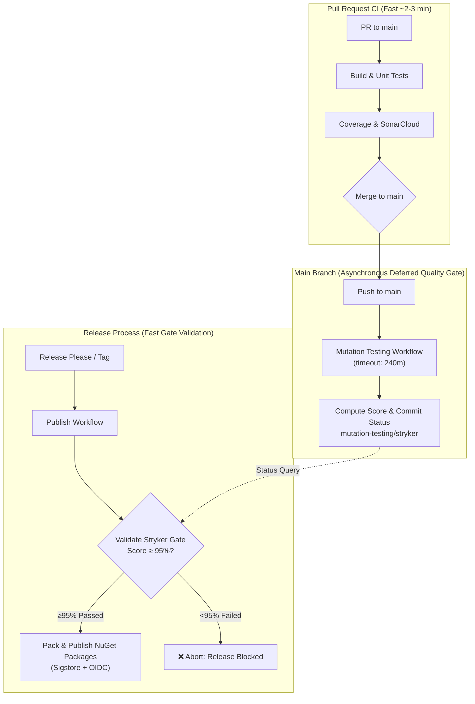

# CI/CD Pipelines & Build Strategy

The repository utilizes **GitHub Actions** for Continuous Integration, Continuous Delivery, mutation testing, and automated benchmarking.
All workflows are located in the `.github/workflows/` directory.

## Workflows

### 1. Build and Test (`ci.yml` / `dotnet-build-test.yml`)
* **Triggers**: `push` to `main`, `develop`, and `pull_request` against `main`, `develop`.
* **Environment**: `ubuntu-latest`.
* **Steps**:
  1. Checks out the code (`actions/checkout@v4`).
  2. Provisions .NET SDK (`10.0.x`) via `actions/setup-dotnet@v4`.
  3. Restores Strong Name signing key if available.
  4. Restores dependencies (`dotnet restore`).
  5. Builds all projects in `Release` mode (`dotnet build --configuration Release`).
  6. Executes test projects with XPlat Code Coverage (`dotnet test --no-build --configuration Release --collect:"XPlat Code Coverage"`).
  7. Conducts SonarCloud static analysis.
  8. Uploads test results and coverage reports to Codecov via `codecov/codecov-action@v4`.
* **Secrets Required**: `SNK_KEY`, `CODECOV_TOKEN`, `SONAR_TOKEN`.

### 2. Benchmarks (`benchmark.yml`)
* **Triggers**: `push` to `main`, and `pull_request` against `main`.
* **Environment**: `ubuntu-latest`.
* **Steps**:
  1. Provisions .NET SDK.
  2. Runs BenchmarkDotNet suite (`dotnet run -c Release --project tests/EricksonLopez.Pagination.Benchmarks/EricksonLopez.Pagination.Benchmarks.csproj`).
  3. Uploads benchmark results as GitHub Artifacts via `actions/upload-artifact@v4`.
* **Secrets Required**: None.
* **Artifacts Produced**: `benchmark-results` (BenchmarkDotNet output files from `BenchmarkDotNet.Artifacts/results/`).

> [!NOTE]
> The benchmark CI workflow targets `tests/EricksonLopez.Pagination.Benchmarks/` for automated micro-benchmarks. Multi-engine database benchmarks using Docker Compose (PostgreSQL, SQL Server, MySQL, Oracle, SQLite) live under `benchmarks/`.

### 3. Mutation Testing (`mutation-testing.yml`)
* **Triggers**: `push` to `main`, weekly schedule (Sundays 04:00 UTC), and `workflow_dispatch`.
* **Environment**: `ubuntu-latest`.
* **Timeout**: 240 minutes (accommodates full solution multi-framework mutation run across 14 test projects, analyzers, and source generators).
* **Permissions**: `contents: read`, `statuses: write` (commits mutation gate result), `actions: read`.
* **Concurrency**: `mutation-testing-${{ github.ref }}` — cancels in-progress runs on new pushes.
* **Profiles** (selected via `workflow_dispatch` input):
  - `Standard` (default): Standard mutation testing run across all configured test projects.
  - `Basic`: Basic mutation profile for rapid triage.
  - `Advanced`: Advanced mutation profile for exhaustive inspection.
* **Steps**:
  1. Checks out repository with full history (`actions/checkout@v4`).
  2. Provisions .NET SDK (`10.0.x`).
  3. Restores Strong Name key.
  4. Restores dependencies and builds `EricksonLopez.Pagination.slnx` in `Release` mode.
  5. Restores/installs `dotnet-stryker`.
  6. Runs Stryker.NET against `EricksonLopez.Pagination.slnx` with configured profile.
  7. Uploads report artifacts (`stryker-report-${{ github.run_id }}`, retained 30 days).
  8. Extracts metrics and generates Step Summary via `scripts/record-stryker-result.js`.
  9. Publishes commit status `mutation-testing/stryker` on commit SHA with score and status.
  10. Enforces quality gate: fails job if exit code != 0 or mutation score < 95% (break threshold).
* **Secrets Required**: `SNK_KEY`, `GITHUB_TOKEN` (auto-provided).
* **Artifacts Produced**: `stryker-report-${{ github.run_id }}` (HTML + JSON reports), `stryker-metadata-${{ github.sha }}`.

### 4. Publish NuGet Packages (`publish.yml`)
* **Triggers**: `push` to tags (`v*.*.*`), or `workflow_dispatch` (triggered automatically by Release Please when release PR is merged).
* **Environment**: `ubuntu-latest`.
* **Permissions**: `id-token: write` (Sigstore / NuGet OIDC), `contents: write` (GitHub Release), `attestations: write`, `statuses: read`, `actions: read`.
* **Steps**:
  1. Checks out repository (`actions/checkout@v4` with `fetch-depth: 0`).
  2. Resolves version from input, git tag, or `Directory.Build.props`.
  3. Validates Stryker mutation quality gate via `scripts/verify-mutation-gate.js` — **Gate Threshold: ≥95.0%** on latest valid `main` mutation run (does NOT re-run Stryker).
  4. Provisions .NET SDK (`10.0.x`).
  5. Restores Strong Name Key from `SNK_KEY` into `DummyDevelopmentKey.snk`.
  6. Builds all packages in `Release` mode.
  7. Runs full test suite with coverage before publishing.
  8. Packs all 18 ecosystem packages into `./nupkgs`.
  9. Generates Sigstore Provenance Attestation (`actions/attest-build-provenance@v2`).
  10. Authenticates with NuGet.org via OIDC (`NuGet/login@v1`).
  11. Pushes packages to NuGet.org with `--skip-duplicate`.
  12. Creates GitHub Release with release notes and `.nupkg` assets.
* **Secrets Required**: `SNK_KEY`, `CODECOV_TOKEN`, `GITHUB_TOKEN` (auto-provided).

## Secrets Summary

| Secret | Used In | Purpose |
|--------|---------|---------|
| `SNK_KEY` | `mutation-testing.yml`, `ci.yml`, `publish.yml` | Base64-encoded Strong Name Key for assembly signing |
| `CODECOV_TOKEN` | `ci.yml`, `publish.yml` | Upload coverage reports to Codecov |
| `SONAR_TOKEN` | `ci.yml` | SonarCloud static analysis token |
| `GITHUB_TOKEN` | `publish.yml`, `mutation-testing.yml` | Create commit statuses and GitHub Releases (auto-provided) |

## Supply Chain Security

* **Dependabot**: Configured in `.github/dependabot.yml`:
  - **NuGet ecosystem**: Weekly updates.
  - **GitHub Actions**: Monthly updates.
* **Strong Name Signing**: Production assemblies are signed with a key injected from `SNK_KEY`. Development builds use `DummyDevelopmentKey.snk` if present.
* **Sigstore Attestation**: All published packages receive cryptographic build provenance attestations.
* **Package Validation**: Enabled across all library projects with baseline compatibility checks.
* **Native AOT Verification**: CI verifies trimming and Native AOT compatibility.
* **Deferred Mutation Quality Gate in Publish**: `publish.yml` validates the Stryker mutation score (≥95.0%) before packing and publishing, eliminating redundant 1+ hour runs during release.

## Release & Mutation Gate Architecture

