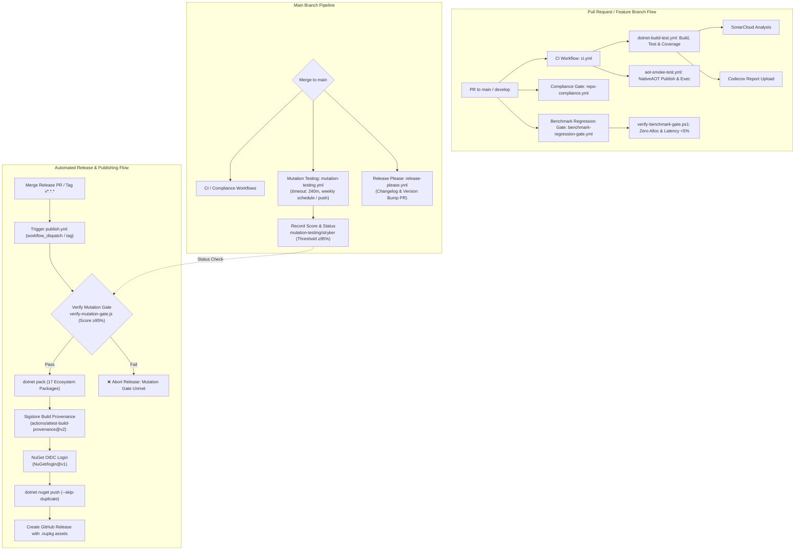

# CI/CD Pipelines & Build Strategy

The repository utilizes **GitHub Actions** for Continuous Integration, Continuous Delivery, automated quality assurance, Native AOT verification, mutation testing, benchmark regression gates, and package release automation.
All workflows are located in the `.github/workflows/` directory.

---

## 1. End-to-End CI/CD Pipeline Architecture

---

## 2. GitHub Actions Workflows Inventory

The CI/CD matrix is governed by **9 dedicated GitHub Actions workflows**:

| Workflow File | Name | Trigger Events | Key Responsibilities |
|---|---|---|---|
| `.github/workflows/ci.yml` | `CI` | `push`, `pull_request` (`main`, `develop`) | Master orchestrator invoking `dotnet-build-test.yml` and `aot-smoke-test.yml` in parallel. |
| `.github/workflows/dotnet-build-test.yml` | `Reusable — .NET Build & Test` | `workflow_call` | Solution build, test runner with coverage (OpenCover/Cobertura), SonarCloud analysis, Codecov upload. |
| `.github/workflows/aot-smoke-test.yml` | `NativeAOT Smoke Test` | `workflow_call`, `push`, `pull_request` (`main`, `develop`), `workflow_dispatch` | Compiles and executes `EricksonLopez.Pagination.AotTest` as native binary (`PublishAot=true`). |
| `.github/workflows/repo-compliance.yml` | `Repository Compliance` | `push`, `pull_request` (`main`, `develop`) | Enforces architectural boundaries, naming conventions, CPM alignment via `scripts/verify-compliance.ps1`. |
| `.github/workflows/benchmark-regression-gate.yml` | `Benchmark Regression Gate` | `pull_request` (`main`, `develop` on `src/**`, `benchmarks/**`), `workflow_dispatch` | Validates heap zero-allocation and max 5% latency regression against baseline via `scripts/verify-benchmark-gate.ps1`. |
| `.github/workflows/benchmark.yml` | `Benchmarks` | `push`, `pull_request` (`main`) | Automated micro-benchmarking using BenchmarkDotNet and artifact upload. |
| `.github/workflows/mutation-testing.yml` | `Mutation Testing` | `push` (`main`), `schedule` (weekly Sun 04:00 UTC), `workflow_dispatch` | Solution-wide Stryker.NET mutation testing, commit status publication, 95% quality gate enforcement. |
| `.github/workflows/release-please.yml` | `Release Please` | `push` (`main`) | Automates Conventional Commits parsing, CHANGELOG generation, release PR creation, and dispatch to `publish.yml`. |
| `.github/workflows/publish.yml` | `Publish NuGet Packages` | `push` tags (`v*.*.*`), `workflow_dispatch` | Validates deferred mutation gate, packs 17 packages, signs with SNK, generates Sigstore provenance, pushes to NuGet via OIDC. |

---

## 3. Workflow Specifications

### 1. Master CI Orchestrator (`ci.yml`)
* **File**: `.github/workflows/ci.yml`
* **Trigger**: `push` and `pull_request` targeting `main` and `develop`.
* **Jobs**:
  - `build-and-test`: Calls `./.github/workflows/dotnet-build-test.yml` with input `artifact-name: test-results`.
  - `aot-smoke-test`: Calls `./.github/workflows/aot-smoke-test.yml`. Runs concurrently with `build-and-test` to keep wall-clock time minimal.
* **Secrets Passed**: `SNK_KEY`, `CODECOV_TOKEN`, `SONAR_TOKEN`.

### 2. Reusable Build & Test Engine (`dotnet-build-test.yml`)
* **File**: `.github/workflows/dotnet-build-test.yml`
* **Trigger**: `workflow_call`.
* **Inputs**:
  - `dotnet-version` (string, default: `10.0.x`): .NET SDK version.
  - `test-filter` (string, optional): Test filter expression.
  - `test-project` (string, optional): Specific test project path.
  - `upload-coverage` (boolean, default: `true`): Flag to upload coverage to Codecov.
  - `artifact-name` (string, default: `test-results`): Name of uploaded artifact.
* **Steps**:
  1. Checks out repository via `actions/checkout@v4`.
  2. Sets up .NET SDK via `actions/setup-dotnet@v4`.
  3. Decodes `SNK_KEY` to `DummyDevelopmentKey.snk` if provided.
  4. Sets up Java 17 Zulu and installs `dotnet-sonarscanner`.
  5. Initiates SonarScanner with OpenCover report path (`**/coverage.opencover.xml`) and explicit exclusion rules.
  6. Compiles `EricksonLopez.Pagination.slnx` in `Release` configuration.
  7. Executes tests with TRX logger and `XPlat Code Coverage` (dual output: `opencover` and `cobertura`).
  8. Finalizes SonarScanner analysis.
  9. Uploads `./test-results/` via `actions/upload-artifact@v4`.
  10. Publishes coverage to Codecov via `codecov/codecov-action@v4` with `flags: unittests`.

### 3. Native AOT Smoke Test (`aot-smoke-test.yml`)
* **File**: `.github/workflows/aot-smoke-test.yml`
* **Trigger**: `workflow_call`, `push` (`main`, `develop`), `pull_request` (`main`, `develop`), `workflow_dispatch`.
* **Environment**: `ubuntu-latest`, timeout 20 minutes.
* **Prerequisites**: Installs Linux native toolchain: `clang`, `lld`, `zlib1g-dev`.
* **Execution**:
  - Publishes `tests/EricksonLopez.Pagination.AotSmokeTest/EricksonLopez.Pagination.AotSmokeTest.csproj` with flags:
    `--configuration Release --runtime linux-x64 --self-contained -p:PublishAot=true -p:TargetFramework=net10.0 --output ./aot-output`.
  - Executes `./aot-output/EricksonLopez.Pagination.AotSmokeTest` directly on the host and asserts exit code `0`.
  - On failure, uploads `./aot-output/` artifact for post-mortem analysis (retained 7 days).

### 4. Repository Compliance Gate (`repo-compliance.yml`)
* **File**: `.github/workflows/repo-compliance.yml`
* **Trigger**: `push` and `pull_request` targeting `main` and `develop`.
* **Execution**: Runs `./scripts/verify-compliance.ps1` in PowerShell 7 (`pwsh`).
* **Enforced Invariants**:
  - Central Package Management (CPM) integrity across all `.csproj` files.
  - Assembly Strong Name signing configuration (`Directory.Build.props`).
  - Documentation casing convention (Root: `SCREAMING_CASE.md`, Docs: `kebab-case.md`).
  - English language purity (zero Spanish accents/characters).
  - Absence of obsolete or phantom packages (e.g., `SqlBuilder`).
  - Strict ADR numbering and status hygiene.

### 5. Benchmark Regression Gate (`benchmark-regression-gate.yml`)
* **File**: `.github/workflows/benchmark-regression-gate.yml`
* **Trigger**: `pull_request` targeting `main`, `develop` when changes touch `src/**` or `benchmarks/**`, and `workflow_dispatch`.
* **Inputs**: `threshold` (default: `"5"` percent).
* **Execution**:
  - Sets up multi-targeted .NET SDKs (`8.0.x`, `9.0.x`, `10.0.x`).
  - Executes BenchmarkDotNet suite on `tests/EricksonLopez.Pagination.Benchmarks/EricksonLopez.Pagination.Benchmarks.csproj` under `--framework net10.0 --job short --exporters json --memory`.
  - Evaluates `./scripts/verify-benchmark-gate.ps1` comparing results against `./benchmarks/results/baseline.json`:
    1. **Heap Allocation Invariant**: Ensures `0 B` allocated on hot-path combinators.
    2. **Latency Gate**: Fails if mean latency degrades by more than 5% relative to baseline.
  - Uploads `./benchmarks/pr-results` artifact (retained 30 days).

### 6. Automated Benchmarking (`benchmark.yml`)
* **File**: `.github/workflows/benchmark.yml`
* **Trigger**: `push` and `pull_request` to `main`.
* **Execution**: Runs BenchmarkDotNet suite and uploads `benchmark-results` artifacts from `BenchmarkDotNet.Artifacts/results/`.

### 7. Mutation Testing Suite (`mutation-testing.yml`)
* **File**: `.github/workflows/mutation-testing.yml`
* **Trigger**: `push` to `main`, weekly schedule (`0 4 * * 0`), and `workflow_dispatch` (profiles: `Standard`, `Basic`, `Advanced`).
* **Environment**: `ubuntu-latest`, timeout 240 minutes.
* **Concurrency**: `mutation-testing-${{ github.ref }}` (auto-cancels redundant queued runs).
* **Execution**:
  - Restores dependencies and builds `EricksonLopez.Pagination.slnx` in `Release`.
  - Installs and executes `dotnet-stryker` against configured mutation test projects.
  - Uploads `stryker-report-${{ github.run_id }}` (HTML and JSON reports retained for 30 days).
  - Invokes `scripts/record-stryker-result.js` to compute summary metrics and post GitHub Commit Status `mutation-testing/stryker` on commit SHA.
  - Enforces hard quality gate: fails job if exit code != 0 or mutation score < 95.0%.

### 8. Release Automation (`release-please.yml`)
* **File**: `.github/workflows/release-please.yml`
* **Trigger**: `push` to `main`.
* **Execution**:
  - Runs `googleapis/release-please-action@v4` driven by `.release-please-config.json` and `.release-please-manifest.json`.
  - Parses Conventional Commits to generate release pull requests and bump versions.
  - Upon merge of a release PR (`release_created == 'true'`), triggers `publish.yml` via GitHub REST API dispatch passing the resolved semantic version.

### 9. NuGet Publishing & Provenance (`publish.yml`)
* **File**: `.github/workflows/publish.yml`
* **Trigger**: `push` to tags (`v*.*.*`), or `workflow_dispatch` with input `version`.
* **Permissions**: `id-token: write` (OIDC), `contents: write`, `attestations: write`, `statuses: read`, `actions: read`.
* **Execution Steps**:
  1. Resolves semantic version from workflow input, git tag, or `Directory.Build.props`.
  2. **Deferred Mutation Gate**: Runs `scripts/verify-mutation-gate.js` to verify that the latest valid run on `main` achieved a Stryker mutation score ≥ 95.0%. Aborts release immediately if the gate is not met.
  3. Decodes `SNK_KEY` into `DummyDevelopmentKey.snk` for assembly signing.
  4. Builds the full solution in `Release` mode and executes the complete test suite.
  5. Packs all **17 library packages** into `./nupkgs` with deterministic symbol packages (`.snupkg`).
  6. Generates Sigstore Provenance Attestation via `actions/attest-build-provenance@v2`.
  7. Authenticates securely with NuGet.org using keyless OpenID Connect (OIDC) via `NuGet/login@v1`.
  8. Pushes packages to NuGet.org with `--skip-duplicate`.
  9. Creates the official GitHub Release with release notes and attaches `.nupkg` assets.

---

## 4. Secrets Configuration Matrix

| Secret Name | Required By Workflows | Description & Lifecycle |
|---|---|---|
| `SNK_KEY` | `ci.yml`, `dotnet-build-test.yml`, `aot-smoke-test.yml`, `benchmark-regression-gate.yml`, `mutation-testing.yml`, `publish.yml` | Base64-encoded Strong Name Key (`.snk`) used to sign assemblies with official identity. |
| `CODECOV_TOKEN` | `ci.yml`, `dotnet-build-test.yml`, `publish.yml` | Codecov repository token for uploading code coverage matrices. |
| `SONAR_TOKEN` | `ci.yml`, `dotnet-build-test.yml` | SonarCloud authentication token for static code analysis. |
| `GITHUB_TOKEN` | `mutation-testing.yml`, `release-please.yml`, `publish.yml` | Automatically provisioned GitHub token used for commit statuses, PR creation, and GitHub Releases. |

---

## 5. Branch & Versioning Strategy

* **Primary Branches**:
  - `main`: Production-ready branch. All merges trigger CI, mutation testing, compliance verification, and Release Please release preparation.
  - `develop`: Integration branch for active feature development.
* **Semantic Versioning**:
  - Follows [SemVer 2.0.0](https://semver.org/).
  - Managed centrally via `VersionPrefix` in `Directory.Build.props` and automated by `release-please-manifest.json`.
* **Release Artifacts**:
  - Standard NuGet packages (`.nupkg`) and embedded symbol packages (`.snupkg`).
  - Signed cryptographically with official Strong Name Key.
  - Authenticated via keyless OpenID Connect (OIDC) with Sigstore provenance attestation.
