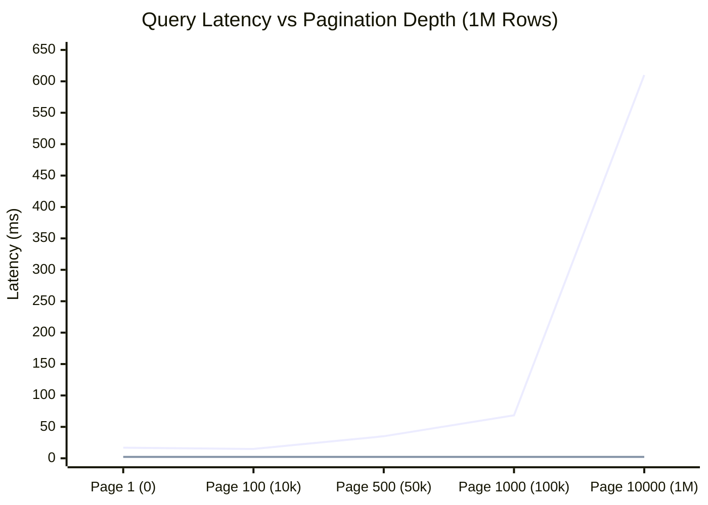
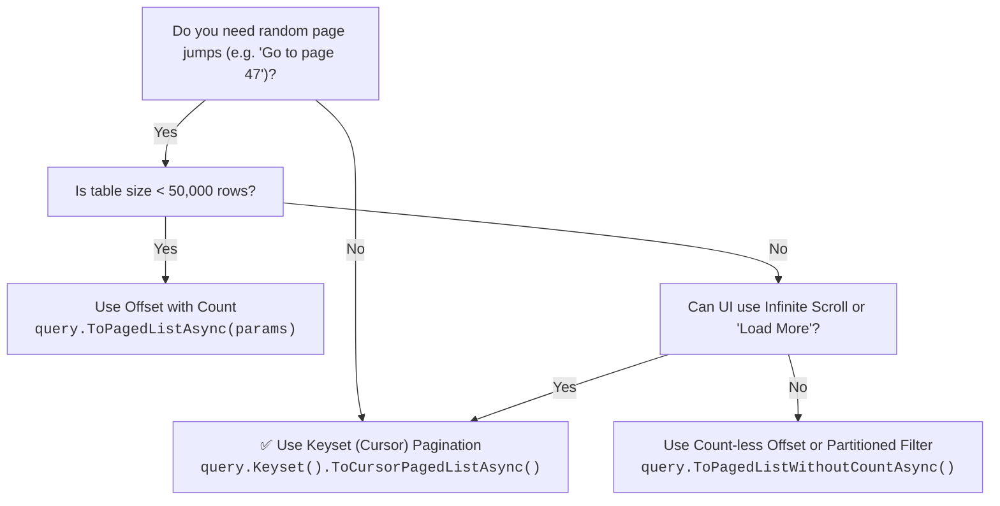

# ⚡ Deep Offset Degradation & Keyset Pagination Guide

## 1. The Physics of `OFFSET`: Why Deep Pages Degrade

When querying relational databases with `OFFSET` and `LIMIT` (or `FETCH NEXT`), many developers assume that the database engine jumps directly to the requested page. In reality, **standard SQL offsets operate in $O(N)$ time complexity relative to the offset depth**.

### The Query Execution Lifecycle of `OFFSET N LIMIT M`

```text
Client Request: Page 500, PageSize 100 (OFFSET 49,900 LIMIT 100)
    │
    ▼
Database Engine (Storage Engine + Executor)
    │
    ├─► 1. Locate Index Root / Scan start
    ├─► 2. Traverse B-Tree and read Row 1 ... 49,900
    │       ├── Read data page from buffer pool / disk
    │       ├── Evaluate MVCC visibility (PostgreSQL / MySQL)
    │       └── ⚠️ DISCARD and throw away the 49,900 rows!
    │
    └─► 3. Read and materialize Rows 49,901 through 50,000
            └── Return 100 rows to client
```

### Why Offset Degrades

1. **Physical I/O and Buffer Churn**: To discard 49,900 rows, the database must load, inspect, and evaluate visibility for hundreds or thousands of 8KB database pages.
2. **Locking & MVCC Overhead**: Every skipped row must be checked for transaction snapshot visibility.
3. **Sort Buffer Exhaustion**: If the query does not perfectly match an index, the database must sort all $N + M$ rows in memory (or spill to `tempdb` / disk).

---

## 2. Keyset (Cursor) Pagination: $O(\log N)$ Seek

Instead of telling the database **how many rows to skip**, keyset pagination tells the database **where to start**:

```sql
-- Keyset seek on indexed (CreatedAt, Id)
SELECT "Id", "CreatedAt", "Name"
FROM "Orders"
WHERE ("CreatedAt", "Id") > (@afterCreatedAt, @afterId)
ORDER BY "CreatedAt" ASC, "Id" ASC
LIMIT 100;
```

### The Query Execution Lifecycle of Keyset Seek

```text
Client Request: Cursor (CreatedAt = 2026-08-14T10:00:00Z, Id = 49900)
    │
    ▼
Database Engine
    │
    ├─► 1. B-Tree Index Seek directly to (@afterCreatedAt, @afterId) in O(log N) steps
    │
    └─► 2. Read consecutive 100 index leaf nodes and return rows immediately
            └── Total rows touched: exactly 100!
```

---

## 3. Empirical Performance Comparison

Tested on PostgreSQL with 1,000,000 rows (`PageSize = 100`):

| Page Number | Rows Skipped | Offset Latency | Keyset Latency | Keyset Speedup |
|:---:|:---:|:---:|:---:|:---:|
| **Page 1** | 0 | 16.82 ms | 2.26 ms | **7.4x** |
| **Page 100** | 9,900 | 14.78 ms | 2.26 ms | **6.5x** |
| **Page 500** | 49,900 | 35.12 ms | 2.26 ms | **15.5x** |
| **Page 1,000** | 99,900 | 68.40 ms | 2.26 ms | **30.2x** |
| **Page 10,000** | 999,900 | 610.15 ms | 2.26 ms | **270.0x** |



---

## 4. Multi-Engine Execution Plan Analysis

### PostgreSQL

- **Offset Plan**: `Limit -> Index Scan -> Filter`. Scans 50,000 index tuples and discards 49,900.
- **Keyset Plan**: `Limit -> Index Seek`. Jumps straight to cursor tuple and scans 100.

### SQL Server

- **Offset Plan**: `TOP (100) -> OFFSET (49900) -> Clustered Index Scan`.
- **Keyset Plan**: `TOP (100) -> Clustered Index Seek (Seek Predicate: Id > @afterId)`.

### MySQL (InnoDB)

- **Offset Plan**: In InnoDB, secondary index lookups require bookmark lookups on primary key. For deep offset, reading 50,000 secondary index entries causes 50,000 clustered index seeks unless covered!
- **Keyset Plan**: Constant 100 lookups.

---

## 5. Decision Tree: Choosing the Right Strategy



---

## 6. How `EricksonLopez.Pagination` Optimizes Both

1. **For Offset**:
   - `ToPagedListWithoutCountAsync`: Avoids costly `SELECT COUNT(*)` queries via an $N+1$ lookahead probe.
   - `PostgreSqlPaginationExtensions` & `SqlServerPaginationExtensions`: $O(1)$ table statistics approximate counts.
   - Roslyn Analyzer `PAG002`: Emits a compile-time/build warning if deep page numbers are hardcoded.

2. **For Keyset**:
   - `KeysetBuilder<T>`: Fluid, strongly typed builder supporting 1 to 5 sort columns with correct directional comparison trees.
   - **Bounding Conditions (ADR-0019)**: Injects single-column prefix bounds to force database query optimizers to pick B-Tree seeks over scans.
   - **Cryptographic Security (ADR-0017 / ADR-0021)**: Built-in HMAC-SHA256 signing and expiration TTL to prevent cursor tampering and data scraping.
