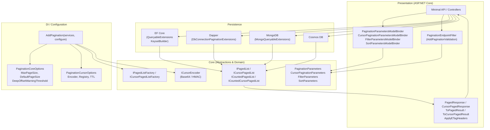
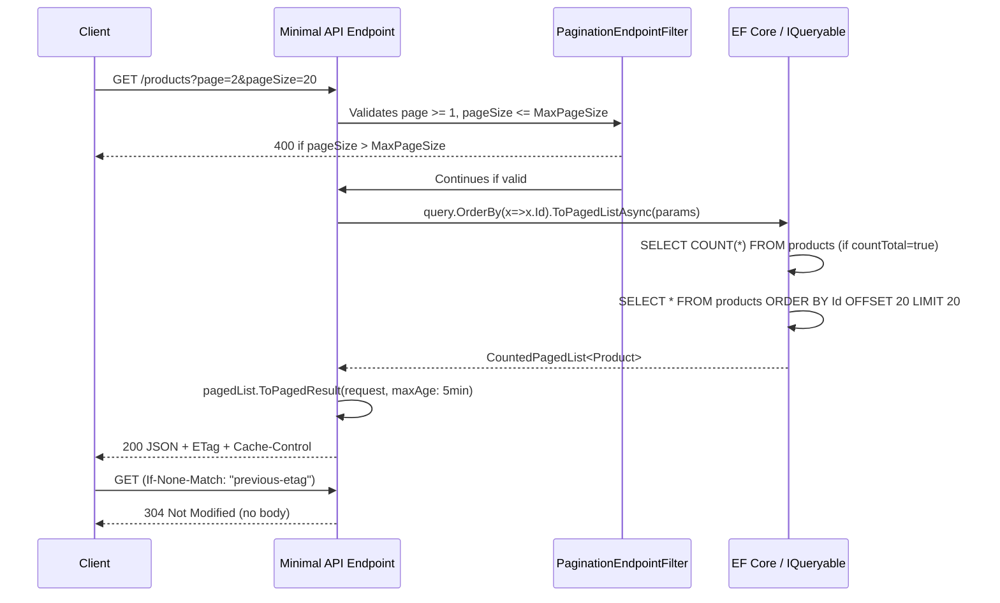
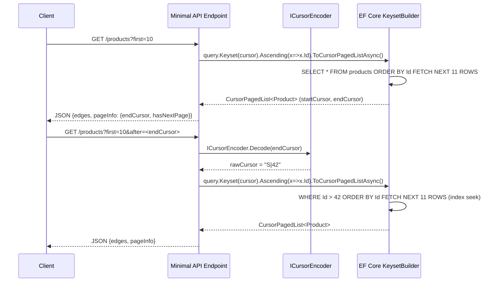
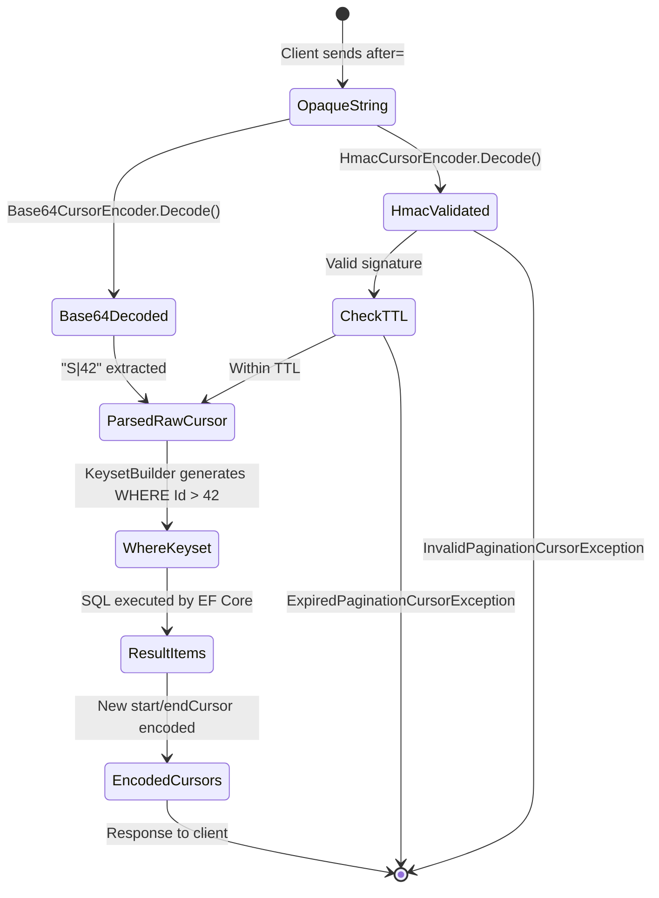
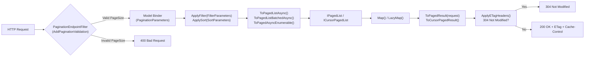
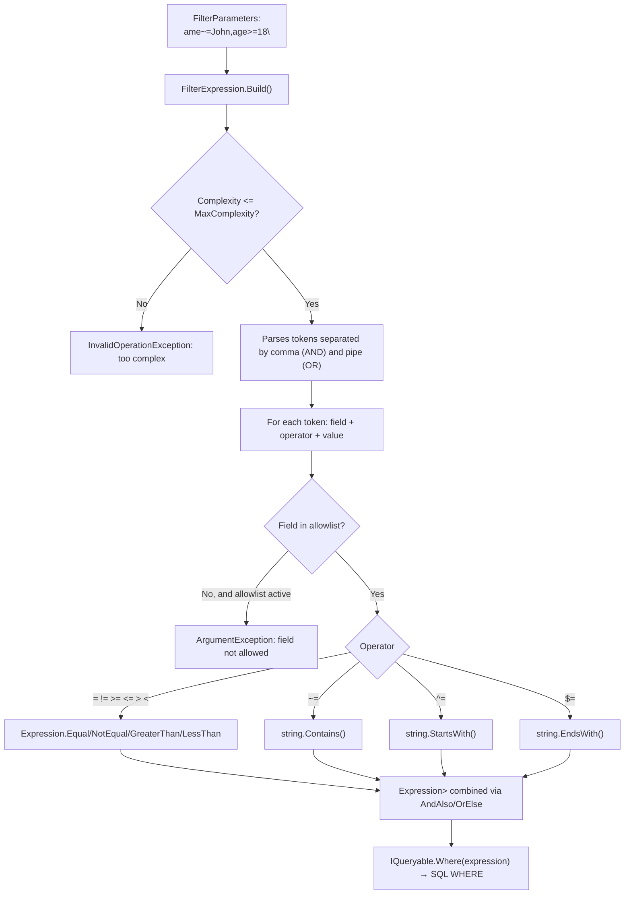
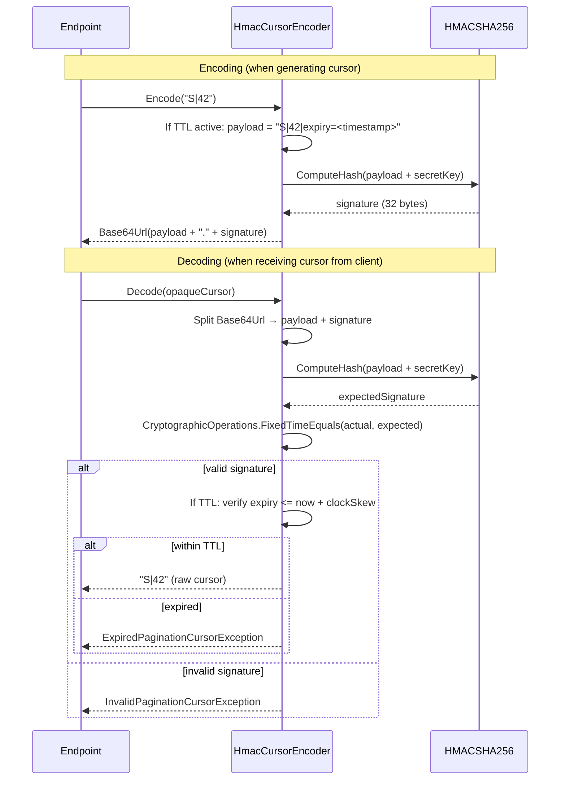
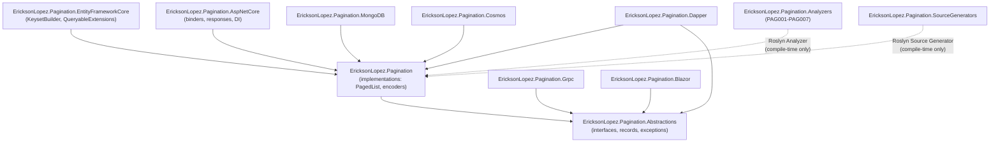
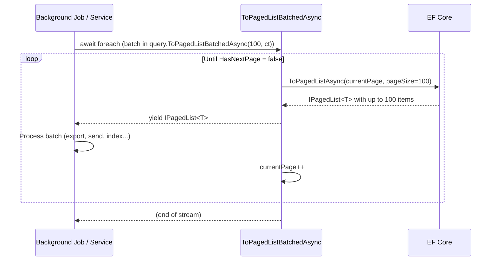

# Architecture Diagrams — EricksonLopez.Pagination

> Updated with complete diagrams for all library layers.
> For narrative description, see [architecture.md](architecture.md) and [functional-map.md](functional-map.md).

---

## 1. General Component Architecture



---

## 2. Main Flow — Offset Pagination



---

## 3. Main Flow — Keyset (Cursor) Pagination



---

## 4. Flow — Dapper Multi-Result-Set

```mermaid
sequenceDiagram
    participant API
    participant Dapper as DbConnectionPaginationExtensions
    participant DB as SQL Database

    API->>Dapper: connection.ToPagedListAsync(sql, params, countTotal: true)
    Note over Dapper: injects @__Pagination_Skip__, @__Pagination_PageSize__
    Dapper->>DB: SELECT COUNT(*) FROM products;\nSELECT * FROM products LIMIT N OFFSET M
    DB-->>Dapper: Result set 1 → total count
    DB-->>Dapper: Result set 2 → items
    Dapper->>Dapper: Builds CountedPagedList<T>
    Dapper-->>API: IPagedList<T>
```

---

## 5. State Machine — Cursor



---

## 6. HTTP Processing Pipeline



---

## 7. Flow — Filter DSL (ApplyFilter)



---

## 8. Flow — HMAC Cursor Encoder (Security)



---

## 9. Package Dependencies

> **Note**: Verified against actual `.csproj` `<ProjectReference>` entries.



> [!NOTE]
> `Grpc` and `Blazor` reference only `Abstractions` (not `Core`), keeping their dependency footprint minimal.
> `OpenApi` depends on `Core` (not `AspNetCore`). `SourceGenerators` and `Analyzers` are compile-time only.

---

## 10. Flow — Batch Processing (ToPagedListBatchedAsync)


