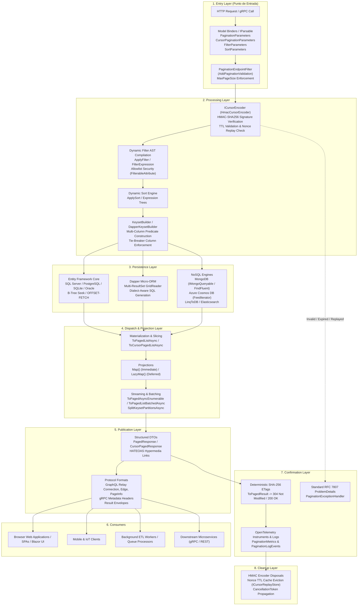

# Functional Map — EricksonLopez.Pagination

> Official Architectural and Functional Flow Specification for `EricksonLopez.Pagination`.  
> Maps all public library components across their real architectural layers from entry to exit.

---

## 1. Architectural Layers & Real System Topology



---

## 2. Layer-by-Layer Architectural Specification

### Layer 1: Application Entry Point (Punto de Entrada)
- **Components**:
  - `PaginationParameters` (Record Struct implementing `IParsable<PaginationParameters>`): Binds `page` and `pageSize`.
  - `CursorPaginationParameters` (Record Struct implementing `IParsable<CursorPaginationParameters>`): Binds `first`, `after`, `last`, `before`.
  - `FilterParameters` & `SortParameters`: Encapsulate query string filter DSL expressions and sort orders.
  - `PaginationEndpointFilter`: Executed via `AddPaginationValidation()`. Enforces that incoming `pageSize` does not exceed `PaginationCoreOptions.MaxPageSize` before database execution occurs, short-circuiting malicious requests with HTTP 400.
  - `PaginationParametersModelBinder`, `CursorPaginationParametersModelBinder`, `FilterParametersModelBinder`, `SortParametersModelBinder`: Provide MVC Controller parameter binding.

### Layer 2: Processing Layer
- **Components**:
  - `ICursorEncoder` (`HmacCursorEncoder` / `Base64CursorEncoder`): Decodes opaque cursors into raw composite values. `HmacCursorEncoder` computes constant-time HMAC-SHA256 signatures, checks timestamps against `timeToLive` + `clockSkewTolerance`, and validates single-use nonces against `ICursorReplayStore`.
  - `ApplyFilter` (`QueryableExtensions` / `MongoQueryableFilterExtensions`): Translates filter tokens (`=`, `!=`, `>=`, `<=`, `>`, `<`, `~=`, `^=`, `$=`) into strongly typed LINQ expression trees, consulting security allowlists (`FilterableAttribute`).
  - `ApplySort` (`QueryableExtensions`): Safely validates property names against entity metadata and appends `OrderBy` / `ThenBy` expressions.
  - `KeysetBuilder<T>` & `DapperKeysetBuilder<T>`: Constructs composite keyset seek expressions (`WHERE (Price > @LastPrice) OR (Price = @LastPrice AND Id > @LastId)`) and enforces unique tie-breakers.

### Layer 3: Persistence Layer
- **Components**:
  - **Entity Framework Core**: Translates expression trees into native database queries across SQL Server, PostgreSQL, SQLite, and Oracle.
  - **Dapper**: Generates parameterized SQL queries using dialect-aware SQL construction (`DatabaseDialect`). Leverages `GridReader` for multi-result sets (total count + paged data).
  - **MongoDB**: Utilizes `IMongoQueryable<T>` and `IFindFluent<TDocument, TProjection>` with cursor slicing and `ObjectId` timestamp ordering.
  - **Azure Cosmos DB**: Paginates Cosmos `FeedIterator<T>` using continuation tokens.
  - **LinqToDB**: Provides lightweight query compilation and keyset projection.
  - **Elasticsearch**: Executes SearchAfter queries mapped from cursor values.

### Layer 4: Dispatch & Projection Layer
- **Components**:
  - `ToPagedListAsync` / `ToCursorPagedListAsync`: Executes database queries and materializes `IPagedList<T>` or `ICursorPagedList<T>`.
  - `CountedPagedList<T>` & `CountedCursorPagedList<T>`: Materializes results when exact total counts are requested.
  - `Map<TResult>()` & `LazyMap<TResult>()`: Projects domain entities into API DTOs. `LazyMap` delays projection until serialization time, preventing intermediate memory allocations.
  - `ToPagedAsyncEnumerable()`: Streams query results asynchronously item-by-item (`IAsyncEnumerable<T>`).
  - `ToPagedListBatchedAsync()`: Evaluates queries in bounded pages across background worker loops.
  - `SplitKeysetPartitionsAsync()`: Calculates disjoint keyset boundaries for concurrent worker partitioning.

### Layer 5: Publication Layer
- **Components**:
  - `PagedResponse<T>`: Standardized REST response DTO encapsulating items, pagination metadata, and optional HATEOAS relative links.
  - `CursorPagedResponse<T>`: Relay-compliant response containing `Edges` and `RelayPageInfo` (`StartCursor`, `EndCursor`, `HasNextPage`, `HasPreviousPage`).
  - `Connection<TNode>`, `Edge<TNode>`, `PageInfo`: High-fidelity GraphQL Relay specification models (`EricksonLopez.Pagination.Relay`).
  - `PaginationGrpcExtensions`: Injects and reads pagination headers via gRPC metadata trailers.
  - `PaginationErrors` & `PaginationResultExtensions`: Returns functional `Result<PagedResponse<T>>` envelopes for railway-oriented architectures.

### Layer 6: Consumers
- **Clients**:
  - **Web Single Page Applications & Blazor**: Consumes offset pages with total count for data grids, or cursor pagination for infinite feeds.
  - **Mobile Clients**: Consumes keyset feeds with drift immunity.
  - **Background ETL Workers**: Consumes keyset partitions or batched streams to migrate or export massive datasets concurrently.
  - **Microservices**: Consumes gRPC streams or REST endpoints with deterministic caching.

### Layer 7: Confirmation Layer
- **Components**:
  - `ToPagedResult()` (`PaginationResultExtensions`): Computes deterministic SHA-256 ETag from response content. Returns `304 Not Modified` when client sends matching `If-None-Match`, short-circuiting network transmission and serialization overhead.
  - `PaginationExceptionHandler`: Global .NET 8+ exception handler intercepting cursor tamper, expiration, or replay exceptions and emitting RFC 7807 `ProblemDetails` with HTTP 400.
  - `PaginationMetrics`: Emits OpenTelemetry meters (`pagination.offset.queries`, `pagination.keyset.queries`, `pagination.cursor.errors`, `pagination.query.duration`).
  - `PaginationLogEvents`: High-performance source-generated log messages for security and diagnostic events.

### Layer 8: Cleanup Layer
- **Operations**:
  - Immediate disposal of cryptographic resources (`HmacCursorEncoder.Dispose()`).
  - Nonce expiration and eviction in distributed stores (`RedisCursorReplayStore` via native Redis key TTL).
  - Cooperative query abortion across all asynchronous database operations via `CancellationToken`.

---

## 3. Layer Transition Walkthrough

### Scenario: Keyset Query with Cryptographic HMAC & Replay Protection

```
[Client] ---> GET /api/products/feed?first=20&after=eyJhbGci...
   │
   ├── (Transition 1: Entry -> Processing)
   │     • Endpoint filter verifies: first (20) <= MaxPageSize (100).
   │     • CursorPaginationParameters binds 'first' and 'after'.
   │
   ├── (Transition 2: Processing -> Security & Verification)
   │     • HmacCursorEncoder decodes cursor:
   │         - Base64Url decode payload.
   │         - Constant-time HMAC-SHA256 signature verification.
   │         - Timestamp checked against UtcNow + ClockSkewTolerance.
   │         - Nonce validated against ICursorReplayStore.TryAcquireNonceAsync.
   │         - Succeeded -> yields raw cursor string "2026-09-12T00:00:00Z|1042".
   │
   ├── (Transition 3: Processing -> Persistence)
   │     • KeysetBuilder constructs SQL seek predicate:
   │         WHERE (CreatedAt < @LastCreatedAt) 
   │            OR (CreatedAt = @LastCreatedAt AND Id > @LastId)
   │         ORDER BY CreatedAt DESC, Id ASC
   │         LIMIT 21
   │     • Database executes B-Tree index seek in O(log N).
   │
   ├── (Transition 4: Persistence -> Dispatch)
   │     • Slices item 21 to determine hasNextPage = true.
   │     • Maps entity to DTO using pagedList.Map(selector).
   │
   ├── (Transition 5: Dispatch -> Publication & Confirmation)
   │     • Encodes fresh StartCursor and EndCursor with new HMAC signatures and nonces.
   │     • Builds CursorPagedResponse<ProductDto>.
   │     • Returns HTTP 200 JSON with Relay PageInfo and Edges.
   │     • Emits OpenTelemetry counter: pagination.keyset.queries incremented.
   │
   └── (Transition 6: Cleanup)
         • ICursorEncoder disposed.
         • Scoped database context disposed.
```
